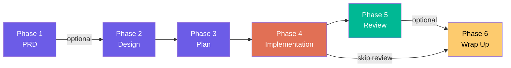
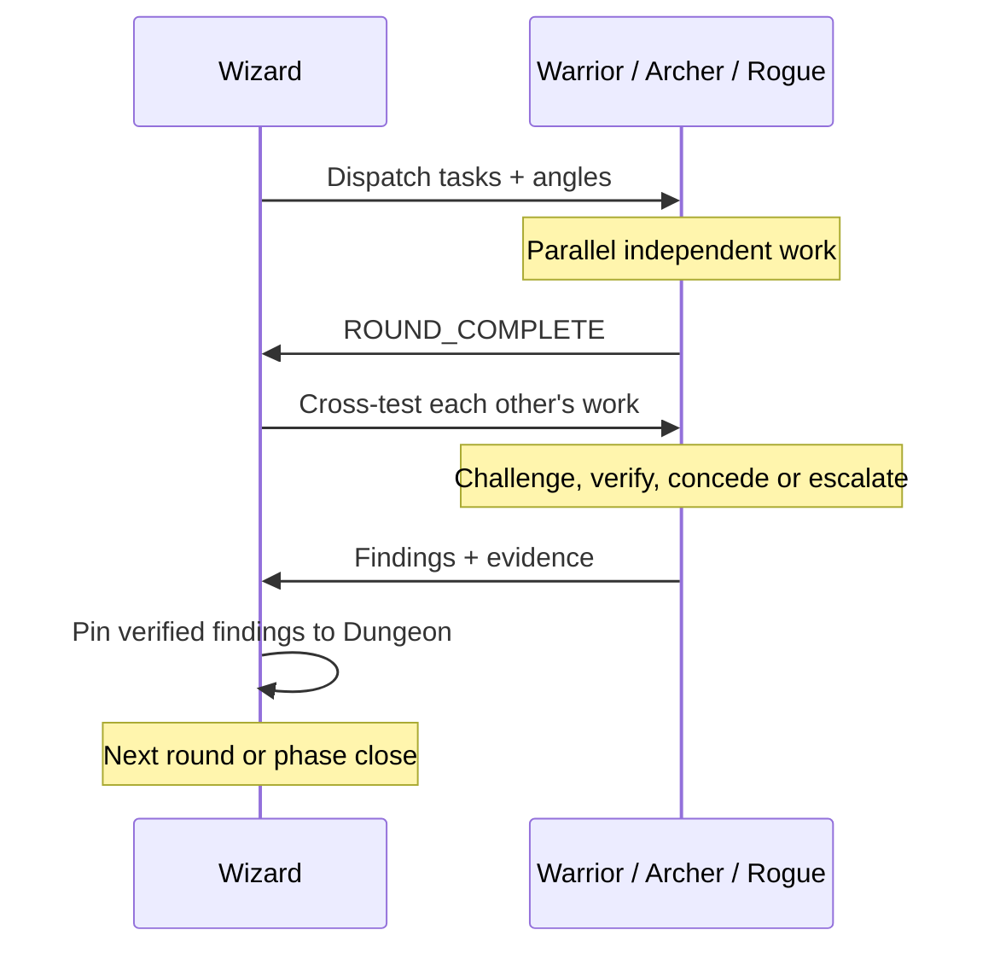

<div align="center">

```
   ⚔ ══════════════════════════════════════════════════════════ ⚔

       ██████╗██╗      █████╗ ██╗   ██╗██████╗ ███████╗
      ██╔════╝██║     ██╔══██╗██║   ██║██╔══██╗██╔════╝
      ██║     ██║     ███████║██║   ██║██║  ██║█████╗
      ██║     ██║     ██╔══██║██║   ██║██║  ██║██╔══╝
      ╚██████╗███████╗██║  ██║╚██████╔╝██████╔╝███████╗
       ╚═════╝╚══════╝╚═╝  ╚═╝ ╚═════╝ ╚═════╝ ╚══════╝
               ██████╗  █████╗ ██╗██████╗
               ██╔══██╗██╔══██╗██║██╔══██╗
               ██████╔╝███████║██║██║  ██║
               ██╔══██╗██╔══██║██║██║  ██║
               ██║  ██║██║  ██║██║██████╔╝
               ╚═╝  ╚═╝╚═╝  ╚═╝╚═╝╚═════╝

      Round-based Adversarial Intelligence Dungeon
                   for Claude Code

   ⚔ ══════════════════════════════════════════════════════════ ⚔
```

**Four AI agents. One shared dungeon. Every decision stress-tested before it ships.**

[](LICENSE)
[](#)
[](#prerequisites)
[](#)

[Quick Start](#quick-start) · [The Canonical Quest](#the-canonical-quest) · [The Party](#the-party) · [The Dungeon](#the-dungeon) · [Configuration](#configuration) · [CLI Reference](#cli-reference)

</div>

---

## What is Claude Raid?

Claude Raid turns a single Claude Code session into a **4-agent adversarial team** that designs, plans, builds, reviews, and ships code through structured phases. Instead of one AI guessing at a solution, four agents challenge each other's work until only battle-tested decisions survive.

The **Wizard** orchestrates. The **Warrior**, **Archer**, and **Rogue** each bring a different lens — stress tolerance, pattern coherence, and assumption destruction. They work in rounds, pin verified findings to a shared **Dungeon**, and no phase closes until the Wizard rules.

One command installs the system. One command starts a quest.

---

## Quick Start

```bash
npx claude-raid summon
```

That's it. One command installs agents, hooks, skills, and config into your project's `.claude/` directory.

```bash
# Preview what gets installed (no changes)
npx claude-raid summon --dry-run

# Start a quest
claude-raid start
```

The Wizard greets you, you describe your task, and the quest begins.

### Prerequisites

| Requirement | Why |
|:--|:--|
| **Node.js** 18+ | Runs the CLI |
| **Claude Code** v2.1.32+ | Agent teams support |
| **tmux** | Multi-pane agent display (`brew install tmux`) |
| **jq** | Config parsing (pre-installed on macOS) |

> **tmux** gives each agent its own pane — click into any pane to observe or talk to that agent directly. Without tmux, agents run in-process and you cycle between them with `Shift+Down`.

The setup wizard checks all prerequisites during `summon` and offers to fix what it can.

---

## The Canonical Quest

The Canonical Quest is a 6-phase development cycle. Every feature, refactor, or system built through the Raid follows this sequence.



### Phase 1 — PRD *(optional)*

Agents research the problem space and produce a complete Product Requirements Document. No code. The Wizard mediates questions between agents and the human.

**Output:** `phase-1-prd.md`

### Phase 2 — Design

Agents explore design approaches from competing angles. Each brings their lens — the Warrior stress-tests architecture choices, the Archer traces ripple effects, the Rogue attacks assumptions. The design survives only if it withstands all three.

**Output:** `phase-2-design.md` with mermaid diagrams and battle-tested decisions

### Phase 3 — Plan

Agents decompose the approved design into discrete, testable tasks. They fight over ordering, scope boundaries, naming, and test coverage until the plan earns consensus.

**Output:** `phase-3-plan.md` + individual task files (`phase-3-plan-task-01.md`, etc.)

### Phase 4 — Implementation

The Wizard assigns tasks in batches. One agent builds each task using strict **TDD** (RED-GREEN-REFACTOR). The others cross-test the implementation — reading code, running tests, and challenging decisions. Every task earns approval before the next batch starts.

**Output:** `phase-4-implementation.md` + committed, tested code

### Phase 5 — Review *(optional)*

Two sub-phases: **Pinning** (find issues) and **Fixing** (resolve them). Agents review independently, then fight over findings *and* missing findings. Critical and Important issues must be fixed. The **Black Card** system handles breaking architectural concerns.

**Output:** `phase-5-review.md`

### Phase 6 — Wrap Up

The Wizard generates a quest storyboard summarizing what was built and why. Creates the PR, archives the dungeon to the vault, and dismisses the party.

**Output:** `phase-6-wrap-up.md` + PR + vault archive

---

## The Party

Four agents, each with a distinct lens. They collaborate through rigor, not agreement.

<table>
<tr>
<td width="25%" align="center"><h3>Wizard</h3><em>Dungeon Master</em></td>
<td width="25%" align="center"><h3>Warrior</h3><em>Stress Tester</em></td>
<td width="25%" align="center"><h3>Archer</h3><em>Pattern Seeker</em></td>
<td width="25%" align="center"><h3>Rogue</h3><em>Assumption Destroyer</em></td>
</tr>
<tr>
<td valign="top">Thinks 5 times before speaking. Opens phases, dispatches the team, observes, and closes with binding rulings. The bridge between agents, dungeon, and human. <strong>Never writes code.</strong></td>
<td valign="top">Does this hold under pressure? Tests boundaries, load, edge cases, and failure modes. Brings the exact scenario that breaks it — not just "this is wrong."</td>
<td valign="top">Does this fit? Traces how changes ripple through the system. Catches naming drift, contract violations, and implicit dependencies that break silently.</td>
<td valign="top">What did everyone assume that isn't guaranteed? Thinks like a failing system, a malicious input, a race condition. Constructs the attack sequence that turns oversight into failure.</td>
</tr>
</table>

### How They Work Together



**Round-based, not real-time.** Agents work independently, flag completion, then cross-test. No mid-thinking interruptions. Each message carries evidence and a conclusion. Converge in 2-3 exchanges per finding — escalate to the Wizard after 3.

### Seven Pillars

Every agent, every phase, every interaction:

1. **Intellectual Honesty** — Every claim backed by evidence gathered this turn. No guessing.
2. **Zero Ego** — Concede instantly when proven wrong. A teammate catching your mistake is a gift.
3. **Discipline** — Every interaction carries work forward. If you're not adding information, stop talking.
4. **Round-Based Interaction** — Turn-based work, flag completion, cross-test on dispatch.
5. **Question Chain** — Agents never ask the human directly. All questions flow through the Wizard.
6. **Phase Spoils** — Every phase produces a detailed markdown artifact. No exceptions.
7. **Black Cards** — Architecture-breaking findings that cannot be fixed within the current design. Escalated to the human with rollback options.

---

## The Dungeon

The Dungeon is the team's shared knowledge artifact — a curated board where agents pin verified findings during each phase.

| Concept | What It Means |
|:--|:--|
| **Quest** | A complete session — from greeting to PR |
| **Dungeon** | The quest's artifact directory: phase files, task files, findings |
| **Vault** | Archive of completed quests for institutional memory |
| **Phase Spoils** | Mandatory output of each phase: a detailed markdown report |
| **Black Card** | A finding that fundamentally breaks the architecture — requires human decision |
| **Pin** | A verified finding that survived challenge from 2+ agents |

### Dungeon Filesystem

```
.claude/dungeon/{quest-slug}/          # Active quest artifacts
├── phase-1-prd.md                     # PRD (optional)
├── phase-2-design.md                  # Battle-tested design
├── phase-3-plan.md                    # Task index
├── phase-3-plan-task-01.md            # Individual task specs
├── phase-4-implementation.md          # Implementation log
├── phase-5-review.md                  # Review board (optional)
└── phase-6-wrap-up.md                 # Quest storyboard

.claude/vault/{quest-slug}/            # Archived completed quests
.claude/raid-session                   # Active session state
```

**What goes in the Dungeon:** Findings that survived challenge from 2+ agents, key decisions, escalation points.

**What stays in conversation:** Back-and-forth challenges, exploratory thinking, concessions. The conversation is the sparring ring. The Dungeon is the scoreboard.

---

## What Gets Installed

<details>
<summary><strong>Full file tree</strong></summary>

```
.claude/
├── raid.json                        # Project config (auto-detected, editable)
├── party-rules.md                   # Party agent rules (editable)
├── dungeon-master-rules.md          # Wizard rules (editable)
├── settings.json                    # Hooks merged with existing (backup created)
├── agents/
│   ├── wizard.md                    # Dungeon master
│   ├── warrior.md                   # Stress tester
│   ├── archer.md                    # Pattern seeker
│   └── rogue.md                     # Assumption destroyer
├── hooks/
│   ├── raid-lib.sh                  # Shared config and session state
│   ├── raid-session-start.sh        # Session activation + quest directory
│   ├── raid-session-end.sh          # Archive to vault + cleanup
│   ├── raid-pre-compact.sh          # Pre-compaction dungeon backup
│   ├── raid-task-created.sh         # Task subject validation
│   ├── validate-commit.sh           # Conventional commits
│   ├── validate-write-gate.sh       # Phase-based write protection
│   ├── validate-file-naming.sh      # Naming convention enforcement
│   ├── validate-no-placeholders.sh  # No TBD/TODO in specs
│   ├── validate-dungeon.sh          # Multi-agent verification on pins
│   ├── validate-browser-tests-exist.sh  # Playwright test detection
│   └── validate-browser-cleanup.sh  # Browser process cleanup
└── skills/
    ├── raid-init/                   # Quest selection and session setup
    ├── raid-canonical-protocol/     # Canonical Quest rules and signals
    ├── raid-canonical-prd/          # Phase 1: PRD creation
    ├── raid-canonical-design/       # Phase 2: Adversarial design
    ├── raid-canonical-implementation-plan/  # Phase 3: Task decomposition
    ├── raid-canonical-implementation/       # Phase 4: TDD + cross-testing
    ├── raid-canonical-review/       # Phase 5: Pinning + fixing
    ├── raid-wrap-up/                # Phase 6: Storyboard + PR + vault
    ├── raid-tdd/                    # RED-GREEN-REFACTOR enforcement
    ├── raid-verification/           # Evidence-before-claims gate
    ├── raid-debugging/              # Root-cause investigation
    ├── raid-browser/                # Browser orchestration
    └── raid-browser-chrome/         # Live Chrome inspection
```

</details>

### Agents (4)

The Wizard orchestrates. Warrior, Archer, and Rogue each bring a specialized lens. All agents run on Claude Opus 4.6.

### Hooks (12)

Hooks enforce workflow discipline automatically and **only activate during Raid sessions** — they never interfere with normal coding.

**Lifecycle hooks** manage session start/end, quest directory creation, vault archival, and context compaction backup.

**Quality gate hooks** enforce conventional commits, phase-based write protection, naming conventions, placeholder blocking, multi-agent verification on dungeon pins, and browser test detection.

All hooks are POSIX-compatible and use `#claude-raid` markers to coexist safely with your existing hooks.

### Skills (13)

Skills guide agent behavior across the workflow. Three categories:

| Category | Skills | Purpose |
|:--|:--|:--|
| **Core** | `raid-init` | Quest selection, greeting, session bootstrap |
| **Canonical Quest** | 7 phase skills | One skill per phase, chained in order |
| **Discipline** | `raid-tdd`, `raid-verification`, `raid-debugging` | Quest-agnostic enforcement — invoked within any phase |
| **Browser** | `raid-browser`, `raid-browser-chrome` | Browser orchestration and live inspection |

---

## Configuration

`claude-raid summon` auto-detects your project and generates `.claude/raid.json`:

```json
{
  "project": {
    "name": "my-project",
    "language": "typescript",
    "testCommand": "npm test",
    "lintCommand": "npm run lint",
    "buildCommand": "npm run build"
  },
  "paths": {
    "specs": "docs/raid/specs",
    "plans": "docs/raid/plans",
    "worktrees": ".worktrees"
  },
  "conventions": {
    "fileNaming": "kebab-case",
    "commits": "conventional"
  },
  "raid": {
    "defaultMode": "full",
    "vault": { "path": ".claude/vault", "enabled": true },
    "lifecycle": {
      "autoSessionManagement": true,
      "testWindowMinutes": 10
    }
  }
}
```

### Auto-Detection

| Marker File | Language | Test Command | Lint Command |
|:--|:--|:--|:--|
| `package.json` | JavaScript/TypeScript | `npm test` | `npm run lint` |
| `Cargo.toml` | Rust | `cargo test` | `cargo clippy` |
| `pyproject.toml` | Python | `pytest` / `poetry run pytest` | `ruff check .` |
| `requirements.txt` | Python | `pytest` | `ruff check .` |
| `go.mod` | Go | `go test ./...` | `go vet ./...` |

Package manager is auto-detected (npm, pnpm, yarn, bun, uv, poetry). Commands are extracted from your project files where possible. Edit `raid.json` to override any value.

<details>
<summary><strong>Full configuration reference</strong></summary>

| Key | Default | Description |
|:--|:--|:--|
| `project.testCommand` | auto-detected | Command to run tests |
| `project.lintCommand` | auto-detected | Command to run linting |
| `project.buildCommand` | auto-detected | Command to build |
| `paths.specs` | `docs/raid/specs` | Design spec output directory |
| `paths.plans` | `docs/raid/plans` | Implementation plan output directory |
| `paths.worktrees` | `.worktrees` | Git worktree directory |
| `conventions.fileNaming` | `none` | `kebab-case`, `snake_case`, `camelCase`, or `none` |
| `conventions.commits` | `conventional` | Commit message format |
| `conventions.commitMinLength` | `15` | Minimum commit message length |
| `conventions.maxDepth` | `8` | Maximum file nesting depth |
| `raid.lifecycle.testWindowMinutes` | `10` | Max age (minutes) of test run for verification |

</details>

### Browser Testing

When a browser framework is detected (Next.js, Vite, Angular, etc.), a `browser` section is added to `raid.json`:

```json
{
  "browser": {
    "enabled": true,
    "framework": "next",
    "devCommand": "npm run dev",
    "baseUrl": "http://localhost:3000",
    "defaultPort": 3000,
    "playwrightConfig": "playwright.config.ts"
  }
}
```

This enables browser-specific hooks and skills — Playwright test detection, browser process cleanup, and live Chrome inspection during reviews.

---

## CLI Reference

| Command | Alias | Purpose |
|:--|:--|:--|
| `claude-raid start` | — | Launch the Wizard and begin a quest |
| `claude-raid summon` | `init` | Install Raid into your project |
| `claude-raid update` | — | Upgrade hooks, skills, and rules to latest |
| `claude-raid dismantle` | `remove` | Remove all Raid files, restore original settings |
| `claude-raid heal` | `doctor` | Check environment health |
| `claude-raid sync` | — | Git pull + re-summon |

<details>
<summary><strong>Command details</strong></summary>

### `start`

Launches `claude --agent wizard` with full permissions. The Wizard loads its rules, greets you, and begins quest selection. This is the primary entry point for running a quest.

### `summon`

Installs the full Raid system. Auto-detects project type, copies agents/hooks/skills, generates `raid.json`, merges settings (with backup), and runs the setup wizard.

- Never overwrites existing files — customized agents are preserved
- Idempotent — safe to run multiple times
- `--dry-run` shows exactly what would be created without touching disk

### `update`

Upgrades hooks, skills, and rules to the latest version. Skips customized agents and warns which ones were preserved. Does not touch `raid.json`.

### `dismantle`

Removes all Raid agents, hooks, skills, and config files. Restores `settings.json` from the backup created during install.

### `heal`

Checks Node.js, Claude Code, jq, tmux, and teammateMode. Offers to fix missing configuration interactively.

### `sync`

Pulls latest from remote and re-runs summon to pick up any template changes. Useful after CI bumps the version.

</details>

---

## Controls

**tmux pane navigation (recommended):**

| Action | How |
|:--|:--|
| Switch to agent pane | Click the pane, or `Ctrl+B` then arrow key |
| Talk to an agent | Click their pane and type |
| View all agents | All panes visible simultaneously |

**In-process mode (no tmux):**

| Shortcut | Action |
|:--|:--|
| `Shift+Down` | Cycle through teammates |
| `Enter` | View a teammate's session |
| `Escape` | Interrupt a teammate's turn |
| `Ctrl+T` | Toggle the shared task list |

---

## Design Principles

- **Non-invasive** — Never touches your `CLAUDE.md`. Merges settings alongside your existing config with automatic backup. Clean removal restores originals.
- **Session-scoped** — Quality gate hooks only activate during Raid sessions. Normal coding is never affected.
- **Zero dependencies** — Pure Node.js stdlib. Fast `npx` cold-start.
- **Safe by default** — Never overwrites existing files. Customized agents and rules are always preserved.
- **Round-based discipline** — Agents work in parallel, flag completion, then cross-test. No mid-thinking interruptions.
- **Question chain** — Agents never ask the human directly. All questions flow through the Wizard.
- **Wizard never implements** — Dispatches, observes, digests, rules. The party writes code.
- **Phase commits** — The Wizard commits at every phase transition with the quest name, phase, and summary.

---

## Heritage

Adapted from [obra/superpowers](https://github.com/obra/superpowers) by Jesse Vincent. The Raid inherits five core enforcement principles:

| Principle | How the Raid Enforces It |
|:--|:--|
| **HARD-GATEs** | No code before design approval. No implementation before plan approval. |
| **TDD Iron Law** | No production code without a failing test first. Enforced in every phase. |
| **Verification Iron Law** | No completion claims without fresh test evidence. |
| **No Placeholders** | Specs and plans must contain complete content — no "TBD" or "implement later". |
| **Conventional Commits** | Enforced via hook: `type(scope): description`. |

**What's different:** Superpowers uses a single agent with subagent delegation. The Raid uses 4 persistent agents with adversarial cross-testing. Agents challenge each other directly, pin verified findings to a shared Dungeon, and self-organize within phases. Every decision is stress-tested from three angles before it passes.

---

## License

MIT

---

<div align="center">

Built for [Claude Code](https://claude.ai/claude-code).

</div>
