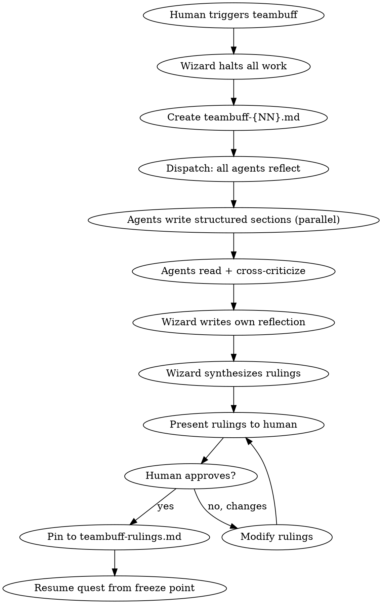

# Design Spec: raid-teambuff — Emergency Team Retrospective

**Date:** 2026-04-10
**Status:** Approved
**Category:** Reusable skill (quest-type agnostic)

## Overview

A side-quest skill that instantly freezes the current quest phase. All agents stop and enter a structured reflection ritual — a round table where every agent examines team dysfunction, token waste, sync problems, and can openly criticize any teammate including the Wizard. Produces a numbered report with binding rulings approved by the human.

## Trigger & Authority

- **Only the human** can trigger teambuff
- Instant and urgent — no confirmation dialog, no waiting for round completion
- The Wizard halts all dispatches immediately upon trigger

## Phase Freeze Behavior

- Current phase, round, and agent assignments are preserved as-is
- No snapshot file needed — raid-session and dungeon files already hold state
- After teambuff concludes, the Wizard resumes from the exact point of interruption
- The raid-session phase field is NOT modified during teambuff

## Process Flow



## Document Structure

### teambuff-{NN}.md

Lives in `{questDir}/` alongside phase files. Numbered sequentially (01, 02, ...).

```markdown
# Teambuff #{NN} — Team Retrospective
## Quest: {quest-name}
## Phase when called: {phase}
## Triggered by: Human

---

### Warrior's Reflection
#### Where I wasted tokens
#### Where I was blocked by another agent
#### What I'd do differently
#### What's working
#### Free thoughts

### Warrior's Criticism
#### On the Wizard
#### On teammates

---

### Archer's Reflection
#### Where I wasted tokens
#### Where I was blocked by another agent
#### What I'd do differently
#### What's working
#### Free thoughts

### Archer's Criticism
#### On the Wizard
#### On teammates

---

### Rogue's Reflection
#### Where I wasted tokens
#### Where I was blocked by another agent
#### What I'd do differently
#### What's working
#### Free thoughts

### Rogue's Criticism
#### On the Wizard
#### On teammates

---

### Wizard's Reflection
#### Where I wasted tokens
#### Where my orchestration failed
#### Where I misjudged agent assignments
#### What I'd do differently
#### What's working
#### Free thoughts

### Wizard's Criticism
#### On teammates

---

### Synthesis — Wizard's Proposed Rulings
1. [Ruling] — Reason
2. [Ruling] — Reason
...

### Human's Verdict
(filled after human reviews and approves)
```

### teambuff-rulings.md

Consolidated active rulings from all teambuffs. The Wizard checks this at every round start.

```markdown
# Active Teambuff Rulings

## From Teambuff #1 (Phase: {phase})
- [Ruling text] — Status: ACTIVE
- [Ruling text] — Status: ACTIVE

## From Teambuff #2 (Phase: {phase})
- [Ruling text] — Status: ACTIVE
- [Ruling text] — Status: SUPERSEDED by #2.3
```

Statuses: ACTIVE, SUPERSEDED (by a later ruling), REVOKED (by human).

## Mode Behavior

| Aspect | Full Raid | Skirmish | Scout |
|--------|-----------|----------|-------|
| Participants | Wizard + 3 agents | Wizard + 2 agents | Wizard self-reflects |
| Cross-criticism | All-vs-all | Between active agents | N/A |
| Rulings | Full synthesis | Condensed | Wizard notes |

## Integration Points

- **raid-session**: no changes — phase stays frozen, teambuff is encapsulated
- **raid-canonical-protocol**: Wizard checks `teambuff-rulings.md` at round start (new behavior to add)
- **Dungeon files**: teambuff files live in `{questDir}/`
- **No phase transition**: teambuff doesn't modify the session phase

## Constraints

- Cannot be triggered before a quest starts (no raid-session = no teambuff)
- Multiple teambuffs allowed per quest (numbered sequentially)
- Rulings from previous teambuffs can be superseded by later ones
- The Wizard must present ALL proposed rulings to the human — no silent enforcement
