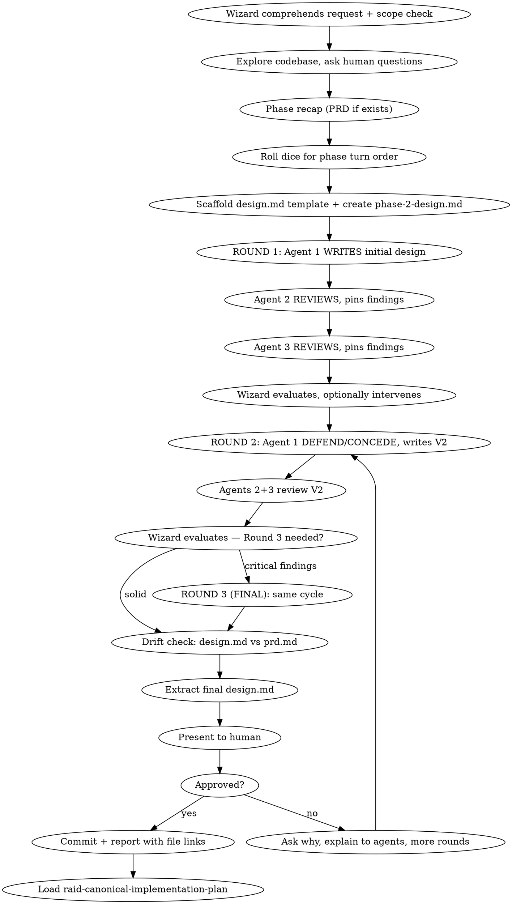

# Raid Design — Phase 2

Turn ideas into battle-tested designs through the writer/reviewer/defend-concede protocol.

<HARD-GATE>
Do NOT write any code, scaffold any project, or take any implementation action until the design is approved and committed.
</HARD-GATE>

## Scope Check

Before dispatching agents, assess scope. If the request describes multiple independent subsystems (e.g., "build a platform with chat, file storage, billing, and analytics"), flag it immediately. Don't spend rounds refining a project that needs decomposition first.

If too large for a single design: decompose into sub-quests with the human. Each sub-quest gets its own design → plan → implementation cycle.

## Process Flow



## Wizard Checklist

1. **Comprehend the request** — read 3 times, identify the real problem beneath the stated one
2. **Scope check** — if multiple independent subsystems, decompose first
3. **Explore project context** — files, docs, recent commits, dependencies, conventions, patterns
4. **Ask clarifying questions** — one at a time to the human, eliminate every ambiguity
5. **Phase recap** — summarize PRD findings and deliverable (read `{questDir}/spoils/prd.md` if it exists). Or summarize the exploration context if PRD was skipped. Present to agents and human.
6. **Roll dice** — randomly shuffle `["warrior", "archer", "rogue"]` for this phase's turn order. Update raid-session via Bash using the jq command from protocol "Dice Roll Reference". Announce: *"The dice have spoken. Turn order for this phase: {agent1} → {agent2} → {agent3}."*
7. **Scaffold documents** — create `{questDir}/spoils/design.md` (template) and `{questDir}/phases/phase-2-design.md` (evolution log)
8. **Run rounds** — see Round Protocol below
9. **Drift check** — compare final design with `prd.md` (if exists). See Drift Detection below.
10. **Extract final** — polish the final version into clean `design.md` from the evolution in `phase-2-design.md`
11. **Present to human** — walk through the design. If not approved: ask why, understand, explain feedback to agents, run more rounds, re-extract. Repeat until approved.
12. **Commit** — `docs(quest-{slug}): phase 2 design — {summary}`
13. **Report** — link both `design.md` and `phase-2-design.md` file paths
14. **Transition** — load `raid-canonical-implementation-plan`

## Round Protocol

### Round 1: Write + Review

**Agent 1 (dice-first) — WRITES the initial design:**
- Receives the PRD (or exploration context), codebase findings, and the `design.md` template
- Writes the complete initial design applying their unique lens
- Signs all work: `@{name} [R1]`
- Output goes to the "Version 1" section of `phase-2-design.md`
- Signals `TURN_COMPLETE:`

**Agent 2 — REVIEWS Agent 1's work:**
- Reads Agent 1's design in `phase-2-design.md`
- Writes review in the "Review — Round 1" section, pins findings
- Challenges gaps, weak assumptions, missing edge cases — from their unique lens
- Signs all findings: `@{name} [R1]`
- Signals `TURN_COMPLETE:`

**Agent 3 — REVIEWS both prior works:**
- Reads Agent 1's design AND Agent 2's review
- Writes their own review section, building on or challenging Agent 2's findings
- Signs all findings: `@{name} [R1]`
- Signals `TURN_COMPLETE:`

**Wizard evaluates Round 1:**
- Reads all work. Ultrathink synthesis.
- Optionally intervenes on the document — with human approval, explaining why. But only if needed; if the document is in good shape, move to Round 2.

### Round 2: Defend/Concede + Review

**Agent 1 — DEFEND or CONCEDE each finding, write Version 2:**
- Reads every finding from Agents 2 and 3
- Responds to **each one** explicitly:
  - `DEFEND:` — counter-evidence showing the approach is correct
  - `CONCEDE:` — acknowledge the issue, commit to addressing it
- Writes Version 2 incorporating all conceded findings
- May intentionally mark specific findings as false positives (with explanation)
- Signs: `@{name} [R2]`
- Signals `TURN_COMPLETE:`

**Agents 2+3 — Review Version 2:**
- Same review pattern as Round 1, but now evaluating the V2 and the defend/concede responses
- Sign: `@{name} [R2]`

**Wizard evaluates Round 2:**
- If no critical or high-relevance findings remain → close
- If breaking concerns exist → announce Round 3 as FINAL: *"This is the final round. Make every move count."*

### Round 3 (if needed): Final Round

Same cycle. Wizard makes clear this is the FINAL round — agents have limited moves, so every one must count. After Round 3, the Wizard closes regardless.

## Evolution Log Structure

`{questDir}/phases/phase-2-design.md` contains the full timeline of the design's evolution:

```markdown
# Phase 2: Design — Evolution Log
## Quest: <task description>
## Quest Type: Canonical Quest
## Turn Order: @{agent1} → @{agent2} → @{agent3}

---

## Version 1 — @{writer} [R1]
<!-- Agent 1 writes the complete initial design here -->

---

## Review — Round 1

### @{reviewer1} [R1] Review
<!-- Agent 2's review findings -->

### @{reviewer2} [R1] Review
<!-- Agent 3's review findings -->

### Wizard [R1] Synthesis
<!-- Wizard's evaluation and any interventions -->

---

## Defend/Concede — @{writer} [R2]
<!-- Agent 1 responds to each finding: DEFEND: or CONCEDE: -->

## Version 2 — @{writer} [R2]
<!-- Agent 1's revised design incorporating conceded findings -->

---

## Review — Round 2

### @{reviewer1} [R2] Review
<!-- Agent 2's review of V2 -->

### @{reviewer2} [R2] Review
<!-- Agent 3's review of V2 -->

### Wizard [R2] Synthesis
<!-- Wizard's evaluation -->

---

## Final Extraction Notes — Wizard
<!-- What was incorporated into design.md and why -->
```

## Design Document Template

Scaffold `{questDir}/spoils/design.md`:

```markdown
# [Feature Name] Design Specification

**Date:** YYYY-MM-DD
**Status:** Draft | Under Review | Approved
**Quest Type:** Canonical Quest

## Problem Statement
## Requirements (numbered, unambiguous)
## Constraints
## Architecture
## File Structure
## Error Handling Strategy
## Testing Strategy
## Edge Cases
## Future Considerations (NOT building now, designing to accommodate)
## Design Decision
### Alternatives Considered (with rejection reasons)
## RULING
```

## What Agents Must Cover

Every agent addresses ALL of these from their assigned angle:

- **Performance** — scale, bottlenecks, complexity
- **Robustness** — retries, fallbacks, graceful degradation
- **Testability** — meaningful tests, mock strategy, test-friendly design
- **Error handling** — what errors occur, how surfaced, UX of failure
- **Edge cases** — empty, null, boundary, Unicode, timezones, large payloads
- **Cascading effects** — blast radius, what else changes
- **Clean architecture** — separation of concerns, single responsibility
- **Dependencies** — version compatibility, security, licensing

## Drift Detection

Before closing, the Wizard compares `design.md` with `prd.md` (if it exists). If the design contradicts or omits a PRD requirement without explicit rationale, that's drift.

If drift detected, present options to the human:
- **(a)** Change PRD to match design — the design exploration revealed the PRD was wrong
- **(b)** Change design to match PRD — the design drifted from the original intent
- **(c)** Something else — explain the situation, let the human decide

## Design Principles

- **Isolation:** Break into units with one clear purpose, well-defined interfaces, testable independently.
- **Encapsulation:** Can someone understand a unit without reading its internals?
- **Size:** When a file grows large, that's a signal it's doing too much.
- **Existing codebases:** Follow existing patterns. Only improve where it serves the current goal.

## Red Flags

| Thought | Reality |
|---------|---------|
| "This is too simple to need a design" | Simple projects hide unexamined assumptions. |
| "I already know the right approach" | Knowing and verifying are different. |
| "The agents all agree after one round" | Minimum 2 rounds. Agreement without challenge is groupthink. |
| "Let me silently ignore that finding" | Every finding must get DEFEND: or CONCEDE:. No silent ignoring. |
| "Good enough, let's move on" | Present to human. Only they decide when it's good enough. |

## Phase Transition

When the design is approved and committed:

1. Update raid-session phase via Bash:
   ```bash
   jq '.phase="plan"' .claude/raid-session > .claude/raid-session.tmp && mv .claude/raid-session.tmp .claude/raid-session
   ```
2. **Commit:** `docs(quest-{slug}): phase 2 design — {summary}`
3. **Report:** Link `design.md` and `phase-2-design.md` file paths to the human.
4. **Load `raid-canonical-implementation-plan` and begin Phase 3.**

## Phase Spoils

**Two outputs:**
- `{questDir}/phases/phase-2-design.md` — Full evolution timeline (all versions, reviews, defend/concede responses)
- `{questDir}/spoils/design.md` — Clean final design specification (wizard-polished)
