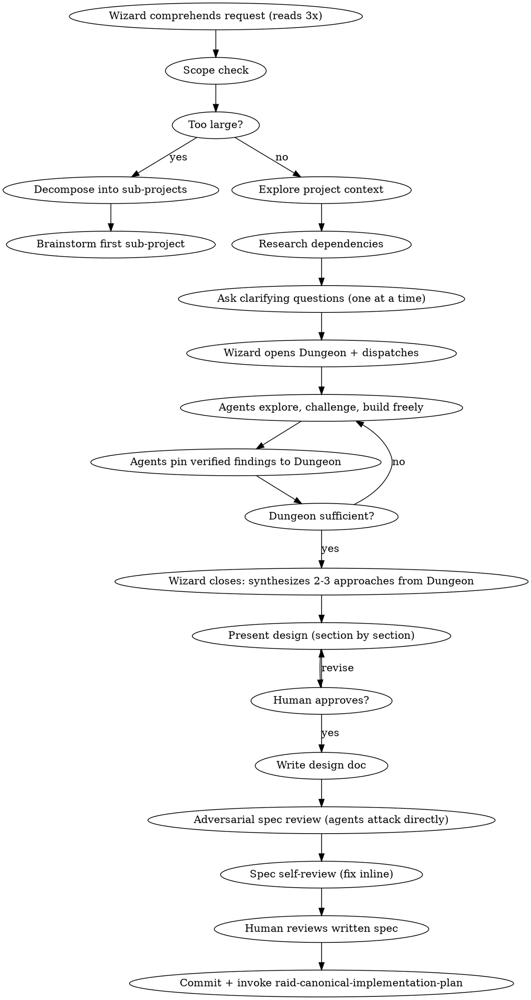

# Raid Design — Phase 2

Turn ideas into battle-tested designs through agent-driven adversarial exploration.

<HARD-GATE>
Do NOT write any code, scaffold any project, or take any implementation action until the Wizard has approved the design and it is committed to git. All assigned agents participate. Agents communicate via SendMessage — do not spawn subagents.
</HARD-GATE>

## Scope Check

Before asking detailed questions, assess scope. If the request describes multiple independent subsystems (e.g., "build a platform with chat, file storage, billing, and analytics"), flag this immediately. Don't spend rounds refining details of a project that needs decomposition first.

If too large for a single design: help the human decompose into sub-quests. Each sub-quest gets its own design → plan → implementation cycle. Design the first sub-quest through the normal flow.

## Mode Behavior

- **Full Raid**: All 3 agents explore from different angles, fight directly, pin findings to Dungeon. Full design doc required.
- **Skirmish**: 2 agents explore and interact, produce a lightweight design+plan combined doc.
- **Scout**: Wizard assesses inline, no design doc required. Skip this skill entirely.

## Process Flow



## Wizard Checklist

Complete in order:

1. **Comprehend the request** — read 3 times, identify the real problem beneath the stated one
2. **Scope check** — if the request describes multiple independent subsystems, flag it immediately
3. **Explore project context** — files, docs, recent commits, dependencies, conventions, patterns
4. **Research dependencies** — API surface, versioning, compatibility, known issues. Read docs COMPLETELY.
5. **Ask clarifying questions** — one at a time to the human, eliminate every ambiguity
6. **Open the Dungeon** — create `{questDir}/phase-2-design.md` (scoreboard) with Phase 2 header, quest, mode. Read `{questDir}/prd.md` if it exists.
7. **Dispatch with angles** — send each agent their angle via SendMessage, then go silent:
   ```
   SendMessage(to="warrior", message="DISPATCH: [quest]. Your angle: [X]...")
   SendMessage(to="archer", message="DISPATCH: [quest]. Your angle: [Y]...")
   SendMessage(to="rogue", message="DISPATCH: [quest]. Your angle: [Z]...")
   ```
8. **Round 1: Research** — agents explore their angles independently in their own panes. Pin findings to Dungeon. Signal `ROUND_COMPLETE:`. **Stop.** Agents do NOT self-initiate cross-testing. You receive messages automatically. Intervene only on protocol violations.
9. **Round 2: Cross-testing** — when ALL agents have flagged `ROUND_COMPLETE:`, dispatch explicit cross-verification assignments. Each agent challenges specific findings from the others. Signal `ROUND_COMPLETE:` when done. **Stop.**
10. **Repeat if needed** — if more exploration is needed, dispatch a new research round with refined angles
11. **Close the phase** — broadcast `HOLD`. Close when Dungeon has sufficient verified findings to form 2-3 approaches
12. **Synthesize approaches** — propose 2-3 approaches from Dungeon evidence, with trade-offs and recommendation
13. **Present design section by section** — scale each section to its complexity (a few sentences if straightforward, up to 200-300 words if nuanced). Ask the human after each section: "Does this look right so far?" Be ready to revise before moving on. Cover: architecture, components, data flow, error handling, testing.
14. **Write design doc** — save to `{questDir}/design.md` (separate from the phase scoreboard). May also create `{questDir}/design-diagrams.md` for mermaid charts.
15. **Adversarial spec review** — agents attack the written spec directly, challenging each other
16. **Spec self-review** — fix issues inline (see checklist below)
17. **Human reviews written spec** — human approves before proceeding
18. **Commit** — `docs(quest-{slug}): phase 2 design — {summary}`
19. **Transition** — invoke `raid-canonical-implementation-plan`

## Opening the Dungeon (Phase Scoreboard)

Create `{questDir}/phase-2-design.md` — this is the **dungeon scoreboard**, not the deliverable. It tracks discoveries, battles, and shared knowledge from agent exploration. Every line in Discoveries/Active Battles must use a recognized prefix (`DUNGEON:`, `UNRESOLVED:`, `BLACKCARD:`, `RESOLVED:`, `TASK:`). Freeform content is only allowed in Resolved, Shared Knowledge, and Escalations sections.

```markdown
# Phase 2: Design
## Quest: <task description from human>
## Mode: <Full Raid | Skirmish>
## PRD: <link to prd.md if it exists>

### Discoveries

### Active Battles

### Resolved

### Shared Knowledge

### Escalations
```

## Question Chain

**Agents NEVER ask the human directly.** The question flow is:
1. Agent discovers they need clarification → sends `WIZARD:` with the question
2. Wizard reasons: can I answer this confidently from the PRD, codebase, or prior context?
3. If yes → answer the agent directly via SendMessage
4. If unsure → digest the question, formulate it clearly for the human, ask human
5. Wizard passes human's answer back to agents with his own interpretation added
6. Goal: minimize questions to human, batch related questions

## Dispatch Pattern

Each agent gets the same objective but a different starting angle. After dispatch, the Wizard goes silent.

**DISPATCH:**

> **@Warrior**: Explore from the data/infrastructure side. What are the hard technical constraints? What schemas, migrations, APIs are needed? What breaks if we get this wrong? Find the structural load-bearing walls. Challenge @Archer and @Rogue's findings directly. Pin verified findings to the Dungeon.
>
> **@Archer**: Explore from the integration/consistency side. How does this fit with existing patterns? What implicit contracts exist? What ripple effects? Trace the dependency chain. Check naming and file structure conventions. Challenge @Warrior and @Rogue's findings directly. Pin verified findings to the Dungeon.
>
> **@Rogue**: Explore from the failure/adversarial side. What assumptions about inputs, state, timing, availability? Build failure scenarios. What does a malicious user do? What does a slow network do? What does concurrent access do? Challenge @Warrior and @Archer's findings directly. Pin verified findings to the Dungeon.
>
> **All**: Read the Dungeon. Build on each other's discoveries. Challenge everything. Pin only what survives. Escalate to me with `WIZARD:` only when genuinely stuck.

## Design Principles

- **Isolation:** Break into units with one clear purpose, well-defined interfaces, testable independently. For each unit: what does it do, how do you use it, what does it depend on?
- **Encapsulation:** Can someone understand a unit without reading its internals? Can you change internals without breaking consumers? If not, the boundaries need work.
- **Size:** Smaller, well-bounded units are easier to reason about. When a file grows large, that's a signal it's doing too much.
- **Existing codebases:** Explore current structure first. Follow existing patterns. Only include targeted improvements where they serve the current goal — no unrelated refactoring.

## What Agents Must Cover

Every agent addresses ALL of these from their assigned angle:

- **Performance** — scale, bottlenecks, complexity
- **Robustness** — retries, fallbacks, graceful degradation
- **Reliability** — blast radius of failure, production-readiness
- **Testability** — meaningful tests, mock strategy, test-friendly design. When `browser.enabled`: can this feature be E2E tested with Playwright? What user flows need browser verification? Are there loading states, client-side routing, or visual states that unit tests can't catch?
- **Error handling** — what errors occur, how surfaced, UX of failure
- **Edge cases** — empty, null, boundary, Unicode, timezones, large payloads
- **Cascading effects** — blast radius, what else changes
- **Clean architecture** — separation of concerns, single responsibility, dependency inversion
- **Modularity & composability** — replaceable, extensible, composable
- **DRY** — duplicating logic? reuse existing code?
- **Dependencies** — version compatibility, security, maintenance, licensing

## The Fight — What Makes It Productive

```
Agents interact DIRECTLY — @Name addressing, building, challenging, roasting:
1. Present findings with EVIDENCE (file paths, docs, concrete examples)
2. Challenge other agents DIRECTLY with COUNTER-EVIDENCE (not opinions)
3. Build on each other's discoveries — BUILDING: with independent verification
4. Go to the EDGES — push every finding to its extreme
5. LEARN from each other — incorporate discoveries into your model
6. Pin verified findings — DUNGEON: only after surviving challenge
7. Challenge weak analysis — back every challenge with your own independent evidence
8. Escalate to Wizard — WIZARD: only when genuinely stuck
```

**The goal is not to tear each other down. The goal is to forge the strongest design by testing it from every angle. The Dungeon captures what survived.**

## Closing the Phase

The Wizard closes when the Dungeon has sufficient verified findings — enough Discoveries, Shared Knowledge, and Resolved battles to synthesize 2-3 approaches.

**How the Wizard knows it's time to close:**
- Dungeon has verified findings covering all major aspects (performance, robustness, testability, etc.)
- Active Battles section is empty or has only minor unresolved points
- Agents are converging — new findings are variations, not revelations
- Shared Knowledge section has the foundational truths the design needs

**RULING:** Synthesize from Dungeon evidence. Propose 2-3 approaches. Recommend one. Archive Dungeon.

## Spec Self-Review

After writing the design doc, the Wizard reviews with fresh eyes:

1. **Placeholder scan:** Any TBD, TODO, incomplete sections, vague requirements? Fix them.
2. **Internal consistency:** Do any sections contradict each other? Architecture match feature descriptions?
3. **Scope check:** Focused enough for a single implementation plan, or needs decomposition?
4. **Ambiguity check:** Could any requirement be interpreted two ways? Pick one and make it explicit.

Fix issues inline.

## Design Document Structure (Phase Deliverable)

The actual design doc is a **separate file**: `{questDir}/design.md`. This file is not validated by the dungeon hook and can contain freeform markdown. Write it when closing the phase — synthesize from scoreboard findings and agent exploration.

```markdown
# [Feature Name] Design Specification

**Date:** YYYY-MM-DD
**Status:** Draft | Under Review | Approved
**Raid Team:** Wizard (dungeon master), [agents used]
**Mode:** Full Raid | Skirmish

## Problem Statement
## Requirements (numbered, unambiguous)
## Constraints
## Dungeon Findings (verified, from Phase 1 Dungeon)
### Key Discoveries (survived cross-testing)
### Lessons Learned (wrong assumptions corrected)
## Design Decision
### Alternatives Considered (2-3 with rejection reasons)
## Architecture
## File Structure
## Error Handling Strategy
## Testing Strategy
## Edge Cases
## Future Considerations (NOT building now, designing to accommodate)
## RULING
```

## Red Flags — Thoughts That Signal Violations

| Thought | Reality |
|---------|---------|
| "This is too simple to need a design" | Simple projects are where unexamined assumptions cause the most waste. |
| "I already know the right approach" | Knowing and verifying are different. Propose 2-3 anyway. |
| "Let's just start coding and figure it out" | Code without design becomes the design. And it's usually wrong. |
| "The agents all agree, let's move on" | Agreement without challenge is groupthink. Did they actually cross-test? |
| "I'll wait for the Wizard to tell me what to do" | You own the phase. Explore, challenge, build. Self-organize. |
| "Let me just post everything to the Dungeon" | Only verified, challenged findings get pinned. |
| "I need the Wizard to mediate this disagreement" | Talk to the other agent directly first. Escalate only if stuck. |

## Escalation

If the team is stuck on a fundamental design choice after genuine direct debate:
1. Present the top 2 options with trade-offs to the human
2. Let the human decide
3. Never ask the human to resolve something the team should handle

---

## Phase Transition

When the design is approved and committed:

1. Update `.claude/raid-session` phase via Bash (write gate blocks Write/Edit on this file):
   ```bash
   jq '.phase="plan"' .claude/raid-session > .claude/raid-session.tmp && mv .claude/raid-session.tmp .claude/raid-session
   ```
2. **Commit:** `docs(quest-{slug}): phase 2 design — {summary}`
3. **Send phase report to human:** summarize key design decisions, trade-offs resolved, what's next
4. **Load the `raid-canonical-implementation-plan` skill now and begin Phase 3.**

Do not wait. Do not ask. The next action after committing the design doc is loading the next skill.
