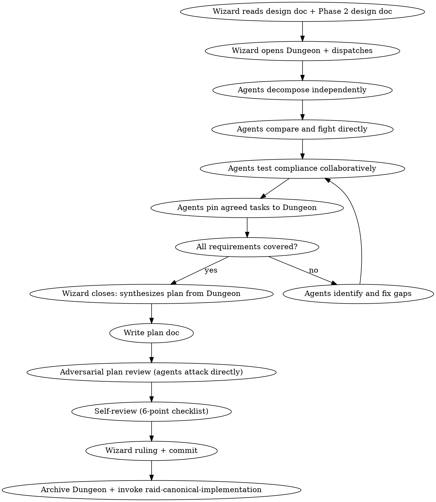

# Raid Implementation Plan — Phase 3

Break the design into bite-sized, battle-tested tasks through agent-driven adversarial decomposition.

<HARD-GATE>
Do NOT start implementation until the plan is approved by the Wizard and committed to git. All assigned agents participate in plan creation AND review. No subagents.
</HARD-GATE>

## Mode Behavior

- **Full Raid**: All 3 agents decompose independently, then fight over the plan directly. Full plan doc.
- **Skirmish**: 2 agents. Plan is combined with the design doc into one lightweight document.
- **Scout**: Skip this skill. Wizard creates inline tasks directly.

## Process Flow



## Wizard Checklist

1. **Read the approved design doc** — every requirement, every constraint
2. **Read the Phase 2 design doc** — carry forward verified knowledge from `{questDir}/design.md` (the deliverable) and `{questDir}/phase-2-design.md` (the scoreboard)
3. **Open the Dungeon** — create `{questDir}/phase-3-plan.md` with Phase 3 header
4. **Dispatch decomposition** — all agents decompose independently with different angles, then interact directly (round-based)
5. **Observe the fight** — agents test each other's plans, argue ordering, coverage, naming. Intervene only on triggers.
6. **Close the phase** — when Dungeon has complete, verified task list
7. **Synthesize** — write plan doc from Dungeon evidence. Create individual task files: `{questDir}/phase-3-plan-task-NN.md`
8. **Adversarial plan review** — agents attack the written plan directly
9. **Self-review** — 6-point checklist (see below)
10. **Wizard ruling** — final plan approval
11. **Commit** — `docs(quest-{slug}): phase 3 plan — {N} tasks, {summary}`
12. **Transition** — invoke `raid-canonical-implementation` and begin Phase 4

## Opening the Dungeon

Create `{questDir}/phase-3-plan.md`:

```markdown
# Phase 3: Implementation Plan
## Quest: Decompose <design topic> into implementation tasks
## Mode: <Full Raid | Skirmish>

### Discoveries

### Active Battles

### Resolved

### Shared Knowledge

### Escalations
```

## File Structure Mapping

Before defining tasks, map ALL files to be created or modified:

```markdown
## File Map

| File | Action | Responsibility |
|------|--------|---------------|
| `src/auth/handler.ts` | Create | Token validation and refresh |
| `src/auth/types.ts` | Create | Auth types and interfaces |
| `tests/auth/handler.test.ts` | Create | Unit tests for handler |
| `src/middleware.ts` | Modify (L45-60) | Add auth middleware hook |
```

- Each file should have one clear responsibility
- Files that change together should live together
- Follow existing codebase patterns — don't restructure unless it serves the current goal
- This map informs the task decomposition: each task should produce self-contained changes

## Plan Document Header

Every plan MUST start with:

```markdown
# [Feature Name] Implementation Plan

**Goal:** [One sentence describing what this builds]
**Architecture:** [2-3 sentences about approach]
**Tech Stack:** [Key technologies/libraries]
```

## Dispatch for Decomposition

**DISPATCH:**

> **@Warrior**: Decompose into tasks. Focus on structural ordering — what MUST be built first? Hard dependencies? Critical path? Include tests for every task. Challenge @Archer and @Rogue's decompositions directly. Pin agreed tasks to Dungeon.
>
> **@Archer**: Decompose into tasks. Focus on completeness and consistency — does every requirement have a task? Are interfaces well-defined across tasks? Are naming patterns and file structure consistent with the codebase? Challenge @Warrior and @Rogue directly. Pin agreed tasks to Dungeon.
>
> **@Rogue**: Decompose into tasks. Focus on hidden complexity — which tasks are deceptively hard? Where will the implementer guess wrong? Which tests miss the failure path? Challenge @Warrior and @Archer directly. Pin agreed tasks to Dungeon.
>
> **All**: Read the Phase 1 archived Dungeon for design knowledge. Interact directly. Build on each other's decompositions. Pin agreed tasks with `DUNGEON:`. Escalate to me with `WIZARD:` only when genuinely stuck.

## Collaborative Compliance Testing (Agent-Driven)

After independent decomposition, agents fight directly over the plan:

1. **Compare decompositions** — address each other by name, argue where they agree (high confidence) and disagree (needs resolution)
2. **Test compliance with design** — every requirement verified against the plan. Line by line. No gaps. Agents cross-check each other.
3. **Test naming consistency** — agents challenge each other's naming choices against codebase patterns
4. **Test file system consistency** — file paths follow project structure, module organization clean
5. **Test coverage** — agents challenge whether tests cover failure paths, not just happy paths
6. **Test ordering** — agents argue dependency order, build-won't-break guarantees
7. **Learn from disagreements** — resolutions often reveal a better approach. Pin lessons to Dungeon.

**Agents do this DIRECTLY with each other. The Wizard observes and intervenes only on triggers.**

## Task Granularity

**Each step is one action (2-5 minutes):**
- "Write the failing test" — step
- "Run it to verify it fails" — step
- "Implement minimal code to pass" — step
- "Run tests to verify pass" — step
- "Commit" — step

### Browser Test Tasks (when `browser.enabled` in raid.json)

When a task involves browser-facing code, the plan must include browser test steps alongside unit tests:
- "Write failing Playwright test (`tests/e2e/<feature>.spec.ts`)" — step
- "Run `{execCommand} playwright test` to verify it fails" — step
- "Implement the feature" — step
- "Run Playwright test to verify it passes" — step
- "Run full suite (unit + browser) to verify no regressions" — step

Not every task needs a browser test. Include them for user-facing flows, UI interactions, client-side routing, and visual state changes. State reasoning — challengers will attack this decision.

## Task Structure

````markdown
### Task N: [Component Name]

**Files:**
- Create: `exact/path/to/file.ext`
- Modify: `exact/path/to/existing.ext`
- Test: `tests/exact/path/to/test.ext`

**Acceptance Criteria:**
- [ ] [Specific, verifiable criterion]
- [ ] All tests pass
- [ ] No regressions
- [ ] Naming follows established patterns

**Steps:**
- [ ] Step 1: Write the failing test
- [ ] Step 2: Run test, verify it fails for the right reason
- [ ] Step 3: Write minimal implementation
- [ ] Step 4: Run test, verify it passes + full suite passes
- [ ] Step 5: Commit with descriptive message
````

## No Placeholders — Ever

These are plan failures. Never write:
- "TBD", "TODO", "implement later", "fill in details"
- "Add appropriate error handling" (specify WHAT error handling)
- "Write tests for the above" (without actual test code)
- "Similar to Task N" (repeat the code — the implementer may read tasks out of order)
- "Handle edge cases" (specify WHICH edge cases)
- Steps that describe what to do without showing how
- References to undefined types, functions, or methods

**Violating the letter of the "no placeholders" rule is violating its spirit.**

## Self-Review (6-Point Checklist)

After writing the complete plan:

1. **Spec coverage:** Skim each requirement in the design doc. Point to the task that implements it. List any gaps.
2. **Placeholder scan:** Search for TBD, TODO, vague descriptions, missing code. Fix them.
3. **Type/name consistency:** Do types, method signatures, property names match across ALL tasks?
4. **File structure consistency:** Do all file paths follow the project's conventions?
5. **Test quality:** Does every task have tests? Do tests cover failure paths? When `browser.enabled`: do browser-facing tasks include Playwright tests?
6. **Ordering:** Can each task be built and committed independently without breaking the build?

Fix issues inline. If a spec requirement has no task, add the task.

## Red Flags

| Thought | Reality |
|---------|---------|
| "The plan is obvious from the design" | Plans expose complexity that specs hide. Decompose anyway. |
| "We can figure out the details during implementation" | Details in implementation = placeholders in the plan. |
| "I'll wait for the Wizard to synthesize" | You own the phase. Debate with teammates directly. |
| "These tasks are similar enough to batch" | Each task must be independently buildable and testable. |
| "Tests can be added later" | TDD means tests are in the plan. No test = no task. |
| "The naming will be consistent enough" | Check it explicitly. Naming drift is the #1 source of bugs. |

---

## Phase Transition

When the plan is approved and committed:

1. Update `.claude/raid-session` phase via Bash (write gate blocks Write/Edit on this file):
   ```bash
   jq '.phase="implementation"' .claude/raid-session > .claude/raid-session.tmp && mv .claude/raid-session.tmp .claude/raid-session
   ```
2. **Commit**: `docs(quest-{slug}): phase 3 plan — {N} tasks, {summary}`
3. **Send phase report to human**: task count, dependency graph, estimated scope
4. **Load the `raid-canonical-implementation` skill now and begin Phase 4.**

Do not wait. Do not ask. The next action after committing the plan doc is loading the next skill.
