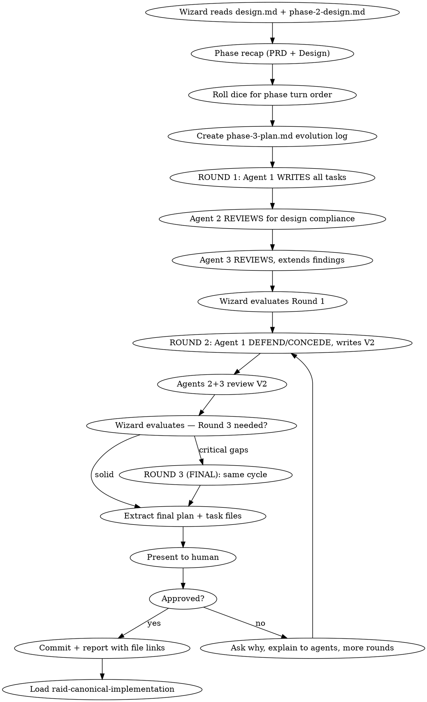

# Raid Implementation Plan — Phase 3

Break the design into bite-sized, battle-tested tasks through the writer/reviewer/defend-concede protocol.

<HARD-GATE>
Do NOT start implementation until the plan is approved by the human and committed to git.
</HARD-GATE>

## Process Flow



## Wizard Checklist

1. **Read the approved design** — `{questDir}/spoils/design.md` (deliverable) and `{questDir}/phases/phase-2-design.md` (evolution log). Every requirement, every constraint.
2. **Phase recap** — summarize PRD + Design findings. Present what carries forward to agents and human.
3. **Roll dice** — randomly shuffle `["warrior", "archer", "rogue"]` for this phase's turn order. Update raid-session via Bash using the jq command from protocol "Dice Roll Reference". Announce: *"The dice have spoken. Turn order for this phase: {agent1} → {agent2} → {agent3}."*
4. **Create evolution log** — `{questDir}/phases/phase-3-plan.md`
5. **Run rounds** — see Round Protocol below
6. **Extract final** — write individual task files `{questDir}/spoils/tasks/phase-3-plan-task-NN.md` from the evolution log
7. **Self-review** — 6-point checklist (see below)
8. **Present to human** — if not approved, ask why, explain feedback to agents, run more rounds
9. **Commit** — `docs(quest-{slug}): phase 3 plan — {N} tasks`
10. **Report** — link task files and `phases/phase-3-plan.md` to the human
11. **Transition** — load `raid-canonical-implementation`

## Dispatch Templates

Dispatch carries only dynamic context. Detailed instructions are embedded in the scaffolded phase file.

**Writer (Round 1, Turn 1):**
```
TURN_DISPATCH: Phase 3 Plan, Round 1, Turn 1.
Quest: {description}
Phase recap: {summary of PRD + Design findings}
Your role: WRITER. Your section: "Version 1 — @{name} [R1]"

FIRST: Read the FULL document at {questDir}/phases/phase-3-plan.md before writing anything.
  Understand the structure, read the embedded instructions in your section, and read the
  Writing Guidance at the bottom. Then read {questDir}/spoils/design.md + codebase.
THEN: Write in your designated section following the embedded instructions.
```

**Reviewer (Round 1, Turns 2-3):**
```
TURN_DISPATCH: Phase 3 Plan, Round 1, Turn {T}.
Quest: {description}
{prior agent} wrote the task decomposition.
Your role: REVIEWER. Your section: "@{name} [R1] Review"

FIRST: Read the FULL document at {questDir}/phases/phase-3-plan.md before writing anything.
  Read the tasks, read the embedded instructions in your review section.
  Cross-check against {questDir}/spoils/design.md for compliance.
THEN: Write your review in your designated section following the embedded instructions.
```

**Writer (Round 2+, Defend/Concede):**
```
TURN_DISPATCH: Phase 3 Plan, Round {N}, Turn 1.
Quest: {description}
Round {N-1} reviews are in. 
Your role: WRITER. Sections: "Defend/Concede" then "Version {N}"

FIRST: Read the FULL document at {questDir}/phases/phase-3-plan.md.
  Read every finding. Read the embedded instructions in your sections.
THEN: Respond to each finding, then write Version {N}.
```

## Evolution Log Template

Scaffold `{questDir}/phases/phase-3-plan.md`. Replace `{writer}`, `{reviewer1}`, `{reviewer2}` with actual agent names from the dice roll:

```markdown
# Phase 3: Plan — Evolution Log

## Quest: [quest description]
## Quest Type: Canonical Quest
## Turn Order: @{agent1} → @{agent2} → @{agent3}

## References
- PRD: `{questDir}/spoils/prd.md` (if exists)
- Design: `{questDir}/spoils/design.md`
- Design Evolution: `{questDir}/phases/phase-2-design.md`

## Quest Goal
<!-- Wizard writes 2-3 lines: what this plan must produce,
     how many requirements from the design need task coverage,
     and any dependency constraints discovered during design -->

---

## File Map — @{writer} [R1]

<!-- @{writer}: Map ALL files before writing tasks. Each task should produce
     self-contained changes to a subset of these files.
     | File | Action | Purpose |
     |------|--------|---------|
     Files that change together belong in the same task. -->

## Version 1 — @{writer} [R1]

<!-- @{writer}: WRITER. Decompose design.md into numbered tasks.
     Every requirement maps to a task. Dependency order — each buildable independently.
     Task granularity: one TDD cycle (2-5 min). Use this structure per task: -->

### Task 1: [Component Name]

**Files:**
- Create: `exact/path/to/file.ext`
- Modify: `exact/path/to/existing.ext`
- Test: `tests/exact/path/to/test.ext`

**Acceptance Criteria:**
<!-- Each criterion must be verifiable by running a test or checking a concrete output.
     Bad: "handles errors properly"
     Good: "returns 401 with {error: 'token_expired'} when JWT is past expiry"
     Good: "throws ValidationError when input.name exceeds 255 characters" -->
- [ ] [Specific, verifiable criterion]
- [ ] All tests pass
- [ ] No regressions

**Steps:**
- [ ] Write the failing test
- [ ] Run test, verify it fails for the right reason
- [ ] Write minimal implementation to pass
- [ ] Run test + full suite, verify all pass
- [ ] Commit: `feat(scope): descriptive message`

**Implementation Notes:**
<!-- Left empty. Agent fills this AFTER implementing the task in Phase 4.
     When filling: state what was built, key decisions made during implementation,
     and any deviations from the plan with reasoning. -->

### Task 2: [Component Name]
<!-- Continue numbering. Same structure for every task. -->

---

## Review — Round 1

### @{reviewer1} [R1] Review

<!-- @{reviewer1}: REVIEWER. Check @{writer}'s tasks against design.md:
     COVERAGE (every requirement → task), ORDERING (buildable independently),
     GRANULARITY (one TDD cycle each), CRITERIA (verifiable), FILES (conventions),
     TESTS (failure paths), NAMING (consistent), NO PLACEHOLDERS (TBD/TODO).
     For each finding: WHAT, WHY, WHAT should change. -->

### @{reviewer2} [R1] Review

<!-- @{reviewer2}: REVIEWER. Read tasks + @{reviewer1}'s review.
     Find what was missed. Challenge with evidence. Don't repeat — add new value. -->

### Wizard [R1] Synthesis

---

## Defend/Concede — @{writer} [R2]

<!-- @{writer}: Read EVERY finding from @{reviewer1} and @{reviewer2}.
     Respond to EACH finding explicitly:

     DEFEND: [finding reference] — [counter-evidence]
     CONCEDE: [finding reference] — [what you'll change in V2]

     No silent ignoring. Every finding gets a response. -->

## Version 2 — @{writer} [R2]

<!-- @{writer}: Revised task list incorporating all conceded findings.
     Mark what changed from V1 (added tasks, reordered, revised criteria). -->

[Same task structure as Version 1]

---

## Review — Round 2

### @{reviewer1} [R2] Review
<!-- @{reviewer1}: Focus on V2 changes. Were findings addressed? New issues? -->

### @{reviewer2} [R2] Review
<!-- @{reviewer2}: Same focus. Challenge defenses. Confirm concessions incorporated. -->

### Wizard [R2] Synthesis

---

## Final Extraction Notes — Wizard
<!-- How many tasks extracted. Dependency graph summary.
     What changed between V1 and final. -->

---

## Writing Guidance
- Sign all work: `@{name} [R{N}]`
- Evidence-based: reference design.md section numbers, file paths, concrete examples
- No placeholders: no TBD, TODO, "implement later", "similar to Task N", "handle edge cases"
- Each task must be independently buildable and committable
- Acceptance criteria must be verifiable by running a test or checking concrete output
- Reviewers: respond to EVERY finding — no silent ignoring
```

**Round 3:** If needed, wizard appends Round 3 sections before dispatching. Do NOT pre-scaffold.

### Browser Test Tasks (when `browser.enabled` in raid.json)

When a task involves browser-facing code, the plan must include Playwright test steps alongside unit tests. Not every task needs browser tests — include them for user-facing flows, UI interactions, client-side routing, and visual state changes.

## No Placeholders — Ever

These are plan failures. Never write:
- "TBD", "TODO", "implement later", "fill in details"
- "Add appropriate error handling" (specify WHAT error handling)
- "Similar to Task N" (repeat — the implementer may read tasks out of order)
- "Handle edge cases" (specify WHICH edge cases)
- References to undefined types, functions, or methods

## Self-Review (6-Point Checklist)

After writing the complete plan:

1. **Spec coverage:** Skim each requirement in `spoils/design.md`. Point to the task that implements it. List any gaps.
2. **Placeholder scan:** Search for TBD, TODO, vague descriptions. Fix them.
3. **Type/name consistency:** Do types, method signatures, property names match across ALL tasks?
4. **File structure consistency:** Do all file paths follow the project's conventions?
5. **Test quality:** Does every task have tests? Do tests cover failure paths?
6. **Ordering:** Can each task be built and committed independently without breaking the build?

## Red Flags

| Thought | Reality |
|---------|---------|
| "The plan is obvious from the design" | Plans expose complexity that specs hide. |
| "We can figure out details during implementation" | Details in implementation = placeholders in the plan. |
| "These tasks are similar enough to batch" | Each task must be independently buildable and testable. |
| "Tests can be added later" | TDD means tests are in the plan. No test = no task. |
| "Let me silently ignore that finding" | Every finding must get DEFEND: or CONCEDE:. |

---

## Phase Transition

When the plan is approved and committed:

1. Update raid-session phase via Bash:
   ```bash
   jq '.phase="implementation"' .claude/raid-session > .claude/raid-session.tmp && mv .claude/raid-session.tmp .claude/raid-session
   ```
2. **Commit:** `docs(quest-{slug}): phase 3 plan — {N} tasks`
3. **Report:** Link task files and `phases/phase-3-plan.md` file paths to the human.
4. **Load `raid-canonical-implementation` and begin Phase 4.**

## Phase Spoils

**Two outputs:**
- `{questDir}/phases/phase-3-plan.md` — Full evolution timeline (all versions, reviews, defend/concede)
- `{questDir}/spoils/tasks/phase-3-plan-task-NN.md` — Individual task files with files, acceptance criteria, TDD steps
