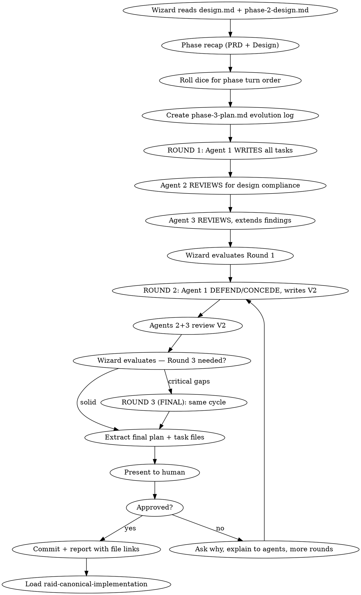

# Raid Implementation Plan — Phase 3

Break the design into bite-sized, battle-tested tasks through the writer/reviewer/defend-concede protocol.

<HARD-GATE>
Do NOT start implementation until the plan is approved by the human and committed to git.
</HARD-GATE>

## Process Flow



## Wizard Checklist

1. **Read the approved design** — `{questDir}/spoils/design.md` (deliverable) and `{questDir}/phases/phase-2-design.md` (evolution log). Every requirement, every constraint.
2. **Phase recap** — summarize PRD + Design findings. Present what carries forward to agents and human.
3. **Roll dice** — randomly shuffle `["warrior", "archer", "rogue"]` for this phase's turn order. Update raid-session via Bash using the jq command from protocol "Dice Roll Reference". Announce: *"The dice have spoken. Turn order for this phase: {agent1} → {agent2} → {agent3}."*
4. **Create evolution log** — `{questDir}/phases/phase-3-plan.md`
5. **Run rounds** — see Round Protocol below
6. **Extract final** — write individual task files `{questDir}/spoils/tasks/phase-3-plan-task-NN.md` from the evolution log
7. **Self-review** — 6-point checklist (see below)
8. **Present to human** — if not approved, ask why, explain feedback to agents, run more rounds
9. **Commit** — `docs(quest-{slug}): phase 3 plan — {N} tasks`
10. **Report** — link task files and `phases/phase-3-plan.md` to the human
11. **Transition** — load `raid-canonical-implementation`

## Round Protocol

### Round 1: Write + Review

**Agent 1 (dice-first) — WRITES all numbered tasks:**
- Receives `spoils/design.md` and codebase context
- Writes the complete task list with file maps, acceptance criteria, and TDD steps
- Applies their unique lens to the decomposition
- Signs: `@{name} [R1]`
- Output goes to "Version 1" section of `phase-3-plan.md`

**Agent 2 — REVIEWS for design compliance:**
- Reads Agent 1's task list against `spoils/design.md` requirement by requirement
- Pins findings: missing requirements, ordering problems, naming drift, test gaps
- Signs: `@{name} [R1]`

**Agent 3 — REVIEWS, extends findings:**
- Reads tasks AND Agent 2's review
- Adds own findings from their unique lens
- Signs: `@{name} [R1]`

### Round 2: Defend/Concede + Review

**Agent 1 — DEFEND or CONCEDE each finding, write Version 2:**
- Responds to every finding explicitly
- Writes revised task list incorporating conceded findings
- Signs: `@{name} [R2]`

**Agents 2+3 — Review Version 2** (same pattern as Round 1)

**Wizard evaluates** — close or announce Round 3 as FINAL.

## File Structure Mapping

Before defining tasks, map ALL files to be created or modified:

```markdown
## File Map

| File | Action | Responsibility |
|------|--------|---------------|
| `src/auth/handler.ts` | Create | Token validation and refresh |
| `tests/auth/handler.test.ts` | Create | Unit tests for handler |
| `src/middleware.ts` | Modify (L45-60) | Add auth middleware hook |
```

## Task Granularity

**Each step is one action (2-5 minutes):**
- "Write the failing test" — step
- "Run it to verify it fails" — step
- "Implement minimal code to pass" — step
- "Run tests to verify pass" — step
- "Commit" — step

### Browser Test Tasks (when `browser.enabled` in raid.json)

When a task involves browser-facing code, include Playwright test steps alongside unit tests. Not every task needs browser tests — include them for user-facing flows, UI interactions, client-side routing, and visual state changes.

## Task Structure

````markdown
### Task N: [Component Name]

**Files:**
- Create: `exact/path/to/file.ext`
- Modify: `exact/path/to/existing.ext`
- Test: `tests/exact/path/to/test.ext`

**Acceptance Criteria:**
- [ ] [Specific, verifiable criterion]
- [ ] All tests pass
- [ ] No regressions
- [ ] Naming follows established patterns

**Steps:**
- [ ] Step 1: Write the failing test
- [ ] Step 2: Run test, verify it fails for the right reason
- [ ] Step 3: Write minimal implementation
- [ ] Step 4: Run test, verify it passes + full suite passes
- [ ] Step 5: Commit with descriptive message

**Implementation Notes:**
<!-- Agent fills this after implementing the task -->
````

## No Placeholders — Ever

These are plan failures. Never write:
- "TBD", "TODO", "implement later", "fill in details"
- "Add appropriate error handling" (specify WHAT error handling)
- "Similar to Task N" (repeat — the implementer may read tasks out of order)
- "Handle edge cases" (specify WHICH edge cases)
- References to undefined types, functions, or methods

## Self-Review (6-Point Checklist)

After writing the complete plan:

1. **Spec coverage:** Skim each requirement in `spoils/design.md`. Point to the task that implements it. List any gaps.
2. **Placeholder scan:** Search for TBD, TODO, vague descriptions. Fix them.
3. **Type/name consistency:** Do types, method signatures, property names match across ALL tasks?
4. **File structure consistency:** Do all file paths follow the project's conventions?
5. **Test quality:** Does every task have tests? Do tests cover failure paths?
6. **Ordering:** Can each task be built and committed independently without breaking the build?

## Red Flags

| Thought | Reality |
|---------|---------|
| "The plan is obvious from the design" | Plans expose complexity that specs hide. |
| "We can figure out details during implementation" | Details in implementation = placeholders in the plan. |
| "These tasks are similar enough to batch" | Each task must be independently buildable and testable. |
| "Tests can be added later" | TDD means tests are in the plan. No test = no task. |
| "Let me silently ignore that finding" | Every finding must get DEFEND: or CONCEDE:. |

---

## Phase Transition

When the plan is approved and committed:

1. Update raid-session phase via Bash:
   ```bash
   jq '.phase="implementation"' .claude/raid-session > .claude/raid-session.tmp && mv .claude/raid-session.tmp .claude/raid-session
   ```
2. **Commit:** `docs(quest-{slug}): phase 3 plan — {N} tasks`
3. **Report:** Link task files and `phases/phase-3-plan.md` file paths to the human.
4. **Load `raid-canonical-implementation` and begin Phase 4.**

## Phase Spoils

**Two outputs:**
- `{questDir}/phases/phase-3-plan.md` — Full evolution timeline (all versions, reviews, defend/concede)
- `{questDir}/spoils/tasks/phase-3-plan-task-NN.md` — Individual task files with files, acceptance criteria, TDD steps
