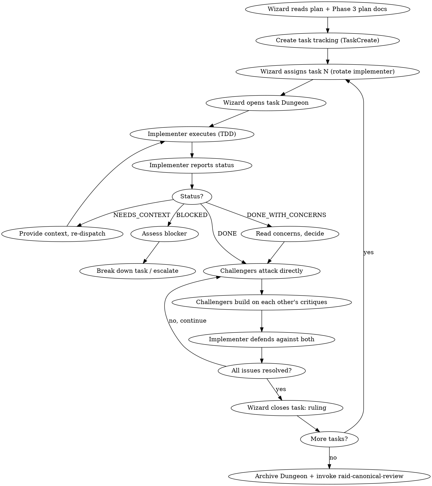

# Raid Implementation — Phase 4

One builds, two attack — and the attackers attack each other's reviews too. Every implementation earns its approval through direct adversarial pressure.

<HARD-GATE>
Do NOT implement without an approved plan (except Scout mode). Do NOT skip TDD. Do NOT let any implementation pass unchallenged. Agents communicate via SendMessage — do not spawn subagents. Use `raid-tdd` skill for all test-driven development. Use `raid-verification` before any completion claims.
</HARD-GATE>

## Mode Behavior

- **Full Raid**: 1 implements, 2 challenge (and challenge each other's reviews). Rotate implementer.
- **Skirmish**: 1 implements, 1 challenges. Swap roles each task.
- **Scout**: 1 agent implements. Wizard reviews. Self-challenge ruthlessly.

TDD is enforced in ALL modes. This is an Iron Law.

## Process Flow



## Step 0: Critical Plan Review (before any implementation)

Each agent MUST review the plan independently before implementing:
- Are there concerns about feasibility or missing dependencies?
- Are any steps unclear or ambiguous?
- Does the plan match the design doc?
- Are the TDD steps complete with actual test code?

If concerns: raise via `WIZARD:` before starting. Fix the plan first. Never force through a flawed plan.

**Branch guard:** Never implement on main/master without explicit human consent. Create a feature branch first.

## Wizard Checklist

1. **Read the plan** — extract all tasks, dependencies, ordering
2. **Read Phase 3 plan docs** — carry forward context from `{questDir}/phase-3-plan.md` and task files
3. **Dispatch plan review** — each agent reviews plan independently, raises concerns via WIZARD:
4. **Resolve concerns** — fix plan issues before any implementation begins
4. **Browser setup (if `browser.enabled` in raid.json)**:
   - Check if `browser.startup` exists — if null, invoke `raid-browser` startup discovery FIRST
   - Check if Playwright is installed — if not, first task becomes "scaffold Playwright"
   - Assign port from `browser.portRange` to implementer
5. **Create task tracking** — use TaskCreate for every plan task
6. **Per task:**
   - Assign implementer via `TaskUpdate(taskId="N", owner="warrior")`
   - Notify via `SendMessage(to="warrior", message="Task N is yours. TDD enforced.")`
   - Alert challengers: `SendMessage(to="archer", message="Warrior implementing Task N. Stand by to challenge.")`
   - Observe messages (auto-delivered) + Dungeon updates
   - Close with ruling via SendMessage to all agents
7. **Track progress** — mark complete only after Wizard ruling per task
8. **After all tasks** — archive Dungeon, invoke `raid-canonical-review`

## The Implementation Gauntlet (per task)

### Step 1: Wizard Assigns + Opens Dungeon

One agent implements. Others prepare to attack. **Rotate the implementer** across tasks.

Assign via task list and notify via SendMessage:
```
TaskUpdate(taskId="N", owner="warrior")
SendMessage(to="warrior", message="Task N is yours. TDD enforced. Commit when green. Report status when done.")
SendMessage(to="archer", message="Warrior is implementing Task N. Challenge when they report done.")
SendMessage(to="rogue", message="Warrior is implementing Task N. Challenge when they report done.")
```

Phase 4 uses `{questDir}/phase-4-implementation.md` as the implementation log. The Wizard announces each task assignment via SendMessage. Agents flag `ROUND_COMPLETE:` when done with their task.

### Step 2: Implementer Executes (TDD)

Following `raid-tdd` strictly:
1. Write the failing test from the plan
2. Run test command from `.claude/raid.json` — verify it fails for the RIGHT reason
3. Write minimal code to pass
4. Run — verify pass
5. Run FULL test suite — verify no regressions
6. Self-review against acceptance criteria
7. Commit: `feat(scope): descriptive message`

**Browser tasks (if `browser.enabled` and task involves browser-facing code):**
- BOOT app on assigned port before browser TDD (invoke `raid-browser`)
- Use Playwright MCP tools to explore while authoring tests
- CLEANUP after task is complete (or on failure — cleanup always runs)

Report status: **DONE** | **DONE_WITH_CONCERNS** | **NEEDS_CONTEXT** | **BLOCKED**

### Step 3: Challengers Attack Directly

Challengers work in their own tmux panes. They communicate directly with the implementer and each other via SendMessage:

1. **Read ACTUAL CODE** (not the implementer's report — reports lie)
2. **Challenge the implementer directly:** `CHALLENGE: @Warrior, your implementation at handler.js:23 doesn't validate...`
3. **Build on each other's critiques:** `BUILDING: @Archer, your naming drift finding — the inconsistency also affects the test at...`
4. **Challenge weak implementations:** `CHALLENGE: @Rogue, you claimed this handles concurrent access but there's no lock at...`
5. **Pin verified issues to Dungeon:** `DUNGEON: Confirmed issue — handler.js:23 missing validation [verified by @Archer and @Rogue]`

**Browser verification (if `browser.enabled`):**
- Challengers can BOOT on their own ports to run Playwright tests independently
- Verify tests pass without flakiness (run 3x if suspect)
- Explore the feature manually via Playwright MCP to find gaps the tests missed
- Each challenger CLEANUPS their own instance when done

**Challengers check:**
- Spec compliance — does it match the task spec line by line?
- Design doc compliance — does it match the design requirements?
- Edge cases — what inputs break it?
- Test quality — do tests prove correctness or just confirm happy path?
- Naming consistency — do new names follow established patterns?
- File structure — does new code follow project conventions?

### Step 4: Implementer Defends

The implementer defends against BOTH challengers simultaneously:
- Respond to each challenge with evidence or concede immediately
- Fix conceded issues
- Re-run all tests
- Pin resolved issues to Dungeon: `DUNGEON: Resolved — added validation at handler.js:23 [tests pass]`

### Step 5: Wizard Closes Task

Broadcast the ruling:
```
SendMessage(to="warrior", message="RULING: Task N [approved | needs fixes].")
SendMessage(to="archer", message="RULING: Task N [approved | needs fixes].")
SendMessage(to="rogue", message="RULING: Task N [approved | needs fixes].")
```

The Wizard closes when messages + Dungeon show all issues resolved and challengers have no remaining critiques.

## Handling Implementer Status

| Status | Action |
|--------|--------|
| **DONE** | Challengers attack directly |
| **DONE_WITH_CONCERNS** | Read concerns. If correctness: address before attack. If observations: note and proceed. |
| **NEEDS_CONTEXT** | Provide missing information. Re-dispatch. |
| **BLOCKED** | 1) Context → provide more. 2) Too complex → break into subtasks. 3) Plan wrong → fix plan. |

**Never ignore an escalation.** If the implementer says it's stuck, something needs to change.

## When to STOP Executing

STOP implementing immediately when:
- Missing dependency not covered in plan
- Test fails for unexpected reason (not the expected "right" failure)
- Instruction is ambiguous — two valid interpretations exist
- Verification fails repeatedly (2+ times on same step)
- Implementation diverges significantly from plan

**Ask via `WIZARD:` rather than guessing.** Don't force through blockers — they indicate plan gaps, not agent weakness. The Wizard escalates to the human if needed.

## Quality Gates Per Task

- [ ] Tests written BEFORE implementation (TDD)
- [ ] Tests fail for the right reason
- [ ] Tests pass after implementation
- [ ] Full test suite passes (no regressions)
- [ ] Challengers attacked ACTUAL CODE directly
- [ ] Challengers built on each other's critiques
- [ ] All challenges addressed (fixed or defended with evidence)
- [ ] Implementation matches task spec (nothing more, nothing less)
- [ ] Naming follows established patterns
- [ ] Verified issues pinned to Dungeon
- [ ] Code committed with descriptive message

## Red Flags

| Thought | Reality |
|---------|---------|
| "This task is simple, skip cross-testing" | Simple tasks are where assumptions slip through. |
| "The challengers should report to the Wizard" | Challengers attack the implementer and each other directly. |
| "We can batch the review for multiple tasks" | Review per task. Batching lets issues compound. |
| "I trust this agent's work" | Trust without verification is the definition of a bug farm. |
| "The same agent can implement twice in a row" | Rotation prevents blind spots. Enforce it. |
| "I'll wait for the Wizard to coordinate the review" | Attack directly. Build on each other's findings. |

## Escalation

- **3+ fix attempts on one task:** Question whether the task spec or design is wrong.
- **Agent repeatedly blocked:** The plan may need revision.
- **Tests can't be written:** The design may not be testable. Return to Phase 2.

---

## Phase Transition

When all tasks are approved and committed:

1. Update `.claude/raid-session` phase to `"review"`
2. **Commit**: `feat(quest-{slug}): phase 4 implementation — {summary}`
3. **Send phase report to human**: what was built, test coverage, any concerns
4. **Ask human**: "Shall we inspect the treasure? (Review phase) Or proceed directly to wrap-up?"
5. If review → **Load `raid-canonical-review` skill and begin Phase 5**
6. If skip → **Load `raid-wrap-up` skill and begin Phase 6**

Do not wait. Do not ask twice. The next action after all tasks pass is the human's choice.
