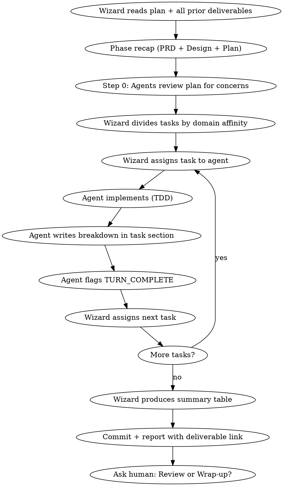

# Raid Implementation — Phase 4

Execute the plan. The Wizard assigns tasks strategically by domain affinity — no dice, no challengers. Agents implement with TDD, report, and move to the next task. Cross-review happens in Phase 5.

<HARD-GATE>
Do NOT implement without an approved plan. Do NOT skip TDD — it is an Iron Law. Use `raid-tdd` skill for all test-driven development. Use `raid-verification` before any completion claims.
</HARD-GATE>

## Process Flow



## Step 0: Critical Plan Review

Before any implementation begins, each agent reviews the plan independently:
- Are there concerns about feasibility or missing dependencies?
- Are any steps unclear or ambiguous?
- Does the plan match the design doc?

If concerns: raise via `WIZARD:` before starting. Fix the plan first.

**Branch guard:** Never implement on main/master without explicit human consent. Create a feature branch first.

## Wizard Checklist

1. **Read the plan** — extract all tasks, dependencies, ordering from task files
2. **Phase recap** — summarize PRD + Design + Plan findings. Present what carries forward.
3. **Dispatch plan review** — each agent reviews the plan, raises concerns via `WIZARD:`
4. **Resolve concerns** — fix plan issues before any implementation begins
5. **Browser setup (if `browser.enabled` in raid.json)**:
   - Check if `browser.startup` exists — if null, invoke `raid-browser` startup discovery FIRST
   - Check if Playwright is installed — if not, first task becomes "scaffold Playwright"
6. **Divide tasks strategically** — see Task Division below
7. **Create task tracking** — use TaskCreate for every plan task
8. **Dispatch tasks one at a time** — see Dispatch Protocol below
9. **After all tasks complete** — produce summary table deliverable
10. **Commit** — `feat(quest-{slug}): phase 4 implementation — {summary}`
11. **Report** — link `phases/phase-4-implementation.md` to the human
12. **Ask human** — Review phase or straight to Wrap-up?

## Task Division — Strategic Assignment

The Wizard assigns tasks deliberately. No dice roll, no rotation — strategic domain-based assignment:

- **Group by affinity:** Tasks that touch the same files or domain go to the same agent. This gives the agent continuity and deeper context across related changes.
- **Match lens to domain:** Wizard considers which agent's lens fits the task best. Infrastructure-heavy tasks suit Warrior's structural lens. Pattern-sensitive integrations suit Archer. Security/validation tasks suit Rogue.
- **Track dependencies:** Know which tasks block which. If task 10 depends on task 3 (currently being implemented by @warrior), don't assign task 10 to @archer yet — give them a non-blocked task instead, or have them wait.

**Example reasoning:**
> *"Tasks 1-3 all modify the auth module — assigning to @warrior for context continuity. Tasks 4-5 are integration points that need pattern consistency — @archer. Tasks 6-7 involve input validation and error paths — @rogue. Task 8 depends on tasks 1-3, so it waits until @warrior finishes those."*

## Dispatch Protocol

One agent at a time. Sequential dispatch, strategic order:

```
TaskUpdate(taskId="N", owner="warrior")
SendMessage(to="warrior", message="TURN_DISPATCH: Task N is yours. TDD enforced. Read the task file at {questDir}/spoils/tasks/phase-3-plan-task-NN.md. Implement, write your breakdown in the Implementation Notes section, commit, then signal TURN_COMPLETE with status.")
```

After `TURN_COMPLETE:`, the Wizard reads the breakdown, then assigns the next task — to the same agent (if they have more tasks in their domain) or to the next agent who has pending work.

## Agent Implementation Protocol (TDD)

Following `raid-tdd` strictly:
1. Write the failing test from the plan
2. Run test command from `.claude/raid.json` — verify it fails for the RIGHT reason
3. Write minimal code to pass
4. Run — verify pass
5. Run FULL test suite — verify no regressions
6. Self-review against acceptance criteria
7. Write brief implementation breakdown in the task's "Implementation Notes" section
8. Commit: `feat(scope): descriptive message`

**Browser tasks (if `browser.enabled` and task involves browser-facing code):**
- BOOT app on assigned port before browser TDD (invoke `raid-browser`)
- Use Playwright MCP tools while authoring tests
- CLEANUP after task is complete (or on failure)

Signal `TURN_COMPLETE:` with status: **DONE** | **DONE_WITH_CONCERNS** | **NEEDS_CONTEXT** | **BLOCKED**

## Handling Agent Status

| Status | Action |
|--------|--------|
| **DONE** | Wizard reads breakdown, assigns next task |
| **DONE_WITH_CONCERNS** | Read concerns. If correctness: address before next task. If observations: note and proceed. |
| **NEEDS_CONTEXT** | Provide missing information. Re-dispatch same task. |
| **BLOCKED** | 1) Context → provide more. 2) Too complex → break into subtasks. 3) Plan wrong → fix plan. |

## When to STOP Executing

STOP implementing immediately when:
- Missing dependency not covered in plan
- Test fails for unexpected reason (not the expected "right" failure)
- Instruction is ambiguous — two valid interpretations exist
- Verification fails repeatedly (2+ times on same step)
- Implementation diverges significantly from plan

**Ask via `WIZARD:` rather than guessing.** The Wizard escalates to the human if needed.

## Implementation Log

Use `{questDir}/phases/phase-4-implementation.md` to track all task completions:

```markdown
# Phase 4: Implementation Log
## Quest: <task description>

### Task 1: [Name] — @warrior
**Status:** Complete
**Files Changed:** `src/auth/handler.ts` (created), `tests/auth/handler.test.ts` (created)
**Summary:** Implemented token validation with JWT verification. 3 tests passing.
**Commit:** `feat(auth): implement token validation handler`

### Task 2: [Name] — @archer
...
```

## Phase Deliverable — Summary Table

After all tasks are complete, the Wizard produces a summary table as the phase deliverable:

```markdown
## Implementation Summary

| File | Change | Why | Task | Agent |
|------|--------|-----|------|-------|
| `src/auth/handler.ts` | Created | Token validation and refresh | 1 | @warrior |
| `tests/auth/handler.test.ts` | Created | Unit tests for handler | 1 | @warrior |
| `src/middleware.ts` | Modified (L45-60) | Added auth middleware hook | 3 | @archer |
```

## Quality Gates Per Task

- [ ] Tests written BEFORE implementation (TDD)
- [ ] Tests fail for the right reason
- [ ] Tests pass after implementation
- [ ] Full test suite passes (no regressions)
- [ ] Implementation matches task spec
- [ ] Naming follows established patterns
- [ ] Implementation breakdown written in task section
- [ ] Code committed with descriptive message

## Red Flags

| Thought | Reality |
|---------|---------|
| "This task is simple, skip TDD" | TDD is an Iron Law. No exceptions. |
| "Let me review my teammate's code" | No cross-review during implementation. That's Phase 5. |
| "I'll implement tasks in whatever order" | Wizard assigns strategically. Follow the assignment. |
| "I'll batch commits across tasks" | One commit per task. Atomic changes. |
| "The plan is wrong, I'll improvise" | Flag to Wizard via WIZARD:. Don't improvise. |

## Escalation

- **3+ attempts on one task:** Question whether the task spec or design is wrong.
- **Agent repeatedly blocked:** The plan may need revision.
- **Tests can't be written:** The design may not be testable. Return to Phase 2.

---

## Phase Transition

When all tasks are complete and committed:

1. Update raid-session phase via Bash:
   ```bash
   jq '.phase="review"' .claude/raid-session > .claude/raid-session.tmp && mv .claude/raid-session.tmp .claude/raid-session
   ```
2. **Commit:** `feat(quest-{slug}): phase 4 implementation — {summary}`
3. **Report:** Link `phases/phase-4-implementation.md` and summary table to the human.
4. **Ask human:** "Shall we inspect the treasure? (Review phase) Or proceed directly to wrap-up?"
5. If review → **Load `raid-canonical-review` and begin Phase 5**
6. If skip → **Load `raid-wrap-up` and begin Phase 6**

## Phase Spoils

**Two outputs:**
- `{questDir}/phases/phase-4-implementation.md` — Implementation log with per-task breakdowns
- Code changes committed with descriptive messages + summary table of all changed files
