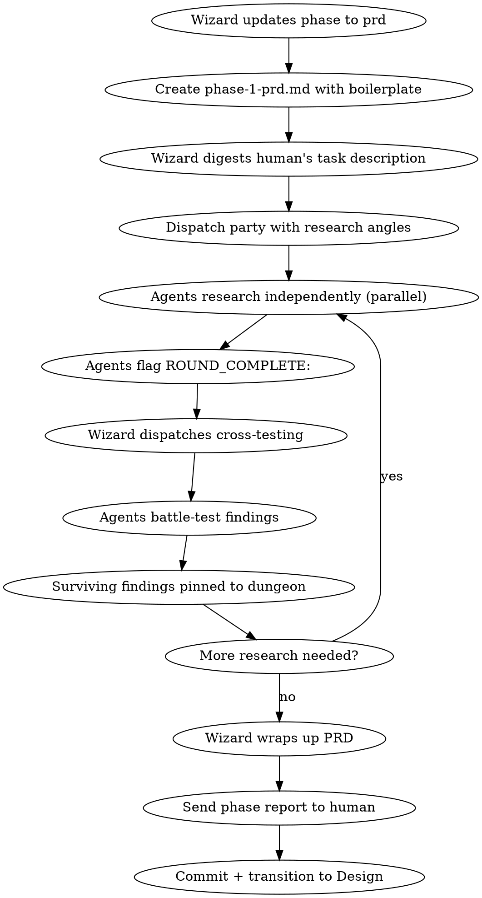

# Raid PRD — Phase 1 (Optional)

Forge the Product Requirements Document through agent-driven research and human-mediated discovery.

<HARD-GATE>
Do NOT write any code. Do NOT modify any project files. Only markdown files in the quest dungeon directory are allowed. Agents communicate via SendMessage — do not spawn subagents.
</HARD-GATE>

## Mode Behavior

- **Full Raid**: All 3 agents explore from different research angles, battle-test findings. Full PRD.
- **Skirmish**: 2 agents research and cross-test. Lighter PRD.
- **Scout**: Wizard drafts PRD alone from human input. Minimal research.

## Process Flow



## Wizard Checklist

1. **Update raid-session** via Bash (write gate blocks Write/Edit on this file):
   ```bash
   jq '.phase="prd"' .claude/raid-session > .claude/raid-session.tmp && mv .claude/raid-session.tmp .claude/raid-session
   ```
2. **Create phase file** — `{questDir}/phase-1-prd.md` with boilerplate sections
3. **Digest the human's request** — understand intent, identify gaps, map the problem space
4. **Dispatch party with research angles** via SendMessage:
   - **@Warrior**: Explore the technical stack. What infrastructure exists? What APIs are available? What technical constraints apply? What precedents exist in the codebase?
   - **@Archer**: Explore the patterns. How does this fit existing architecture? What conventions apply? What similar features exist? What naming and structure patterns should we follow?
   - **@Rogue**: Explore the edge cases. What could go wrong? What assumptions are we making? What requirements are we missing? What will users actually do vs what we think they'll do?
5. **Observe** — agents research in parallel. Go silent.
6. **Mediate questions** — agents ask Wizard, Wizard reasons, Wizard asks human only if unsure
7. **Dispatch cross-testing** — when agents flag ROUND_COMPLETE:, assign their findings to others
8. **Close phase** — wrap up PRD, send report, commit

## Phase File (Dungeon Scoreboard)

Create `{questDir}/phase-1-prd.md` — this is the **dungeon scoreboard**, not the deliverable. It tracks discoveries, battles, and shared knowledge from agent research. Every line in Discoveries/Active Battles must use a recognized prefix (`DUNGEON:`, `UNRESOLVED:`, `BLACKCARD:`, `RESOLVED:`, `TASK:`). Freeform content is only allowed in Resolved, Shared Knowledge, and Escalations sections.

```markdown
# Phase 1: PRD — Product Requirements Document
## Quest: <task description>
## Mode: <Full Raid | Skirmish | Scout>

### Discoveries

### Active Battles

### Resolved

### Shared Knowledge

### Escalations
```

## Phase Deliverable (PRD Document)

The actual PRD is a **separate file**: `{questDir}/prd.md`. This file is not validated by the dungeon hook and can contain freeform markdown. Write it when closing the phase — synthesize from the scoreboard findings.

```markdown
# <Feature Name> — Product Requirements Document

### Problem Statement

### Goals & Non-Goals

#### Goals

#### Non-Goals

### User Stories

### Functional Requirements

### Non-Functional Requirements

### Business Logic

### Constraints & Assumptions

### Success Criteria

### Open Questions
```

## Research Angles

Agents should use all available tools to research:
- **MCP tools** — query context servers, fetch documentation
- **Web search** — find related patterns, prior art, library docs
- **Doc fetching** — read official docs for relevant technologies
- **Codebase analysis** — explore existing code, patterns, conventions
- **Skill discovery** — find relevant skills that may help

## Question Chain

**Agents NEVER ask the human directly.** The flow is:

1. Agent discovers a gap → sends `WIZARD:` with the question and context
2. Wizard reasons: "Can I answer this from the PRD description, codebase, or prior knowledge?"
3. If confident → answer the agent directly via SendMessage
4. If unsure → digest the question into a clear, contextual question for the human
5. Wizard asks the human one well-formulated question (not the raw agent question)
6. Wizard receives answer → interprets, adds context → passes to party

**Goal:** Minimize questions to human. Batch related questions. The party should figure out as much as possible themselves.

## Closing the Phase

When the PRD is complete (all sections filled, open questions resolved):

1. **Wrap up the PRD document** — fill gaps, ensure coherence across sections
2. **Send phase report to human**: "The PRD is forged. Here's what we established: [key points]"
3. **Commit**: `docs(quest-{slug}): phase 1 PRD — {summary}`
4. **Transition**: Load `raid-canonical-design` skill and begin Phase 2

## Red Flags

| Thought | Reality |
|---------|---------|
| "The requirements are obvious, skip PRD" | If they were obvious, the human would have skipped this phase. |
| "Let me start coding to test an idea" | PRD phase. No code. Research and write. |
| "I'll ask the human every question" | Exhaust your own research first. Use MCP, docs, codebase. |
| "This PRD section doesn't apply" | Fill every section. Write "N/A — [reason]" if truly not applicable. |
| "Let me ask the human directly" | Route through the Wizard. Always. |

## Phase Spoils

**Two outputs**:
- `{questDir}/phase-1-prd.md` — Dungeon scoreboard with pinned discoveries, resolved battles, and shared knowledge from agent research
- `{questDir}/prd.md` — Complete Product Requirements Document with all sections filled, synthesized from scoreboard findings
