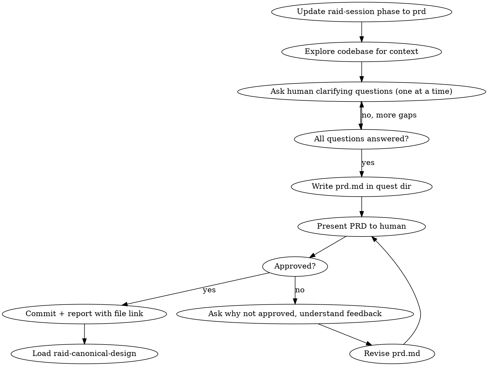

# Raid PRD — Phase 1 (Optional)

Forge the Product Requirements Document through collaborative discovery between the Wizard and the human. This phase is a dialogue — the Wizard asks questions, explores the codebase, and writes the PRD. No agents are dispatched.

<HARD-GATE>
Do NOT write any code. Do NOT modify any project files. Only markdown files in the quest dungeon directory are allowed. Do NOT dispatch any agents — this phase is Wizard + Human only.
</HARD-GATE>

## Process Flow



## Why This Phase Matters

The Wizard is the master of requirements — a visionary who thinks in future-proof solutions and business rules. This phase is where the Wizard builds the complete picture: understanding every constraint, every assumption, every edge case before the party enters the arena. The deeper the Wizard's understanding here, the sharper the direction for every subsequent phase.

## Wizard Checklist

1. **Update raid-session** via Bash (write gate blocks Write/Edit on this file):
   ```bash
   jq '.phase="prd"' .claude/raid-session > .claude/raid-session.tmp && mv .claude/raid-session.tmp .claude/raid-session
   ```

2. **Explore the codebase** — read files, grep for patterns, understand the architecture, dependencies, conventions, and existing solutions. You need this context to ask the right questions and write a thorough PRD.

3. **Ask the human clarifying questions — one at a time.** This is a dialogue, not an interview dump. Each question should build on the previous answer. Focus on:
   - The real problem beneath the stated problem
   - Who the users are and what they actually need
   - Business rules and constraints
   - Success criteria — how will we know this works?
   - Non-goals — what are we explicitly NOT building?
   - Edge cases the human may not have considered
   - Dependencies on other systems or teams

4. **Use all available tools to fill gaps** — MCP tools, web search, doc fetching, codebase analysis. The goal is to minimize questions to the human by answering what you can yourself.

5. **Write `prd.md`** in the quest directory. This is the deliverable — not a scoreboard, not an evolution log. A complete, polished PRD.

6. **Present the PRD to the human for approval.** Walk through the key sections. Ask: "Does this capture everything?"

7. **If not approved:** Ask why — repeatedly if needed — until you fully understand what's wrong or missing. Revise and re-present. Repeat until the human approves.

8. **Commit:** `docs(quest-{slug}): phase 1 PRD — {summary}`

9. **Report to human** with a link to the `prd.md` file path so they can open it directly.

10. **Transition:** Load `raid-canonical-design` skill, begin Phase 2.

## PRD Document Template

Write `{questDir}/spoils/prd.md`:

```markdown
# [Feature Name] — Product Requirements Document

## Quest: [quest description]
## Date: YYYY-MM-DD
## Author: Wizard

## Quest Goal
<!-- Wizard writes 2-3 lines: what this PRD aims to capture and why -->

---

### Problem Statement
<!-- What problem exists today? Who is affected? What's the cost of not solving it?
     Be specific — reference actual code, systems, or user pain points discovered
     during codebase exploration. -->

### Goals
<!-- What does success look like? Each goal should be measurable or verifiable.
     Number them. -->

### Non-Goals
<!-- What are we explicitly NOT building? This prevents scope creep.
     Be specific about what's out of scope and why. -->

### User Stories
<!-- Describe how users will interact with the feature. Write naturally —
     not locked to a rigid format, but professional and clear.
     Cover the primary flow, then edge cases and error scenarios.
     Each story should be concrete enough that you could write a test for it. -->

### Functional Requirements
<!-- Numbered list. Each requirement is specific, unambiguous, and testable.
     Group by domain if the feature spans multiple areas.
     Reference user stories where applicable. -->

### Non-Functional Requirements
<!-- Performance, scalability, security, accessibility, compatibility.
     Include concrete targets where possible (e.g., "responds within 200ms
     at p95 under 1000 concurrent users"). Omit categories that don't apply
     with "N/A — [reason]". -->

### Business Logic
<!-- Rules, calculations, state machines, validation logic.
     Be precise — this section drives implementation decisions.
     Use examples: "When X happens and Y is true, then Z." -->

### Constraints & Assumptions
<!-- Technical constraints (language, framework, infrastructure).
     Business constraints (timeline, budget, compliance).
     Assumptions that, if wrong, would change the approach. -->

### Success Criteria
<!-- How do we verify this feature works? Define acceptance criteria
     at the feature level. These become the basis for the review phase. -->

### Open Questions
<!-- Questions that surfaced during exploration that the human needs to answer.
     Each question includes context on why it matters and what decision it blocks. -->

---

## Writing Guidance
- Every section filled. Write "N/A — [reason]" if truly not applicable.
- Be specific over comprehensive — concrete examples beat abstract descriptions.
- Reference actual code paths, files, and systems discovered during exploration.
- Requirements must be testable — if you can't verify it, rewrite it.
```

Fill every section. Write "N/A — [reason]" if a section truly does not apply.

## Red Flags

| Thought | Reality |
|---------|---------|
| "The requirements are obvious, skip PRD" | If they were obvious, the human would have skipped this phase. |
| "Let me start coding to test an idea" | PRD phase. No code. Research and write. |
| "Let me dispatch the agents for research" | PRD is Wizard + Human only. No agents. |
| "I'll ask 10 questions at once" | One question at a time. Build on answers. |
| "This PRD section doesn't apply" | Fill every section. Write "N/A — [reason]" if truly not applicable. |
| "Good enough, let's move on" | Present to human. Only they decide when it's good enough. |

## Phase Spoils

**One output**: `{questDir}/spoils/prd.md` — Complete Product Requirements Document with all sections filled.
