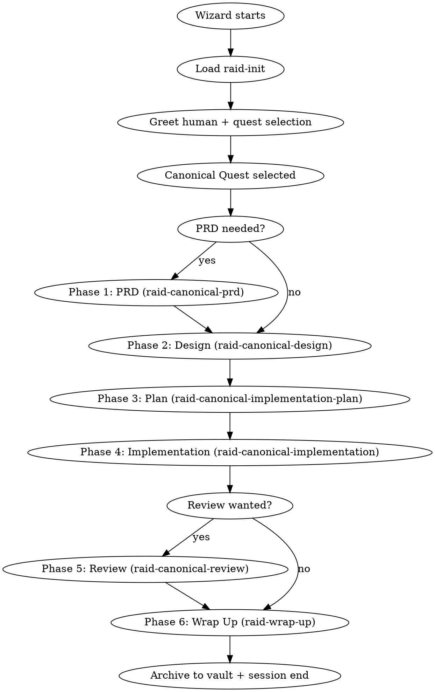

# Canonical Quest Protocol

The canonical workflow for full-cycle development. Every feature, refactor, or system built through the Raid follows this sequence.

<HARD-GATE>
Do NOT skip phases. Do NOT let a single agent work unchallenged (except Scout mode). Do NOT proceed without a Wizard ruling. Agents communicate via SendMessage — do not spawn subagents.
</HARD-GATE>

## Session Lifecycle



## Team

| Agent | Role | Color |
|-------|------|-------|
| **Wizard** (Dungeon Master) | Opens phases, observes, digests, rules. NEVER implements. | Purple |
| **Warrior** | Stress-tests to destruction, edge cases, load testing | Red |
| **Archer** | Pattern-seeker, traces ripple effects, naming drift | Green |
| **Rogue** | Adversarial assumption-destroyer, attack scenarios | Orange |

## Modes

| Aspect | Full Raid | Skirmish | Scout |
|--------|-----------|----------|-------|
| Agents | 3 | 2 | 1 |
| PRD phase | Full | Lightweight | Skip |
| Design | Full adversarial | Lightweight | Inline |
| Plan | Full adversarial | Combined with design | Inline |
| Implementation | 1 builds, 2 cross-test | 1 builds, 1 cross-tests | 1 builds, Wizard reviews |
| Review | 3 independent + fighting | 1 review + Wizard | Wizard only |
| TDD | **Enforced** | **Enforced** | **Enforced** |

## Plan Mode

Claude Code's plan mode is incompatible with the Raid. The Raid has its own permission model — `teammateMode` controls agent write access, and hooks enforce phase-based restrictions. Plan mode would block the quest workflow.

The Wizard detects plan mode at session start (Step 0 in `raid-init`) and asks the human to exit it before proceeding.

## Round-Based Interaction

Think turn-based RPG, not real-time:

```
ROUND START → Wizard dispatches tasks/angles
    ↓
PARALLEL WORK → Each agent works independently
    ↓
FLAG COMPLETION → Agent signals ROUND_COMPLETE: to Wizard
    ↓
CROSS-TESTING → Wizard assigns completed work for review
    ↓
REACTIONS → Agents test, challenge, build
    ↓
RESOLUTION → Findings pinned to dungeon or conceded
    ↓
ROUND END → Wizard assesses: next round or phase close
```

**Rules:**
- No mid-thinking interruptions between agents (only Wizard can interrupt)
- Each message must carry evidence + conclusion (no shallow exchanges)
- Converge in 2-3 exchanges per finding; escalate to Wizard after 3
- Party is silent during phase transitions

## Question Chain

Agents → Wizard → Human. Agents NEVER ask the human directly.

1. Agent discovers gap → sends `WIZARD:` with question
2. Wizard reasons: can I answer from PRD, codebase, context?
3. If confident → answers agent directly
4. If unsure → digests question, asks human one clear question
5. Wizard passes answer back with interpretation

## Phase Transition Gates

| From | To | Gate | Commit Format |
|------|----|------|---------------|
| PRD | Design | PRD approved by Wizard | `docs(quest-{slug}): phase 1 PRD` |
| Design | Plan | Design doc approved, committed | `docs(quest-{slug}): phase 2 design` |
| Plan | Implementation | Plan approved, committed | `docs(quest-{slug}): phase 3 plan` |
| Implementation | Review | All tasks done, tests pass | `feat(quest-{slug}): phase 4 implementation` |
| Review | Wrap Up | Wizard ruling: approved | `fix(quest-{slug}): phase 5 review` |

**Wizard commits at EVERY phase transition.** No exceptions.

## Phase Spoils

Every phase MUST produce at least one detailed markdown artifact:

| Phase | Output File |
|-------|-------------|
| PRD | `{questDir}/phase-1-prd.md` |
| Design | `{questDir}/phase-2-design.md` |
| Plan | `{questDir}/phase-3-plan.md` + task files |
| Implementation | `{questDir}/phase-4-implementation.md` |
| Review | `{questDir}/phase-5-review.md` |
| Wrap Up | `{questDir}/phase-6-wrap-up.md` |

## Communication Signals

| Signal | Who | Meaning | Goes to Dungeon? |
|--------|-----|---------|-----------------|
| `DISPATCH:` | Wizard | Opening a phase, assigning angles | No |
| `ROUND_COMPLETE:` | Any agent | Finished assigned task | No |
| `FINDING:` | Any agent | Discovery with own evidence | No |
| `CHALLENGE:` | Any agent | Independently verified, found problem | No |
| `BUILDING:` | Any agent | Independently verified, goes deeper | No |
| `DUNGEON:` | Any agent | Pinning finding verified by 2+ agents | **Yes** |
| `BLACKCARD:` | Any agent | High-concern finding blocking progress | **Yes** |
| `WIZARD:` | Any agent | Escalation — needs Wizard input | Yes (escalation) |
| `CONCEDE:` | Any agent | Proven wrong, moving on | No |
| `RULING:` | Wizard | Binding decision, phase close | Archived |
| `REDIRECT:` | Wizard | Course correction, one sentence | No |

## Black Card System

A `BLACKCARD:` is a finding that fundamentally breaks the architecture — unfixable within current design.

**Flow:** Agent plays → 2+ agents verify → Wizard escalates to human → Options: (a) rollback to earlier phase, (b) accept limitation.

Black cards are RARE. Most issues are Critical or Important, not black cards.

## The Dungeon

Quest directory at `.claude/dungeon/{quest-slug}/`. Each phase produces a file.

| Event | Action | Who |
|-------|--------|-----|
| Quest starts | Create quest directory | Hook |
| Phase opens | Create `{questDir}/phase-N-{name}.md` with boilerplate | Wizard |
| During phase | Pin findings via `DUNGEON:` | Agents |
| Phase closes | Wrap up doc, commit | Wizard |
| Quest ends | Move to `.claude/vault/{quest-slug}/` | Wizard |

**The Dungeon is a scoreboard, not a chat log.** Only verified findings, resolved battles, shared knowledge.

## Wizard Behavior

- **90% thinking / 10% talking** — thinks 5x before speaking
- **NEVER implements** — dispatches, observes, digests, rules
- **Opens and closes every phase** — creates phase file, dispatches, then goes silent
- **Phase reports** — at every close, summarizes for human: what was done, what's next
- **Question gatekeeper** — digests before passing in either direction
- **Commits at every transition** — with quest name + phase + summary

## Configuration

Read `.claude/raid.json` for project settings:

| Key | Default | Purpose |
|-----|---------|---------|
| `project.testCommand` | (none) | Command to run tests |
| `project.packageManager` | (auto) | Package manager |
| `raid.defaultMode` | `full` | Default mode |
| `raid.agentEffort` | `medium` | Agent effort level (Wizard always max) |
| `raid.vault.path` | `.claude/vault` | Vault location |
| `browser.enabled` | `false` | Browser testing active |

## Browser Testing

When `browser.enabled` is `true`:
- **Phase 4 (Implementation):** Browser-facing code uses TDD with Playwright via `raid-tdd`. Challengers verify on isolated ports.
- **Phase 5 (Review):** Live adversarial Chrome inspection via `raid-browser-chrome`. Each agent on separate port.
- Invoke `raid-browser` for startup discovery and pre-flight.

## Skills Reference

| Skill | Phase | Purpose |
|-------|-------|---------|
| `raid-init` | Pre-phase | Quest selection, greeting, session setup |
| `raid-canonical-protocol` | Start | This doc — session lifecycle, rules, reference |
| `raid-canonical-prd` | 1 | PRD creation (optional) |
| `raid-canonical-design` | 2 | Adversarial design exploration |
| `raid-canonical-implementation-plan` | 3 | Task decomposition |
| `raid-canonical-implementation` | 4 | TDD implementation with cross-testing |
| `raid-canonical-review` | 5 | Pinning + fixing + black cards (optional) |
| `raid-wrap-up` | 6 | Storyboard, PR, vault archival |
| `raid-tdd` | Any | RED-GREEN-REFACTOR enforcement |
| `raid-verification` | Any | Evidence-before-claims gate |
| `raid-debugging` | Any | Root-cause investigation |
| `raid-browser` | 4, 5 | Browser orchestration |
| `raid-browser-chrome` | 5 | Live Chrome inspection |

## Red Flags

| Thought | Reality |
|---------|---------|
| "This phase is obvious, skip it" | Obvious phases hide assumptions. |
| "The agents agree, no need for cross-testing" | Agreement without challenge is groupthink. |
| "TDD would slow us down" | TDD is an Iron Law. No exceptions. |
| "Let me ask the human directly" | Route through the Wizard. Always. |
| "Let me just post everything to the Dungeon" | Pin only what survived challenge. |
| "I'll wait for the Wizard to tell me what to do" | Self-organize within the round. |
