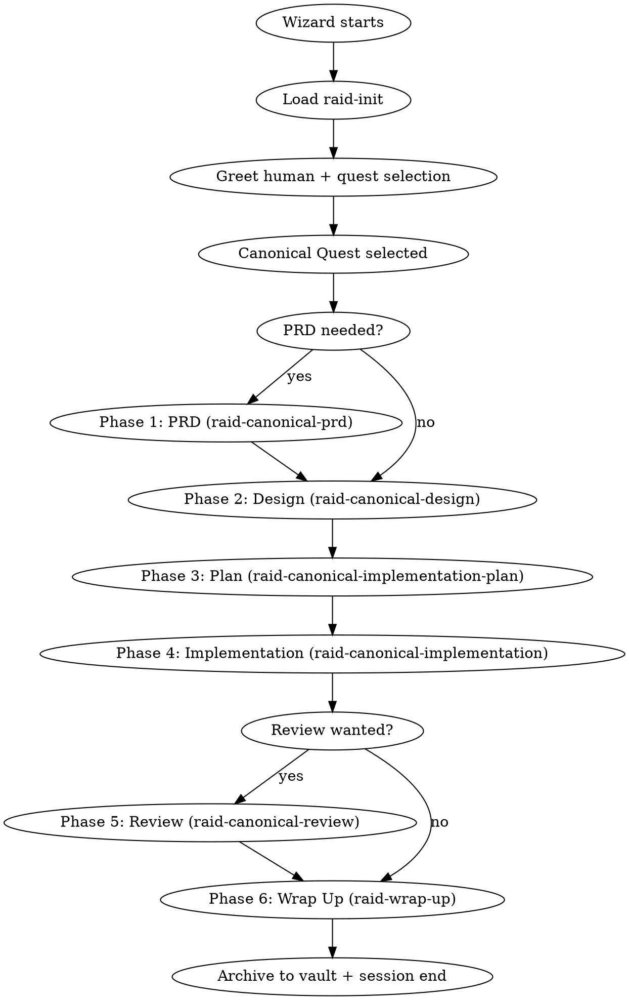

# Canonical Quest Protocol

The canonical workflow for full-cycle development. Every feature, refactor, or system built through the Raid follows this sequence.

<HARD-GATE>
Do NOT skip phases. Do NOT let a single agent work unchallenged. Do NOT proceed without a Wizard ruling. Agents communicate via SendMessage — do not spawn subagents.
</HARD-GATE>

## Session Lifecycle



## Team

| Agent | Role | Color |
|-------|------|-------|
| **Wizard** (Dungeon Master) | Opens phases, observes, digests, rules. NEVER implements. | Purple |
| **Warrior** | Stress-tests to destruction, edge cases, load testing | Red |
| **Archer** | Pattern-seeker, traces ripple effects, naming drift | Green |
| **Rogue** | Adversarial assumption-destroyer, attack scenarios | Orange |

## Party Composition

The Canonical Quest always runs with the full party: Wizard + Warrior + Archer + Rogue (4 agents). 3 sequential turns per round, 2-3 rounds per phase. TDD enforced. No reduced-party modes.

## Plan Mode

Claude Code's plan mode is incompatible with the Raid. The Raid has its own permission model — `teammateMode` controls agent write access, and hooks enforce phase-based restrictions. Plan mode would block the quest workflow.

The Wizard detects plan mode at session start (Step 0 in `raid-init`) and asks the human to exit it before proceeding.

## Phase Transition Gates

| From | To | Gate | Commit Format |
|------|----|------|---------------|
| PRD | Design | PRD approved by Human | `docs(quest-{slug}): phase 1 PRD` |
| Design | Plan | Design doc approved, committed | `docs(quest-{slug}): phase 2 design` |
| Plan | Implementation | Plan approved, committed | `docs(quest-{slug}): phase 3 plan` |
| Implementation | Review | All tasks done, tests pass | `feat(quest-{slug}): phase 4 implementation` |
| Review | Wrap Up | Wizard ruling: approved | `fix(quest-{slug}): phase 5 review` |

**Wizard commits at EVERY phase transition.** No exceptions.

## Phase Spoils

Every phase MUST produce at least one detailed markdown artifact:

| Phase | Evolution Log | Deliverable |
|-------|---------------|-------------|
| PRD | (none — wizard+human only) | `{questDir}/spoils/prd.md` |
| Design | `{questDir}/phases/phase-2-design.md` | `{questDir}/spoils/design.md` |
| Plan | `{questDir}/phases/phase-3-plan.md` | task files (`spoils/tasks/phase-3-plan-task-NN.md`) |
| Implementation | `{questDir}/phases/phase-4-implementation.md` | code changes + summary table |
| Review | `{questDir}/phases/phase-5-review.md` | `{questDir}/spoils/review.md` (fix plan) |
| Wrap Up | `{questDir}/phase-6-wrap-up.md` | PR + storyboard |

## Dice Roll Reference

When a phase needs a dice roll, use this jq command to shuffle the turn order:

```bash
jq --argjson to '["warrior","archer","rogue"]' \
  '.turnOrder=($to | [.[] | {name: ., r: (now * 1000 % 997 | floor)}] | sort_by(.r) | [.[].name]) | .currentRound=1 | .currentTurnIndex=0 | .maxRounds=3' \
  .claude/raid-session > .claude/raid-session.tmp && mv .claude/raid-session.tmp .claude/raid-session
```

## Browser Testing

When `browser.enabled` is `true` in `raid.json`:
- **Phase 4 (Implementation):** Browser-facing code uses TDD with Playwright via `raid-tdd`.
- **Phase 5 (Review):** Live adversarial Chrome inspection via `raid-browser-chrome`. Each agent on separate port.
- Invoke `raid-browser` for startup discovery and pre-flight.

## Skills Reference

| Skill | Phase | Purpose |
|-------|-------|---------|
| `raid-init` | Pre-phase | Quest selection, greeting, session setup |
| `raid-canonical-protocol` | Start | This doc — lifecycle, gates, spoils, reference |
| `raid-canonical-prd` | 1 | PRD creation — wizard+human only (optional) |
| `raid-canonical-design` | 2 | Writer/reviewer design with defend-concede |
| `raid-canonical-implementation-plan` | 3 | Writer/reviewer task decomposition |
| `raid-canonical-implementation` | 4 | Strategic TDD implementation — no challengers |
| `raid-canonical-review` | 5 | Review + fix sub-phase (optional) |
| `raid-wrap-up` | 6 | Storyboard, PR, vault archival |
| `raid-tdd` | Any | RED-GREEN-REFACTOR enforcement |
| `raid-verification` | Any | Evidence-before-claims gate |
| `raid-debugging` | Any | Root-cause investigation |
| `raid-browser` | 4, 5 | Browser orchestration |
| `raid-browser-chrome` | 5 | Live Chrome inspection |

## Red Flags

| Thought | Reality |
|---------|---------|
| "This phase is obvious, skip it" | Obvious phases hide assumptions. |
| "The agents agree after one round, let's close" | Minimum 2 rounds. Agreement without challenge is groupthink. |
| "TDD would slow us down" | TDD is an Iron Law. No exceptions. |
| "Let me ask the human directly" | Route through the Wizard. Always. |
| "Let me just post everything to the Dungeon" | Pin only what survived challenge. |
| "I'll wait for the Wizard to tell me what to do" | You wait for your turn dispatch, then work your angle fully. |
