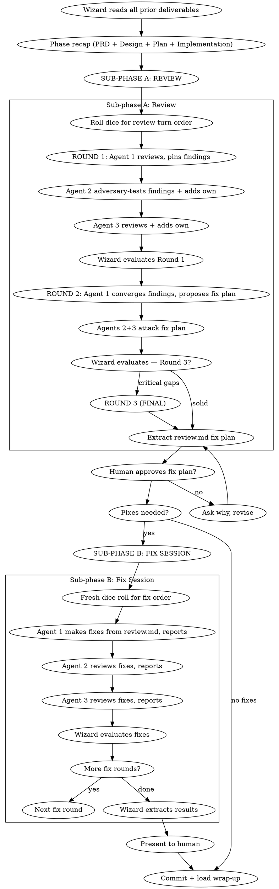

# Raid Review — Phase 5 (Optional)

Two sub-phases: **Review** (find issues, build fix plan) then **Fix Session** (execute fixes). The review digests all prior deliverables — PRD, Design, Plan, Implementation — and verifies the implementation is correct, complete, and coherent.

<HARD-GATE>
This phase is OPTIONAL — the Wizard asks the human before entering. All agents review the ENTIRE implementation. Use `raid-verification` before any completion claims.
</HARD-GATE>

## Process Flow



## Sub-phase A: Review

### Wizard Checklist (Review)

1. **Prepare** — gather all prior deliverables: PRD, design.md, task files, phase-4-implementation.md, git diff range
2. **Phase recap** — summarize all prior phases. Present to agents and human.
3. **Roll dice** — randomly shuffle `["warrior", "archer", "rogue"]` for the review turn order. Update raid-session via Bash using the jq command from protocol "Dice Roll Reference". Announce: *"The dice have spoken. Review turn order: {agent1} → {agent2} → {agent3}."*
4. **Create evolution log** — `{questDir}/phases/phase-5-review.md`
5. **Run rounds** — see Round Protocol below
6. **Extract fix plan** — polish into `{questDir}/spoils/review.md`
7. **Present to human** for approval

### Round Protocol (Review)

**Round 1: Find + Challenge**

**Agent 1 — Reviews the full implementation:**
- Reads all code changes against design.md and plan
- Pins findings with severity classification (Critical / Important / Minor)
- Signs: `@{name} [R1]`

**Agent 2 — Adversary-tests Agent 1's findings + adds own:**
- Reads Agent 1's findings, independently verifies each one
- Challenges severity classifications where warranted
- Adds findings Agent 1 missed from their own lens
- Signs: `@{name} [R1]`

**Agent 3 — Reviews all + adds own:**
- Reads both prior agents' findings
- Challenges, extends, adds from their lens
- Signs: `@{name} [R1]`

**Round 2: Converge + Fix Plan**

**Agent 1 — Converges all findings into a fix plan:**
- Reads every finding from all agents
- Groups by severity and domain
- Proposes a concrete fix plan: what to fix, how, in what order
- May mark some findings as false positives (with evidence)
- Signs: `@{name} [R2]`

**Agents 2+3 — Attack the fix plan:**
- Challenge the proposed fixes: are they correct? Complete? Do they introduce new issues?
- Challenge false positive designations
- Signs: `@{name} [R2]`

**Round 3 (if needed):** Wizard announces FINAL round. Same cycle — converge and close.

### Severity Classification

| Severity | Definition | Action |
|----------|------------|--------|
| **Critical** | Bugs, security holes, data loss, crashes | Must fix. No exceptions. |
| **Important** | Missing features, poor error handling, test gaps, naming inconsistencies | Must fix. |
| **Minor** | Style, docs, optimization | Note for future. |

### Review Checklist — Each Agent

- **Requirements:** Every design doc requirement implemented? No extras (YAGNI)?
- **Code Quality:** Clean separation? Error handling? DRY? Clear names?
- **Testing:** Every function tested? Edge cases? Failure paths?
- **Architecture:** Design decisions implemented correctly? No drift?
- **Naming & Structure:** Consistent? Follows conventions?
- **Production:** Performance? Timeouts? No secrets in code?

### Browser Inspection (when `browser.enabled`)

After code review findings are pinned, agents inspect the live application:
1. Each reviewer boots their own instance on separate ports (invoke `raid-browser`)
2. Pre-flight: state test subject, check auth, discover routes
3. Inspect from angle (invoke `raid-browser-chrome`): Warrior=stress, Archer=visual, Rogue=security
4. Cross-verify others' findings on own instance
5. Pin browser findings alongside code findings
6. Cleanup instances

Browser bugs block merge the same way code bugs do.

## Sub-phase B: Fix Session

Only entered if `review.md` contains fixes to make. This is different from the Implementation phase — the source is `review.md`, not numbered plan tasks.

### Wizard Checklist (Fix Session)

1. **Fresh dice roll** — a new turn order for the fix session. Update raid-session via Bash using the jq command from protocol "Dice Roll Reference". Announce: *"Fresh dice for the fix session: {agent1} → {agent2} → {agent3}."*
2. **Dispatch fixes** — round-based, sequential

### Fix Session Round Protocol

**Agent 1 — Makes fixes from `review.md`:**
- Implements each fix following TDD
- Reports what was fixed and how
- Signs: `@{name} [R1]`

**Agent 2 — Reviews the fixes:**
- Reads the actual code changes
- Verifies each fix addresses the original finding
- Checks for regressions
- Signs: `@{name} [R1]`

**Agent 3 — Reviews fixes + prior review:**
- Reads fixes AND Agent 2's review
- Final verification pass
- Signs: `@{name} [R1]`

2-3 rounds until the Wizard is satisfied all fixes are sound.

### Fix Implementation Order

Prioritize within each severity level:
1. **Blocking issues** — crashes, security holes, data loss
2. **Simple fixes** — typos, imports, naming
3. **Complex fixes** — refactoring, logic changes

Test each fix individually. Verify no regressions before the next.

## Black Card System

If any agent finds something that fundamentally breaks the architecture — unfixable within current design:

```
BLACKCARD: [description]
Evidence: [file paths, scenarios, why unfixable]
Impact: [what breaks, how deep]
```

**Flow:** Agent plays → 2+ agents verify → Wizard escalates to human → Options: (a) rollback to earlier phase, (b) accept limitation.

Black cards are RARE. Most issues are Critical or Important, not black cards.

## No Performative Agreement

NEVER respond with "Great catch!" or "You're absolutely right!" Instead: state the finding, show evidence, or push back. If a finding IS correct: fix it and move on.

## Verification Protocol

Before acting on ANY finding:
1. **READ:** Complete the finding without reacting
2. **VERIFY:** Check against actual code at the referenced location
3. **EVALUATE:** Is this technically sound for THIS codebase?
4. **RESPOND:** Technical evidence or reasoned pushback

## Red Flags

| Thought | Reality |
|---------|---------|
| "The implementation looks fine" | Every review finds at least one issue. Look harder. |
| "This is Minor" (when it causes wrong behavior) | Wrong results = Important or Critical. |
| "The tests pass, so it works" | Tests prove what they test. What DON'T they test? |
| "Let me silently ignore that finding" | Every finding gets addressed in the fix plan. |
| "Fixes are simple, skip re-review" | Fixes introduce new bugs. Always re-verify. |

---

## Phase Transition

When the review is complete and all fixes verified:

1. Update raid-session phase via Bash:
   ```bash
   jq '.phase="wrap-up"' .claude/raid-session > .claude/raid-session.tmp && mv .claude/raid-session.tmp .claude/raid-session
   ```
2. **Commit:** `fix(quest-{slug}): phase 5 review — {N} findings resolved`
3. **Report:** Link `review.md` and `phase-5-review.md` file paths to the human.
4. **Load `raid-wrap-up` and begin Phase 6.**

## Phase Spoils

**Two outputs:**
- `{questDir}/phases/phase-5-review.md` — Full evolution (findings, challenges, fix plan debate, fix session)
- `{questDir}/spoils/review.md` — Clean fix plan deliverable (what was found, what was fixed, what was deferred)
