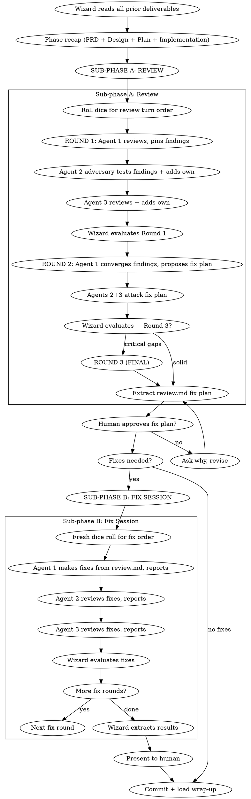

# Raid Review — Phase 5 (Optional)

Two sub-phases: **Review** (find issues, build fix plan) then **Fix Session** (execute fixes). The review digests all prior deliverables — PRD, Design, Plan, Implementation — and verifies the implementation is correct, complete, and coherent.

<HARD-GATE>
This phase is OPTIONAL — the Wizard asks the human before entering. All agents review the ENTIRE implementation. Use `raid-verification` before any completion claims.
</HARD-GATE>

## Process Flow



## Sub-phase A: Review

### Wizard Checklist (Review)

1. **Prepare** — gather all prior deliverables: PRD, design.md, task files, phase-4-implementation.md, git diff range
2. **Phase recap** — summarize all prior phases. Present to agents and human.
3. **Roll dice** — randomly shuffle `["warrior", "archer", "rogue"]` for the review turn order. Update raid-session via Bash using the jq command from protocol "Dice Roll Reference". Announce: *"The dice have spoken. Review turn order: {agent1} → {agent2} → {agent3}."*
4. **Create evolution log** — `{questDir}/phases/phase-5-review.md`
5. **Run rounds** — see Round Protocol below
6. **Extract fix plan** — polish into `{questDir}/spoils/review.md`
7. **Present to human** for approval

### Dispatch Templates (Review)

Dispatch carries only dynamic context. Detailed instructions (severity format, checklist, finding structure) are embedded in the scaffolded phase file.

**Reviewer (Round 1):**
```
TURN_DISPATCH: Phase 5 Review, Round 1, Turn {T}.
Quest: {description}
Phase recap: {summary of all prior phases — what was built, key decisions}
Your role: REVIEWER. Your section: "@{name} [R1]"

FIRST: Read the FULL document at {questDir}/phases/phase-5-review.md to understand the structure.
  Read the embedded instructions in your section. Then read the code changes (git diff),
  {questDir}/spoils/design.md, and task files.
THEN: Write your review in your designated section following the embedded instructions.
```

**Fix Plan Writer (Round 2, Turn 1):**
```
TURN_DISPATCH: Phase 5 Review, Round 2, Turn 1.
Quest: {description}
All Round 1 findings are in.
Your role: converge findings into fix plan. Your section: "@{name} [R2] — Converged Fix Plan"

FIRST: Read the FULL document at {questDir}/phases/phase-5-review.md.
  Read all Round 1 findings. Read the embedded instructions in your section.
THEN: Write the converged fix plan following the embedded instructions.
```

**Fix Session dispatch:**
```
TURN_DISPATCH: Phase 5 Fix Session, Round 1, Turn {T}.
Quest: {description}
Fix plan: {questDir}/spoils/review.md

FIRST: Read the FULL document at {questDir}/phases/phase-5-review.md to find
  the Fix Session section and your embedded instructions. Then read the fix plan.
THEN: Execute your role following the embedded instructions.
TDD enforced — load raid-tdd. Signal TURN_COMPLETE with status when done.
```

### Evolution Log Template (Sub-phase A)

Scaffold `{questDir}/phases/phase-5-review.md`. Replace agent name placeholders with actual names from dice roll:

```markdown
# Phase 5: Review — Evolution Log

## Quest: [quest description]
## Quest Type: Canonical Quest
## Turn Order (Review): @{agent1} → @{agent2} → @{agent3}

## References
- PRD: `{questDir}/spoils/prd.md` (if exists)
- Design: `{questDir}/spoils/design.md`
- Tasks: `{questDir}/spoils/tasks/phase-3-plan-task-*.md`
- Implementation: `{questDir}/phases/phase-4-implementation.md`

## Quest Goal
<!-- Wizard writes 2-3 lines: what this review must verify,
     total file count from implementation, key risk areas to focus on -->

---

## Sub-phase A: Review

### @{agent1} [R1] — Full Implementation Review

<!-- @{agent1}: FIRST REVIEWER. Read ACTUAL CODE — not reports.
     For each finding: [Severity] `file:line` — what, why, proposed fix.
     Example: [Critical] `src/auth/handler.ts:23` — missing validation. Fix: add zod schema.
     Checklist: requirements, code quality, testing, architecture, naming, production. -->

### @{agent2} [R1] — Adversarial Review

<!-- @{agent2}: ADVERSARIAL REVIEWER. Verify @{agent1}'s findings against actual code.
     Challenge severity if overblown. Add findings @{agent1} missed. Don't repeat.
     Same format: [Severity] `file:line` — what, why, fix. -->

### @{agent3} [R1] — Final Review Pass

<!-- @{agent3}: FINAL REVIEWER. Read all prior findings. Challenge what you disagree with.
     Find what BOTH reviewers missed. Same format: [Severity] `file:line` — what, why, fix. -->

### Wizard [R1] Synthesis
<!-- Wizard categorizes all surviving findings by severity.
     Counts: N Critical, N Important, N Minor.
     Direction for Round 2. -->

---

### @{agent1} [R2] — Converged Fix Plan

<!-- @{agent1}: Read EVERY finding from all reviewers (R1).
     Your job is to produce a SINGLE converged fix plan.

     1. Group all findings by severity (Critical → Important → Minor)
     2. Within each group, order by domain/file for efficient fixing
     3. For each finding: confirm, mark as false positive (with evidence), or merge duplicates
     4. Propose concrete fix for each confirmed finding
     5. Note execution order (dependencies between fixes)

     Format per finding:
     **[Critical-1]** `src/auth/handler.ts:23` — Missing input validation
     - Found by: @{agent2} [R1], confirmed by @{agent3} [R1]
     - Fix: Add zod schema validation in validateToken() before line 23
     - Blocked by: none -->

### @{agent2} [R2] — Fix Plan Review

<!-- @{agent2}: Review fix plan. Are fixes correct? Execution order right?
     Challenge false positive designations. Flag dropped findings. -->

### @{agent3} [R2] — Fix Plan Review

<!-- @{agent3}: Same focus. Challenge what @{agent2} missed.
     Confirm or dispute false positive designations. -->

### Wizard [R2] Synthesis
<!-- Wizard evaluates the fix plan. If solid → extract to review.md.
     If critical gaps → announce Round 3 as FINAL. -->

---

## Final Extraction Notes — Wizard
<!-- What was incorporated into review.md.
     False positives excluded and why.
     Total findings: N confirmed, N false positives, N deferred. -->

---

## Writing Guidance
- Sign all work: `@{name} [R{N}]`
- Read ACTUAL CODE — not summaries, not reports, not commit messages
- Every finding needs: severity, location, what, why, proposed fix
- No performative agreement — no "Great catch!" Just evidence or pushback.
- Reviewers: challenge severity classifications, not just content
- Fix plan must be actionable — concrete fixes, not "improve error handling"
```

**Round 3:** If needed, wizard appends Round 3 sections before dispatching. Do NOT pre-scaffold.

### Browser Inspection (when `browser.enabled`)

After code review findings are pinned, agents inspect the live application:
1. Each reviewer boots their own instance on separate ports (invoke `raid-browser`)
2. Pre-flight: state test subject, check auth, discover routes
3. Inspect from angle (invoke `raid-browser-chrome`): Warrior=stress, Archer=visual, Rogue=security
4. Cross-verify others' findings on own instance
5. Pin browser findings alongside code findings
6. Cleanup instances

Browser bugs block merge the same way code bugs do.

## Sub-phase B: Fix Session

Only entered if `review.md` contains fixes to make. This is different from the Implementation phase — the source is `review.md`, not numbered plan tasks.

### Wizard Checklist (Fix Session)

1. **Fresh dice roll** — a new turn order for the fix session. Update raid-session via Bash using the jq command from protocol "Dice Roll Reference". Announce: *"Fresh dice for the fix session: {agent1} → {agent2} → {agent3}."*
2. **Dispatch fixes** — round-based, sequential

### Fix Session Evolution Log (Appended Dynamically)

When Sub-phase B begins, the wizard appends these sections to `phase-5-review.md` with fresh agent names from the new dice roll:

```markdown
---

## Sub-phase B: Fix Session

## Turn Order (Fix Session): @{agent1} → @{agent2} → @{agent3}
<!-- Fresh dice roll — may be different order from review sub-phase -->

### @{agent1} [R1] — Implementing Fixes

<!-- @{agent1}: Work through review.md fix plan in order.
     For each fix:
     1. Implement the fix following TDD (write test → verify fail → fix → verify pass)
     2. Report what was fixed and how

     Format per fix:
     **[Critical-1]** `src/auth/handler.ts:23` — FIXED
     - Change: Added zod schema validation in validateToken()
     - Test: `tests/auth/handler.test.ts` — added "rejects malformed tokens" test
     - Commit: `fix(auth): add input validation to token handler`

     Prioritize: blocking issues first, then simple fixes, then complex fixes. -->

### @{agent2} [R1] — Fix Verification

<!-- @{agent2}: Read the ACTUAL CODE changes for each fix above.
     - Does each fix address the original finding?
     - Does any fix introduce new issues?
     - Run the full test suite — any regressions?
     Report per fix: VERIFIED or ISSUE: [what's wrong] -->

### @{agent3} [R1] — Fix Verification

<!-- @{agent3}: Same focus. Verify fixes AND @{agent2}'s verification.
     Final pass — anything missed? -->

### Wizard [R1] Synthesis
<!-- All fixes verified? If issues remain → another round.
     If clean → extract results, present to human. -->
```

2-3 rounds until the Wizard is satisfied all fixes are sound.

### Review Deliverable Template

Wizard extracts into `{questDir}/spoils/review.md` — issue-centric, grouped by severity:

```markdown
# [Feature Name] — Review Report

## Quest: [quest description]
## Date: YYYY-MM-DD
## Author: Wizard (extracted from phase-5-review.md)

---

## Summary
<!-- Total findings, breakdown by severity, fix session outcome -->

## Critical Issues

### [Critical-1] `file:line` — Short description
- **Found by:** @agent [R1], confirmed by @agent [R1]
- **Description:** What is wrong and why it matters
- **Fix:** What was done to resolve it
- **Status:** Fixed | Deferred — [reason]
- **Verification:** Test name or evidence that the fix works

## Important Issues

### [Important-1] `file:line` — Short description
<!-- Same structure -->

## Minor Issues (Noted for Future)

### [Minor-1] `file:line` — Short description
- **Found by:** @agent [R1]
- **Description:** What and why
- **Status:** Deferred — not blocking

## False Positives

### [FP-1] `file:line` — Short description
- **Raised by:** @agent [R1]
- **Dismissed by:** @agent [R2] — [evidence why it's not an issue]
```

## Black Card System

If any agent finds something that fundamentally breaks the architecture — unfixable within current design:

```
BLACKCARD: [description]
Evidence: [file paths, scenarios, why unfixable]
Impact: [what breaks, how deep]
```

**Flow:** Agent plays → 2+ agents verify → Wizard escalates to human → Options: (a) rollback to earlier phase, (b) accept limitation.

Black cards are RARE. Most issues are Critical or Important, not black cards.

## No Performative Agreement

NEVER respond with "Great catch!" or "You're absolutely right!" Instead: state the finding, show evidence, or push back. If a finding IS correct: fix it and move on.

## Verification Protocol

Before acting on ANY finding:
1. **READ:** Complete the finding without reacting
2. **VERIFY:** Check against actual code at the referenced location
3. **EVALUATE:** Is this technically sound for THIS codebase?
4. **RESPOND:** Technical evidence or reasoned pushback

## Red Flags

| Thought | Reality |
|---------|---------|
| "The implementation looks fine" | Every review finds at least one issue. Look harder. |
| "This is Minor" (when it causes wrong behavior) | Wrong results = Important or Critical. |
| "The tests pass, so it works" | Tests prove what they test. What DON'T they test? |
| "Let me silently ignore that finding" | Every finding gets addressed in the fix plan. |
| "Fixes are simple, skip re-review" | Fixes introduce new bugs. Always re-verify. |

---

## Phase Transition

When the review is complete and all fixes verified:

1. Update raid-session phase via Bash:
   ```bash
   jq '.phase="wrap-up"' .claude/raid-session > .claude/raid-session.tmp && mv .claude/raid-session.tmp .claude/raid-session
   ```
2. **Commit:** `fix(quest-{slug}): phase 5 review — {N} findings resolved`
3. **Report:** Link `review.md` and `phase-5-review.md` file paths to the human.
4. **Load `raid-wrap-up` and begin Phase 6.**

## Phase Spoils

**Two outputs:**
- `{questDir}/phases/phase-5-review.md` — Full evolution (findings, challenges, fix plan debate, fix session)
- `{questDir}/spoils/review.md` — Clean fix plan deliverable (what was found, what was fixed, what was deferred)
