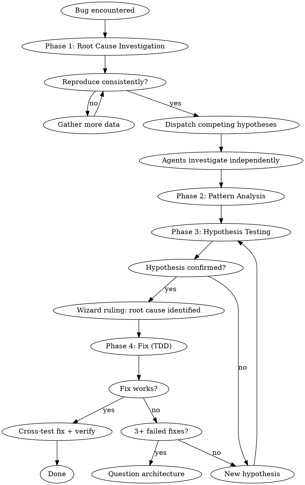

# Raid Debugging — Adversarial Root Cause Analysis

Three investigators, three hypotheses, one truth.

**Core principle:** ALWAYS find root cause before attempting fixes. Symptom fixes are failure.

**Violating the letter of this process is violating the spirit of debugging.**

## The Iron Law

```
NO FIXES WITHOUT ROOT CAUSE INVESTIGATION FIRST
```

If you haven't completed Phase 1, you cannot propose fixes.

## Mode Behavior

- **Full Raid**: 3 agents investigate competing hypotheses in parallel.
- **Skirmish**: 2 agents with different hypotheses.
- **Scout**: 1 agent investigates + Wizard challenges the hypothesis.

## Process Flow



## The Four Phases

### Phase 1: Root Cause Investigation

**BEFORE attempting ANY fix:**

1. **Read error messages carefully** — stack traces, line numbers, error codes. Don't skip past them. The answer is often in the first error.
2. **Reproduce consistently** — exact steps, every time. If not reproducible, gather more data — don't guess. An unreproducible bug is not understood.
3. **Check recent changes** — `git diff`, recent commits, new dependencies, config changes. What changed since it last worked?
4. **Gather evidence at boundaries** — in multi-component systems, log what enters and exits each component boundary. Run once to see WHERE it breaks. THEN investigate that component.
5. **Trace data flow** — where does the bad value originate? Keep tracing upstream until you find the source. Fix at source, not at symptom.

### Phase 2: Pattern Analysis

1. **Find working examples** of similar code in the same codebase
2. **Read reference implementations COMPLETELY** — don't skim. The difference between working and broken is often subtle.
3. **List every difference** between working and broken, however small
4. **Understand dependency assumptions** — what does this code expect from its environment?

### Phase 3: Hypothesis and Testing

1. **Form a single, specific hypothesis:** "X is the root cause because Y"
2. **Make the SMALLEST possible change** to test it. One variable at a time.
3. **Did it work?** -> Phase 4. **Didn't work?** -> NEW hypothesis. Don't pile fixes on top of failed fixes.

### Phase 4: Fix Implementation

1. **Write a failing test** that reproduces the bug (use `raid-tdd`)
2. **Implement single fix** addressing root cause
3. **Verify** — test passes, no regressions (run test command from `.claude/raid.json`)
4. **Cross-testing** by challengers — does the fix introduce new issues?

## Raid-Specific: Competing Hypotheses

The Wizard dispatches all agents with different hypotheses:

**📡 DISPATCH:**
> **Warrior**: Investigate [structural/data cause]. Reproduce. Trace data flow. Gather evidence at boundaries.
> **Archer**: Investigate [integration/contract cause]. Check interfaces, type mismatches, implicit contracts, dependency versions.
> **Rogue**: Investigate [timing/state/adversarial cause]. Race conditions, stale state, environment assumptions, concurrent access.

Agents present evidence and fight. The hypothesis that survives cross-testing wins.

⚡ WIZARD RULING: Root cause is [X] because [evidence].

## Root Cause Tracing

When tracing a bad value upstream:

```
1. Start at the symptom (where the bug manifests)
2. Find where the bad value is used
3. Find where it was set
4. Is THIS the source? Or was it passed from somewhere else?
5. If passed: go to the caller. Repeat from step 2.
6. When you find where the value ORIGINATES incorrectly: that's the root cause.
7. Fix at the source. Add validation at boundaries for defense-in-depth.
```

## 3+ Fixes Failed? Question Architecture

If 3 or more fix attempts fail, **STOP fixing and question architecture:**

- Each fix revealing a new problem in a different place = architectural issue, not implementation bug
- All three agents discuss fundamentals
- Wizard decides: fix architecture or escalate to human with evidence

This is not failure — it's the system working. Detecting architectural problems before sinking more time into symptom fixes.

## Defense in Depth

After finding and fixing the root cause, add validation at multiple layers:

1. **Entry point** — validate at the boundary where bad data enters
2. **Business logic** — assert preconditions at the function that broke
3. **Environment guards** — check assumptions about dependencies/state
4. **Debug instrumentation** — add logging at key boundaries for future diagnosis

## Red Flags — STOP and Follow Process

| Thought | Reality |
|---------|---------|
| "Quick fix for now" | NO. Find root cause. Quick fixes become permanent. |
| "Just try changing X" | NO. Hypothesize first. Random changes = random results. |
| "I'm confident it's Y" | Confidence ≠ evidence. Verify before acting. |
| "One more fix attempt" (after 2 failures) | STOP. Question architecture. |
| "I see the problem, let me fix it" | Seeing symptoms ≠ understanding root cause. Trace it. |
| "The issue is simple, don't need process" | Simple issues have root causes too. Process is fast. |
| "Emergency, no time" | Systematic debugging is FASTER than thrashing. Always. |
| "Just try this first" | The first fix sets the pattern. Do it right. |

## Escalation

| Situation | Action |
|-----------|--------|
| Can't reproduce | Gather more data. Instrument boundaries. Don't guess. |
| Root cause identified but fix is risky | Present to human with evidence and risk assessment. |
| 3+ fixes failed | Architectural discussion. Don't force through. |
| Bug is in a dependency | Document, workaround, and report upstream. |
