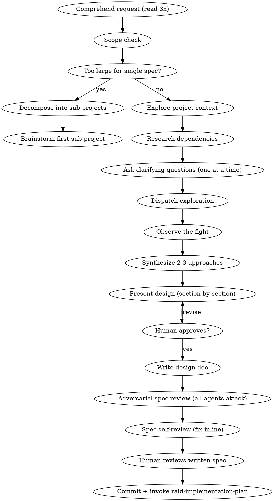

# Raid Design — Phase 1

Turn ideas into battle-tested designs through adversarial multi-agent exploration.

<HARD-GATE>
Do NOT write any code, scaffold any project, or take any implementation action until the Wizard has approved the design and it is committed to git. All assigned agents participate. No subagents.
</HARD-GATE>

## Mode Behavior

- **Full Raid**: All 3 agents explore from different angles, fight, cross-test. Full design doc required.
- **Skirmish**: 2 agents explore, produce a lightweight design+plan combined doc.
- **Scout**: Wizard assesses inline, no design doc required. Skip this skill entirely.

## Process Flow



## Wizard Checklist

Complete in order:

1. **Comprehend the request** — read 3 times, identify the real problem beneath the stated one
2. **Scope check** — if the request describes multiple independent subsystems, flag it immediately. Don't spend effort refining a project that needs decomposition first.
3. **Explore project context** — files, docs, recent commits, dependencies, conventions, patterns
4. **Research dependencies** — if external services/libraries involved: API surface, versioning, compatibility, known issues, rate limits, pricing, licensing. Read docs COMPLETELY, don't skim.
5. **Ask clarifying questions** — one at a time to the human, eliminate every ambiguity
6. **Dispatch exploration** — all agents explore from different angles
7. **Observe the fight** — let agents cross-test, learn from each other, push to edges
8. **Synthesize approaches** — propose 2-3 approaches with trade-offs and recommendation
9. **Present design** — in sections scaled to complexity, get human approval per section
10. **Write design doc** — save to specs path from `.claude/raid.json`
11. **Adversarial spec review** — all agents attack the written spec
12. **Spec self-review** — fix issues inline (see checklist below)
13. **Human reviews written spec** — human approves before proceeding
14. **Commit** — `docs(design): <topic> specification`
15. **Transition** — invoke `raid-implementation-plan`

## Dispatch Pattern

Each agent gets the same objective but a different starting angle:

**📡 DISPATCH:**

> **Warrior**: Explore from the data/infrastructure side. What are the hard technical constraints? What schemas, migrations, APIs are needed? What breaks if we get this wrong? Find the structural load-bearing walls.
>
> **Archer**: Explore from the integration/consistency side. How does this fit with existing patterns? What implicit contracts exist? What ripple effects? Trace the dependency chain. Check naming and file structure conventions.
>
> **Rogue**: Explore from the failure/adversarial side. What assumptions about inputs, state, timing, availability? Build failure scenarios. What does a malicious user do? What does a slow network do? What does concurrent access do?

## What Agents Must Cover

Every agent addresses ALL of these from their assigned angle:

- **Performance** — scale, bottlenecks, complexity
- **Robustness** — retries, fallbacks, graceful degradation
- **Reliability** — blast radius of failure, production-readiness
- **Testability** — meaningful tests, mock strategy, test-friendly design
- **Error handling** — what errors occur, how surfaced, UX of failure
- **Edge cases** — empty, null, boundary, Unicode, timezones, large payloads
- **Cascading effects** — blast radius, what else changes
- **Clean architecture** — separation of concerns, single responsibility, dependency inversion
- **Modularity & composability** — replaceable, extensible, composable
- **DRY** — duplicating logic? reuse existing code?
- **Dependencies** — version compatibility, security, maintenance, licensing

## The Fight — What Makes It Productive

```
Agents must:
1. Present findings with EVIDENCE (file paths, docs, concrete examples)
2. Challenge with COUNTER-EVIDENCE (not opinions)
3. Go to the EDGES — push every finding to its extreme
4. LEARN from each other — incorporate discoveries into your model
5. BUILD on discoveries — don't just attack, explore improvements
6. Test wrong assumptions EXPLICITLY — document WHY it was wrong
```

**The goal is not to tear each other down. The goal is to forge the strongest design by testing it from every angle.**

## Spec Self-Review

After writing the design doc, the Wizard reviews with fresh eyes:

1. **Placeholder scan:** Any TBD, TODO, incomplete sections, vague requirements? Fix them.
2. **Internal consistency:** Do any sections contradict each other? Architecture match feature descriptions?
3. **Scope check:** Focused enough for a single implementation plan, or needs decomposition?
4. **Ambiguity check:** Could any requirement be interpreted two ways? Pick one and make it explicit.

Fix issues inline. No need to re-review — just fix and move on.

## Design Document Structure

Save to: specs path from `.claude/raid.json` (default: `docs/raid/specs/YYYY-MM-DD-<topic>-design.md`)

```markdown
# [Feature Name] Design Specification

**Date:** YYYY-MM-DD
**Status:** Draft | Under Review | Approved
**Raid Team:** Wizard (lead), [agents used]
**Mode:** Full Raid | Skirmish

## Problem Statement
## Requirements (numbered, unambiguous)
## Constraints
## Research Findings
### Key Discoveries (survived cross-testing)
### Lessons Learned (wrong assumptions corrected)
## Design Decision
### Alternatives Considered (2-3 with rejection reasons)
## Architecture
## File Structure
## Error Handling Strategy
## Testing Strategy
## Edge Cases
## Future Considerations (NOT building now, designing to accommodate)
## ⚡ WIZARD RULING
```

## Red Flags — Thoughts That Signal Violations

| Thought | Reality |
|---------|---------|
| "This is too simple to need a design" | Simple projects are where unexamined assumptions cause the most waste. |
| "I already know the right approach" | Knowing and verifying are different. Propose 2-3 anyway. |
| "Let's just start coding and figure it out" | Code without design becomes the design. And it's usually wrong. |
| "The agents all agree, let's move on" | Agreement without challenge is groupthink. Did they actually cross-test? |
| "We don't need to research this dependency" | Don't assume. Read the docs. Check versioning. Known issues exist. |
| "One question covers it" | One question at a time. Cognitive overload hides ambiguity. |

## Escalation

If the team is stuck on a fundamental design choice after genuine exploration:
1. Present the top 2 options with trade-offs to the human
2. Let the human decide
3. Never ask the human to resolve something the team should handle

**Terminal state:** ⚡ WIZARD RULING: Design approved. Commit. Invoke `raid-implementation-plan`.
