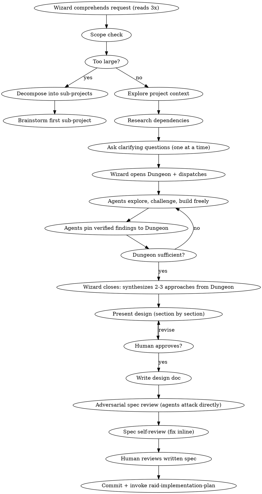

# Raid Design — Phase 1

Turn ideas into battle-tested designs through agent-driven adversarial exploration.

<HARD-GATE>
Do NOT write any code, scaffold any project, or take any implementation action until the Wizard has approved the design and it is committed to git. All assigned agents participate. No subagents.
</HARD-GATE>

## Mode Behavior

- **Full Raid**: All 3 agents explore from different angles, fight directly, pin findings to Dungeon. Full design doc required.
- **Skirmish**: 2 agents explore and interact, produce a lightweight design+plan combined doc.
- **Scout**: Wizard assesses inline, no design doc required. Skip this skill entirely.

## Process Flow



## Wizard Checklist

Complete in order:

1. **Comprehend the request** — read 3 times, identify the real problem beneath the stated one
2. **Scope check** — if the request describes multiple independent subsystems, flag it immediately
3. **Explore project context** — files, docs, recent commits, dependencies, conventions, patterns
4. **Research dependencies** — API surface, versioning, compatibility, known issues. Read docs COMPLETELY.
5. **Ask clarifying questions** — one at a time to the human, eliminate every ambiguity
6. **Open the Dungeon** — create `.claude/raid-dungeon.md` with Phase 1 header, quest, mode
7. **Dispatch with angles** — give each agent their angle, then go silent
8. **Observe the fight** — agents explore, challenge, build, roast, and pin findings to Dungeon. Intervene only on triggers.
9. **Close the phase** — when Dungeon has sufficient verified findings to form 2-3 approaches
10. **Synthesize approaches** — propose 2-3 approaches from Dungeon evidence, with trade-offs and recommendation
11. **Present design** — in sections scaled to complexity, get human approval per section
12. **Write design doc** — save to specs path from `.claude/raid.json`
13. **Adversarial spec review** — agents attack the written spec directly, challenging each other
14. **Spec self-review** — fix issues inline (see checklist below)
15. **Human reviews written spec** — human approves before proceeding
16. **Commit** — `docs(design): <topic> specification`
17. **Archive Dungeon** — rename to `.claude/raid-dungeon-phase-1.md`
18. **Transition** — invoke `raid-implementation-plan`

## Opening the Dungeon

Create `.claude/raid-dungeon.md`:

```markdown
# Dungeon — Phase 1: Design
## Quest: <task description from human>
## Mode: <Full Raid | Skirmish>

### Discoveries

### Active Battles

### Resolved

### Shared Knowledge

### Escalations
```

## Dispatch Pattern

Each agent gets the same objective but a different starting angle. After dispatch, the Wizard goes silent.

**📡 DISPATCH:**

> **@Warrior**: Explore from the data/infrastructure side. What are the hard technical constraints? What schemas, migrations, APIs are needed? What breaks if we get this wrong? Find the structural load-bearing walls. Challenge @Archer and @Rogue's findings directly. Pin verified findings to the Dungeon.
>
> **@Archer**: Explore from the integration/consistency side. How does this fit with existing patterns? What implicit contracts exist? What ripple effects? Trace the dependency chain. Check naming and file structure conventions. Challenge @Warrior and @Rogue's findings directly. Pin verified findings to the Dungeon.
>
> **@Rogue**: Explore from the failure/adversarial side. What assumptions about inputs, state, timing, availability? Build failure scenarios. What does a malicious user do? What does a slow network do? What does concurrent access do? Challenge @Warrior and @Archer's findings directly. Pin verified findings to the Dungeon.
>
> **All**: Read the Dungeon. Build on each other's discoveries. Challenge everything. Pin only what survives. Escalate to me with `🆘 WIZARD:` only when genuinely stuck.

## What Agents Must Cover

Every agent addresses ALL of these from their assigned angle:

- **Performance** — scale, bottlenecks, complexity
- **Robustness** — retries, fallbacks, graceful degradation
- **Reliability** — blast radius of failure, production-readiness
- **Testability** — meaningful tests, mock strategy, test-friendly design. When `browser.enabled`: can this feature be E2E tested with Playwright? What user flows need browser verification? Are there loading states, client-side routing, or visual states that unit tests can't catch?
- **Error handling** — what errors occur, how surfaced, UX of failure
- **Edge cases** — empty, null, boundary, Unicode, timezones, large payloads
- **Cascading effects** — blast radius, what else changes
- **Clean architecture** — separation of concerns, single responsibility, dependency inversion
- **Modularity & composability** — replaceable, extensible, composable
- **DRY** — duplicating logic? reuse existing code?
- **Dependencies** — version compatibility, security, maintenance, licensing

## The Fight — What Makes It Productive

```
Agents interact DIRECTLY — @Name addressing, building, challenging, roasting:
1. Present findings with EVIDENCE (file paths, docs, concrete examples)
2. Challenge other agents DIRECTLY with COUNTER-EVIDENCE (not opinions)
3. Build on each other's discoveries — 🔗 BUILDING ON @Name:
4. Go to the EDGES — push every finding to its extreme
5. LEARN from each other — incorporate discoveries into your model
6. Pin verified findings — 📌 DUNGEON: only after surviving challenge
7. Roast weak analysis — 🔥 ROAST: with evidence, not insults
8. Escalate to Wizard — 🆘 WIZARD: only when genuinely stuck
```

**The goal is not to tear each other down. The goal is to forge the strongest design by testing it from every angle. The Dungeon captures what survived.**

## Closing the Phase

The Wizard closes when the Dungeon has sufficient verified findings — enough Discoveries, Shared Knowledge, and Resolved battles to synthesize 2-3 approaches.

**How the Wizard knows it's time to close:**
- Dungeon has verified findings covering all major aspects (performance, robustness, testability, etc.)
- Active Battles section is empty or has only minor unresolved points
- Agents are converging — new findings are variations, not revelations
- Shared Knowledge section has the foundational truths the design needs

**⚡ WIZARD RULING:** Synthesize from Dungeon evidence. Propose 2-3 approaches. Recommend one. Archive Dungeon.

## Spec Self-Review

After writing the design doc, the Wizard reviews with fresh eyes:

1. **Placeholder scan:** Any TBD, TODO, incomplete sections, vague requirements? Fix them.
2. **Internal consistency:** Do any sections contradict each other? Architecture match feature descriptions?
3. **Scope check:** Focused enough for a single implementation plan, or needs decomposition?
4. **Ambiguity check:** Could any requirement be interpreted two ways? Pick one and make it explicit.

Fix issues inline.

## Design Document Structure

Save to: specs path from `.claude/raid.json` (default: `docs/raid/specs/YYYY-MM-DD-<topic>-design.md`)

```markdown
# [Feature Name] Design Specification

**Date:** YYYY-MM-DD
**Status:** Draft | Under Review | Approved
**Raid Team:** Wizard (dungeon master), [agents used]
**Mode:** Full Raid | Skirmish

## Problem Statement
## Requirements (numbered, unambiguous)
## Constraints
## Dungeon Findings (verified, from Phase 1 Dungeon)
### Key Discoveries (survived cross-testing)
### Lessons Learned (wrong assumptions corrected)
## Design Decision
### Alternatives Considered (2-3 with rejection reasons)
## Architecture
## File Structure
## Error Handling Strategy
## Testing Strategy
## Edge Cases
## Future Considerations (NOT building now, designing to accommodate)
## ⚡ WIZARD RULING
```

## Red Flags — Thoughts That Signal Violations

| Thought | Reality |
|---------|---------|
| "This is too simple to need a design" | Simple projects are where unexamined assumptions cause the most waste. |
| "I already know the right approach" | Knowing and verifying are different. Propose 2-3 anyway. |
| "Let's just start coding and figure it out" | Code without design becomes the design. And it's usually wrong. |
| "The agents all agree, let's move on" | Agreement without challenge is groupthink. Did they actually cross-test? |
| "I'll wait for the Wizard to tell me what to do" | You own the phase. Explore, challenge, build. Self-organize. |
| "Let me just post everything to the Dungeon" | Only verified, challenged findings get pinned. |
| "I need the Wizard to mediate this disagreement" | Talk to the other agent directly first. Escalate only if stuck. |

## Escalation

If the team is stuck on a fundamental design choice after genuine direct debate:
1. Present the top 2 options with trade-offs to the human
2. Let the human decide
3. Never ask the human to resolve something the team should handle

**Terminal state:** ⚡ WIZARD RULING: Design approved. Commit. Archive Dungeon. Invoke `raid-implementation-plan`.
