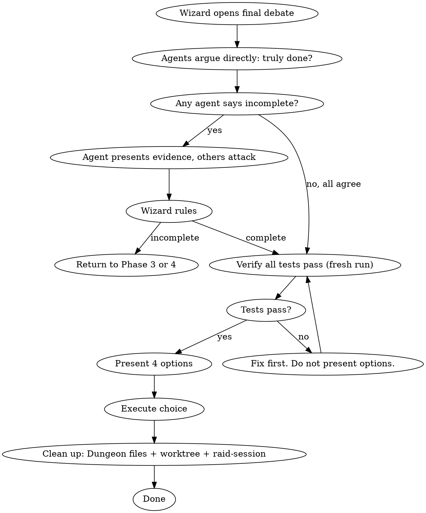

# Raid Finishing — Complete the Development Branch

Agents debate completeness directly. Verify. Present options. Execute. Clean up.

**Violating the letter of this process is violating its spirit.**

## Mode Behavior

- **Full Raid**: All 3 agents debate completeness directly. Full verification.
- **Skirmish**: 1 agent + Wizard verify completeness.
- **Scout**: Wizard verifies alone.

## Process Flow



## Wizard Checklist

1. **Open final debate** — dispatch agents to argue completeness directly
2. **Observe the fight** — agents challenge each other on what's done vs. missing
3. **Wizard rules on completeness** — only proceed if ruling is "complete"
4. **Verify all tests pass** — full suite, fresh run
5. **Present options** — exactly 4 choices
6. **Execute choice** — merge, PR, keep, or discard
7. **Clean up** — remove all Dungeon files (`.claude/raid-dungeon.md`, `.claude/raid-dungeon-phase-*.md`), worktree if applicable, remove `.claude/raid-session`

## Step 1: The Completeness Debate

**DISPATCH:**

> **@Warrior**: Review the implementation against the plan. Is every task completed? Every acceptance criterion met? Every test passing? Is anything half-done? Fight @Archer and @Rogue directly on their assessments.
>
> **@Archer**: Review the implementation against the design doc. Is every requirement covered? Naming patterns consistent throughout? File structure clean? Did we introduce inconsistencies with the rest of the codebase? Fight @Warrior and @Rogue directly.
>
> **@Rogue**: Review from the adversarial angle. What did we miss? What edge case is untested? What requirement was subtly misinterpreted? What will break in the first week of production? Fight @Warrior and @Archer directly.
>
> **All**: Reference ALL archived Dungeons (Phase 1-4) for full context. Debate directly. If you believe the work is incomplete, present evidence. Others challenge your claim. Pin conclusions to conversation (no Dungeon for finishing — this is the final debate).

**The agents must fight over this.** If any agent believes the work is incomplete, they present evidence. The other two challenge that claim directly.

RULING: [Complete — proceed | Incomplete — return to Phase 3/4 with specific issues]

## Step 2: Final Verification

```
BEFORE presenting options:
1. IDENTIFY: test command from .claude/raid.json
2. RUN: Execute the FULL test suite (fresh, complete)
3. READ: Full output, check exit code, count failures
4. VERIFY: Zero failures?
   If NO → STOP. Fix first. Do not present options.
   If YES → Proceed with evidence.
```

### Browser Verification (when `browser.enabled` in raid.json)

Additional final checks:
- Full Playwright test suite passes headlessly
- Verify no leaked processes from prior browser sessions
- Verify all ports in `browser.portRange` are free (`lsof -i :PORT`)
- Agents debate: "Are browser tests sufficient for this feature's coverage?"

## Step 3: Present Options

```
RULING: Implementation complete and verified.

Tests: [N] passing, 0 failures (evidence: [command output])

Options:
1. Merge back to [base-branch] locally
2. Push and create a Pull Request
3. Keep the branch as-is (handle later)
4. Discard this work

Which option?
```

## Step 4: Execute

| Option | Actions |
|--------|---------|
| **1. Merge** | Checkout base -> pull -> merge -> run tests on merged result -> delete branch -> clean up |
| **2. PR** | Push with -u -> create PR via gh -> clean up |
| **3. Keep** | Report branch location. Done. |
| **4. Discard** | Require typed "discard" confirmation -> delete branch (force) -> clean up |

## Step 5: Clean Up

Remove ALL Dungeon artifacts:
- `.claude/raid-dungeon.md` (if exists)
- `.claude/raid-dungeon-phase-1.md`
- `.claude/raid-dungeon-phase-2.md`
- `.claude/raid-dungeon-phase-3.md`
- `.claude/raid-dungeon-phase-4.md`
- `.claude/raid-session`
- Worktree (if applicable)

## Red Flags

| Thought | Reality |
|---------|---------|
| "Tests passed earlier, no need to re-run" | Verification Iron Law. Fresh run or no claim. |
| "The completeness debate is a formality" | It's where missed requirements surface. Take it seriously. |
| "Let me report to the Wizard whether it's complete" | Debate with the other agents directly. |
| "Merge without testing the merged result" | Merges introduce conflicts. Always test after merge. |
| "Leave the Dungeon files, they might be useful" | Clean up. Session artifacts don't belong in the repo. |

---

## Session Complete

When the chosen option is executed:

1. Remove all Dungeon files (`.claude/raid-dungeon*.md`)
2. Remove `.claude/raid-session`
3. Send shutdown to all teammates
4. **Session is over. No further skills to load.**
