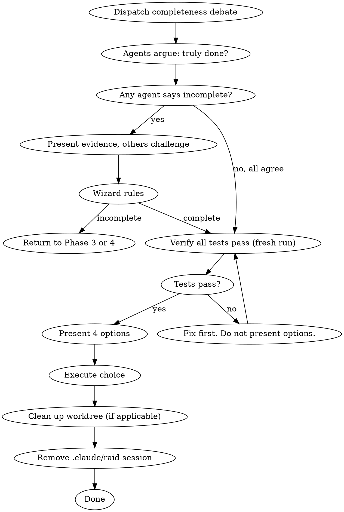

# Raid Finishing — Complete the Development Branch

Debate completeness. Verify. Present options. Execute. Clean up.

**Violating the letter of this process is violating its spirit.**

## Mode Behavior

- **Full Raid**: All 3 agents debate completeness independently. Full verification.
- **Skirmish**: 1 agent + Wizard verify completeness.
- **Scout**: Wizard verifies alone.

## Process Flow



## Wizard Checklist

1. **Dispatch completeness debate** — agents argue whether it's truly done
2. **Wizard rules on completeness** — only proceed if ruling is "complete"
3. **Verify all tests pass** — full suite, fresh run using test command from `.claude/raid.json`
4. **Present options** — exactly 4 choices
5. **Execute choice** — merge, PR, keep, or discard
6. **Clean up** — worktree if applicable, remove `.claude/raid-session`

## Step 1: The Completeness Debate

**📡 DISPATCH:**

> **Warrior**: Review the implementation against the plan. Is every task completed? Every acceptance criterion met? Every test passing? Is anything half-done?
>
> **Archer**: Review the implementation against the design doc. Is every requirement covered? Are naming patterns consistent throughout? Is the file structure clean? Did we introduce any inconsistencies with the rest of the codebase?
>
> **Rogue**: Review from the adversarial angle. What did we miss? What edge case is untested? What requirement was subtly misinterpreted? What will break in the first week of production?

**The agents must fight over this.** If any agent believes the work is incomplete, they must present evidence. The other two must challenge that claim. The Wizard decides.

⚡ WIZARD RULING: [Complete — proceed | Incomplete — return to Phase 3/4 with specific issues]

## Step 2: Final Verification

```
BEFORE presenting options:
1. IDENTIFY: test command from .claude/raid.json
2. RUN: Execute the FULL test suite (fresh, complete)
3. READ: Full output, check exit code, count failures
4. VERIFY: Zero failures?
   If NO → STOP. Fix first. Do not present options.
   If YES → Proceed with evidence.
```

## Step 3: Present Options

```
⚡ WIZARD RULING: Implementation complete and verified.

Tests: [N] passing, 0 failures (evidence: [command output])

Options:
1. Merge back to [base-branch] locally
2. Push and create a Pull Request
3. Keep the branch as-is (handle later)
4. Discard this work

Which option?
```

## Step 4: Execute

| Option | Actions |
|--------|---------|
| **1. Merge** | Checkout base -> pull -> merge -> run tests on merged result -> delete branch -> clean up worktree |
| **2. PR** | Push with -u -> create PR via gh -> clean up worktree |
| **3. Keep** | Report branch location. Done. |
| **4. Discard** | Require typed "discard" confirmation -> delete branch (force) -> clean up worktree |

## Red Flags

| Thought | Reality |
|---------|---------|
| "Tests passed earlier, no need to re-run" | Verification Iron Law. Fresh run or no claim. |
| "The completeness debate is a formality" | It's where missed requirements surface. Take it seriously. |
| "Let's skip the debate, the review was thorough" | Review checks quality. Finishing checks completeness. Different concerns. |
| "Merge without testing the merged result" | Merges introduce conflicts. Always test after merge. |
| "Just delete the branch, it's fine" | Require typed confirmation. Never delete work silently. |

**Terminal state:** Choice executed. Worktree cleaned. `.claude/raid-session` removed. Session over.
