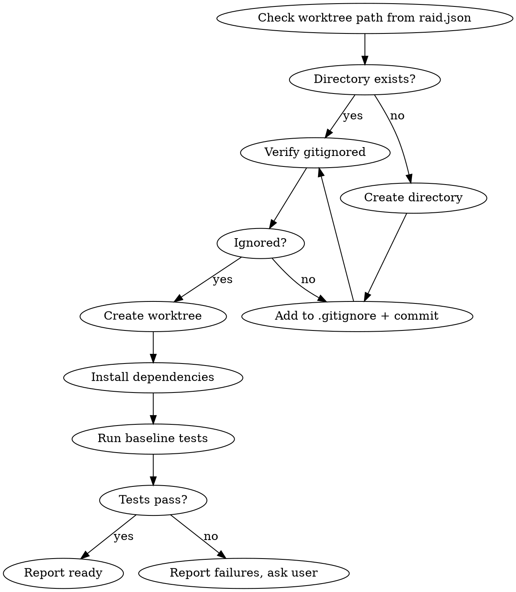

# Raid Git Worktrees — Isolated Workspaces

Systematic directory selection + safety verification = reliable isolation.

## Process Flow



## Directory Selection Priority

1. Check worktrees path from `.claude/raid.json` (default: `.worktrees/`) -> use it (verify ignored)
2. Check CLAUDE.md for preference -> use it
3. Ask the user

## Safety Verification

```bash
# MUST verify directory is gitignored before creating worktree
git check-ignore -q [worktrees-path] 2>/dev/null
```

If NOT ignored: add to `.gitignore`, commit immediately, then proceed. Fix broken things immediately — don't leave unignored worktree directories.

## Creation

```bash
WORKTREE_PATH=$(jq -r '.paths.worktrees // ".worktrees"' .claude/raid.json)
git worktree add "$WORKTREE_PATH/$BRANCH_NAME" -b "$BRANCH_NAME"
cd "$WORKTREE_PATH/$BRANCH_NAME"

# Auto-detect and install deps
[ -f package.json ] && npm install
[ -f Cargo.toml ] && cargo build
[ -f requirements.txt ] && pip install -r requirements.txt
[ -f pyproject.toml ] && poetry install
[ -f go.mod ] && go mod download

# Verify clean baseline
TEST_CMD=$(jq -r '.project.testCommand // empty' .claude/raid.json)
[ -n "$TEST_CMD" ] && eval "$TEST_CMD"
```

## Report

```
Worktree ready at [path]
Branch: [branch-name]
Tests: [N] passing, 0 failures
Ready for Raid implementation

Note: Dungeon files (.claude/raid-dungeon*.md) are session artifacts
and will be cleaned up by raid-finishing. No gitignore needed.
```

## Quick Reference

| Situation | Action |
|-----------|--------|
| `.worktrees/` exists | Use it (verify ignored) |
| `worktrees/` exists | Use it (verify ignored) |
| Both exist | Use `.worktrees/` |
| Neither exists | Check raid.json -> CLAUDE.md -> ask user |
| Directory not ignored | Add to .gitignore + commit first |
| Tests fail during baseline | Report failures + ask user before proceeding |
| No test command configured | Warn, proceed without baseline |

## Red Flags

| Thought | Reality |
|---------|---------|
| "I'll add it to .gitignore later" | Fix it now. Worktree dirs must never be committed. |
| "Baseline tests don't matter" | Failing baseline = you'll waste time debugging pre-existing failures. |
| "Skip dependency install, it'll be fine" | Missing deps = mysterious failures during implementation. |

**Never** create a worktree without verifying it's gitignored. **Never** skip baseline test verification. **Never** proceed with failing baseline tests without asking.
