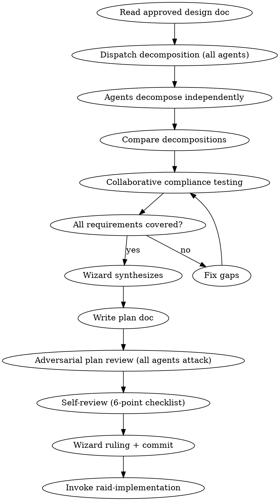

# Raid Implementation Plan — Phase 2

Break the design into bite-sized, battle-tested tasks through collaborative adversarial decomposition.

<HARD-GATE>
Do NOT start implementation until the plan is approved by the Wizard and committed to git. All assigned agents participate in plan creation AND review. No subagents.
</HARD-GATE>

## Mode Behavior

- **Full Raid**: All 3 agents decompose independently, then build the plan together. Full plan doc.
- **Skirmish**: 2 agents. Plan is combined with the design doc into one lightweight document.
- **Scout**: Skip this skill. Wizard creates inline tasks directly.

## Process Flow



## Wizard Checklist

1. **Read the approved design doc** — every requirement, every constraint
2. **Dispatch decomposition** — all agents decompose independently
3. **Observe the collaborative fight** — agents test each other's plans for compliance
4. **Synthesize** — merge the best elements from all decompositions
5. **Write the plan doc** — save to plans path from `.claude/raid.json`
6. **Adversarial plan review** — all agents attack the written plan
7. **Self-review** — 6-point checklist (see below)
8. **Wizard ruling** — final plan approval
9. **Commit** — `docs(plan): <feature> implementation plan`
10. **Transition** — invoke `raid-implementation`

## Dispatch for Decomposition

**📡 DISPATCH:**

> **Warrior**: Decompose into tasks. Focus on structural ordering — what MUST be built first? Hard dependencies? Critical path? Include tests for every task.
>
> **Archer**: Decompose into tasks. Focus on completeness and consistency — does every requirement have a task? Are interfaces well-defined across tasks? Are naming patterns and file structure consistent with the codebase?
>
> **Rogue**: Decompose into tasks. Focus on hidden complexity — which tasks are deceptively hard? Where will the implementer guess wrong? Which tests miss the failure path?

## Collaborative Compliance Testing

After independent decomposition, agents build together:

1. **Compare decompositions** — where they agree (high confidence) and disagree (needs discussion)
2. **Test compliance with design** — every requirement verified against the plan. Line by line. No gaps.
3. **Test naming consistency** — all names consistent with each other, the codebase, and the design doc
4. **Test file system consistency** — file paths follow project structure, module organization clean
5. **Test coverage** — every task has tests covering failure paths and edge cases
6. **Test ordering** — dependencies correct, build won't break between commits
7. **Learn from disagreements** — resolutions often reveal a better approach. Document why.

## Task Granularity

**Each step is one action (2-5 minutes):**
- "Write the failing test" — step
- "Run it to verify it fails" — step
- "Implement minimal code to pass" — step
- "Run tests to verify pass" — step
- "Commit" — step

## Task Structure

````markdown
### Task N: [Component Name]

**Files:**
- Create: `exact/path/to/file.ext`
- Modify: `exact/path/to/existing.ext`
- Test: `tests/exact/path/to/test.ext`

**Acceptance Criteria:**
- [ ] [Specific, verifiable criterion]
- [ ] All tests pass
- [ ] No regressions
- [ ] Naming follows established patterns

**Steps:**
- [ ] Step 1: Write the failing test
- [ ] Step 2: Run test, verify it fails for the right reason
- [ ] Step 3: Write minimal implementation
- [ ] Step 4: Run test, verify it passes + full suite passes
- [ ] Step 5: Commit with descriptive message
````

## No Placeholders — Ever

These are plan failures. Never write:
- "TBD", "TODO", "implement later", "fill in details"
- "Add appropriate error handling" (specify WHAT error handling)
- "Write tests for the above" (without actual test code)
- "Similar to Task N" (repeat the code — the implementer may read tasks out of order)
- "Handle edge cases" (specify WHICH edge cases)
- Steps that describe what to do without showing how
- References to undefined types, functions, or methods

**Violating the letter of the "no placeholders" rule is violating its spirit.**

## Self-Review (6-Point Checklist)

After writing the complete plan:

1. **Spec coverage:** Skim each requirement in the design doc. Point to the task that implements it. List any gaps.
2. **Placeholder scan:** Search for TBD, TODO, vague descriptions, missing code. Fix them.
3. **Type/name consistency:** Do types, method signatures, property names match across ALL tasks? A function called `clearLayers()` in Task 3 but `clearFullLayers()` in Task 7 is a bug.
4. **File structure consistency:** Do all file paths follow the project's conventions? Module organization clean?
5. **Test quality:** Does every task have tests? Do tests cover failure paths, not just happy paths?
6. **Ordering:** Can each task be built and committed independently without breaking the build?

Fix issues inline. If a spec requirement has no task, add the task.

## Red Flags

| Thought | Reality |
|---------|---------|
| "The plan is obvious from the design" | Plans expose complexity that specs hide. Decompose anyway. |
| "We can figure out the details during implementation" | Details in implementation = placeholders in the plan. |
| "These tasks are similar enough to batch" | Each task must be independently buildable and testable. |
| "Tests can be added later" | TDD means tests are in the plan. No test = no task. |
| "The naming will be consistent enough" | Check it explicitly. Naming drift is the #1 source of bugs across tasks. |

**Terminal state:** ⚡ WIZARD RULING: Plan approved. Commit. Invoke `raid-implementation`.
