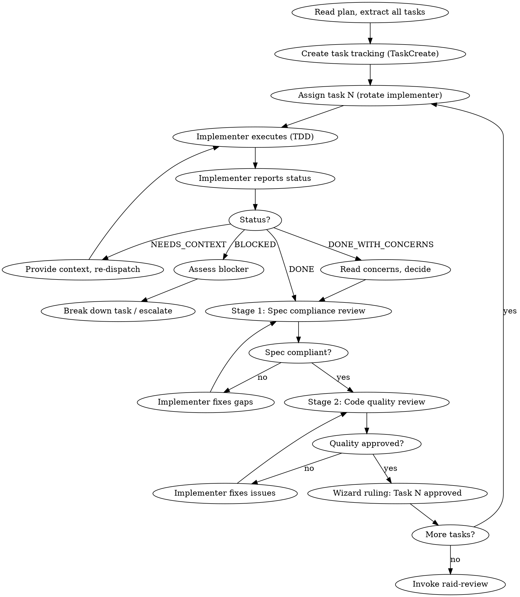

# Raid Implementation — Phase 3

One builds, two attack. Rotate. Every implementation earns its approval through two-stage review.

<HARD-GATE>
Do NOT implement without an approved plan (except Scout mode). Do NOT skip TDD. Do NOT let any implementation pass unchallenged. Do NOT use subagents. Use `raid-tdd` skill for all test-driven development. Use `raid-verification` before any completion claims.
</HARD-GATE>

## Mode Behavior

- **Full Raid**: 1 implements, 2 challenge. Rotate implementer across tasks.
- **Skirmish**: 1 implements, 1 challenges. Swap roles each task.
- **Scout**: 1 agent implements. Wizard reviews. Self-challenge ruthlessly.

TDD is enforced in ALL modes. This is an Iron Law.

## Process Flow

## Wizard Checklist

1. **Read the plan** — extract all tasks, dependencies, ordering
2. **Set up worktree** — use `raid-git-worktrees` for isolation (optional)
3. **Create task tracking** — use TaskCreate for every plan task
4. **Assign first task** — one implementer, challengers based on mode. **Rotate the implementer.**
5. **Run the gauntlet** — implement -> two-stage review -> fix -> approve per task
6. **Track progress** — mark complete only after Wizard ruling per task
7. **After all tasks** — invoke `raid-review`

## The Implementation Gauntlet (per task)

### Step 1: Wizard Assigns

One agent implements. Others prepare to attack. **Rotate the implementer** across tasks — track assignments with TaskCreate to ensure no agent implements twice in a row.

### Step 2: Implementer Executes (TDD)

Following `raid-tdd` strictly:
1. Write the failing test from the plan
2. Run test command from `.claude/raid.json` — verify it fails for the RIGHT reason
3. Write minimal code to pass
4. Run — verify pass
5. Run FULL test suite — verify no regressions
6. Self-review against acceptance criteria
7. Commit: `feat(scope): descriptive message`

Report status: **DONE** | **DONE_WITH_CONCERNS** | **NEEDS_CONTEXT** | **BLOCKED**

### Step 3: Two-Stage Review

**Stage 1 — Spec Compliance (did they build the right thing?)**

Each challenger independently:
1. Read ACTUAL CODE (not the implementer's report — reports lie)
2. Verify against task spec line by line
3. Check against design doc requirements
4. Check: missing requirements? Extra features not requested? Misinterpretations?

**Stage 2 — Code Quality (did they build it right?)**

Each challenger independently:
1. Try to break it — edge cases, failure scenarios, adversarial inputs
2. Check test quality — do tests prove correctness or just confirm happy path?
3. Check naming consistency — do new names follow established patterns?
4. Check file structure — does new code follow project conventions?
5. Present findings with evidence: file paths, line numbers, concrete scenarios

### Step 4: Implementer Responds

Defend with evidence or concede immediately. Fix conceded issues. Re-run all tests.

### Step 5: Wizard Rules

⚡ WIZARD RULING: Task N [approved | needs fixes]

## Handling Implementer Status

| Status | Action |
|--------|--------|
| **DONE** | Proceed to Stage 1 review |
| **DONE_WITH_CONCERNS** | Read concerns. If about correctness: address before review. If observations: note and proceed. |
| **NEEDS_CONTEXT** | Provide missing information. Re-dispatch. |
| **BLOCKED** | 1) Context problem → provide more context. 2) Task too complex → break into subtasks. 3) Plan wrong → fix plan, re-assign. |

**Never ignore an escalation.** If the implementer says it's stuck, something needs to change.

## Quality Gates Per Task

- [ ] Tests written BEFORE implementation (TDD)
- [ ] Tests fail for the right reason
- [ ] Tests pass after implementation
- [ ] Full test suite passes (no regressions)
- [ ] Stage 1: Spec compliance verified by challengers
- [ ] Stage 2: Code quality verified by challengers
- [ ] All challenges addressed (fixed or defended with evidence)
- [ ] Implementation matches task spec (nothing more, nothing less)
- [ ] Naming follows established patterns
- [ ] Code committed with descriptive message

## Red Flags

| Thought | Reality |
|---------|---------|
| "This task is simple, skip cross-testing" | Simple tasks are where assumptions slip through. |
| "The implementer's self-review is sufficient" | Self-review catches simple issues. Cross-testing catches design issues. Both needed. |
| "We can batch the review for multiple tasks" | Review per task. Batching lets issues compound. |
| "I trust this agent's work" | Trust without verification is the definition of a bug farm. |
| "Let's skip Stage 1, go straight to quality" | Wrong order. Build the wrong thing well = waste. |
| "The same agent can implement twice in a row" | Rotation prevents blind spots. Enforce it. |

## Escalation

- **3+ fix attempts on one task:** Question whether the task spec or design is wrong, not just the implementation.
- **Agent repeatedly blocked:** The plan may need revision. Discuss with the team before forcing through.
- **Tests can't be written:** The design may not be testable. Return to Phase 1.

**Terminal state:** All tasks approved. Invoke `raid-review`.
