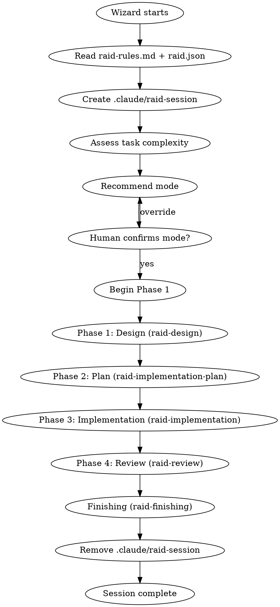
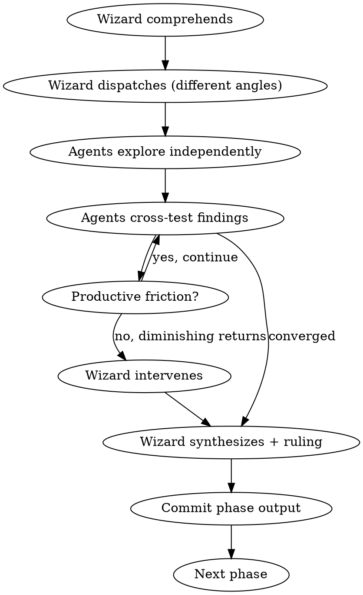

# Raid Protocol — Adversarial Multi-Agent Development

The canonical workflow for all Raid operations. Every feature, bugfix, refactor follows this sequence.

<HARD-GATE>
Do NOT skip phases. Do NOT let a single agent work unchallenged (except in Scout mode). Do NOT proceed without a Wizard ruling. No subagents — agent teams only.
</HARD-GATE>

## Session Lifecycle

**On session start:** Create `.claude/raid-session` to activate workflow hooks.
**On session end:** Remove `.claude/raid-session` to deactivate hooks.

Hooks that enforce workflow discipline (phase-gate, test-pass, verification) only fire when `.claude/raid-session` exists. This prevents hooks from blocking normal coding outside of a Raid.

## Team

| Agent | Role | Color |
|-------|------|-------|
| **Wizard** (Lead) | Coordinator, analyzer, judge, final authority | Purple |
| **Warrior** | Aggressive thorough explorer, stress-tests to destruction | Red |
| **Archer** | Precise pattern-seeker, finds hidden connections and drift | Green |
| **Rogue** | Adversarial assumption-destroyer, thinks like attacker | Orange |

## Team Rules

Read and follow `.claude/raid-rules.md`. Non-negotiable.

## Configuration

Read `.claude/raid.json` for project-specific settings. If absent, use sensible defaults:

| Key | Default | Purpose |
|-----|---------|---------|
| `project.testCommand` | (none) | Command to run tests |
| `project.lintCommand` | (none) | Command to run linting |
| `project.buildCommand` | (none) | Command to build |
| `paths.specs` | `docs/raid/specs` | Where design docs go |
| `paths.plans` | `docs/raid/plans` | Where plans go |
| `paths.worktrees` | `.worktrees` | Where worktrees go |
| `conventions.fileNaming` | `none` | Naming convention |
| `conventions.commits` | `conventional` | Commit format |
| `raid.defaultMode` | `full` | Default mode |

## Modes

Three modes that scale effort to task complexity.

| Aspect | Full Raid | Skirmish | Scout |
|--------|-----------|----------|-------|
| Agents active | 3 | 2 | 1 |
| Design phase | Full adversarial | Lightweight | Skip (inline) |
| Plan phase | Full adversarial | Merged with design | Skip (inline) |
| Implementation | 1 builds, 2 attack | 1 builds, 1 attacks | 1 builds, Wizard reviews |
| Review phase | 3 independent reviews | 1 review + Wizard | Wizard review only |
| TDD | **Enforced** | **Enforced** | **Enforced** |
| Verification | Triple | Double | Single + Wizard |
| Design doc | Required | Optional (brief) | Not required |
| Plan doc | Required | Combined with design | Not required |

**Mode selection:** User specifies, or Wizard recommends based on task complexity.
**Escalation:** Wizard may escalate (Scout->Skirmish->Full) with human approval.
**De-escalation:** Only with human approval.

**TDD is non-negotiable in ALL modes.** This is an Iron Law, not a preference.

## The Phase Pattern

Every phase follows the same adversarial loop:

### Phase Transition Gates

| From | To | Gate |
|------|-----|------|
| Design | Plan | Design doc approved by Wizard, committed |
| Plan | Implementation | Plan approved by Wizard, committed |
| Implementation | Review | All tasks complete, all tests passing, committed |
| Review | Done | Wizard ruling: approved for merge |

**Violating the letter of these gates is violating the spirit of the process.**

## When the Wizard Intervenes

The Wizard observes 90%, acts 10%. Intervention triggers:

| Signal | Action |
|--------|--------|
| Same arguments 3+ rounds, no new evidence | Break the loop. Rule or redirect. |
| All agents converged | Synthesize and move on. |
| Irreconcilable deadlock | Rule with rationale. Binding. |
| Agents drifting from objective | Redirect with clarity. |
| Agents wasting moves on trivial points | Call out and refocus. |
| Agent rubber-stamping (lazy) | Call out and demand genuine challenge. |
| Agent defending past evidence (ego) | Call out. Evidence or concede. |

## Red Flags — Thoughts That Signal Violations

| Thought | Reality |
|---------|---------|
| "This phase is obvious, let's skip it" | Obvious phases are where assumptions hide. |
| "The agents agree, no need for cross-testing" | Agreement without challenge is groupthink. |
| "Let's just fix this quickly, no need for design" | Quick fixes without design become tech debt. |
| "TDD would slow us down on this one" | TDD is an Iron Law. No exceptions. |
| "One agent can handle this alone" | Scout mode exists. Use it. Don't bypass modes. |
| "We already know what to build" | Knowing and verifying are different things. |
| "The human doesn't need to see intermediate results" | Wizard is the human interface. Always report. |

## Skills Reference

| Skill | Phase | Purpose |
|-------|-------|---------|
| `raid-protocol` | Start | Session lifecycle, modes, rules, reference |
| `raid-design` | 1 | Adversarial design with edge exploration |
| `raid-implementation-plan` | 2 | Collaborative plan with compliance testing |
| `raid-implementation` | 3 | Cross-validated implementation with rotation |
| `raid-review` | 4 | Adversarial full review |
| `raid-finishing` | End | Completeness debate + merge options |
| `raid-tdd` | 3 | TDD with adversarial test quality review |
| `raid-debugging` | Any | Competing hypothesis root cause analysis |
| `raid-verification` | Any | Evidence before completion claims |
| `raid-git-worktrees` | 3 | Isolated workspace setup |

## Hooks Reference

| Hook | Event | Active | Purpose |
|------|-------|--------|---------|
| `validate-file-naming.sh` | PostToolUse (Write/Edit) | Always | Enforce naming conventions |
| `validate-commit-message.sh` | PreToolUse (Bash) | Always | Conventional commits |
| `validate-tests-pass.sh` | PreToolUse (Bash) | Raid session only | Tests before commits |
| `validate-phase-gate.sh` | PreToolUse (Write) | Raid session only | Design doc before code |
| `validate-no-placeholders.sh` | PostToolUse (Write/Edit) | Always | No TBD/TODO in specs/plans |
| `validate-verification.sh` | PreToolUse (Bash) | Raid session only | Test evidence before completion |

## Commit Convention

All commits follow: `type(scope): description`

Types: `feat`, `fix`, `docs`, `style`, `refactor`, `perf`, `test`, `build`, `ci`, `chore`, `revert`

Phase transitions: `docs(design): <topic>`, `docs(plan): <topic>`, `feat(scope): <what>`, `fix(scope): <what>`

## Communication Prefixes

| Prefix | Agent | Meaning |
|--------|-------|---------|
| 📡 DISPATCH: | Wizard | Assigning tasks |
| ⚡ WIZARD RULING: | Wizard | Final decision, binding, no appeals |
| 🔍 FINDING: / ⚔️ CHALLENGE: | Warrior | Discovery / Challenge |
| 🎯 FINDING: / 🏹 CHALLENGE: | Archer | Discovery / Challenge |
| 💀 FINDING: / 🗡️ CHALLENGE: | Rogue | Discovery / Challenge |
| ✅ CONCEDE: | Any | Conceding (brief, move on) |
