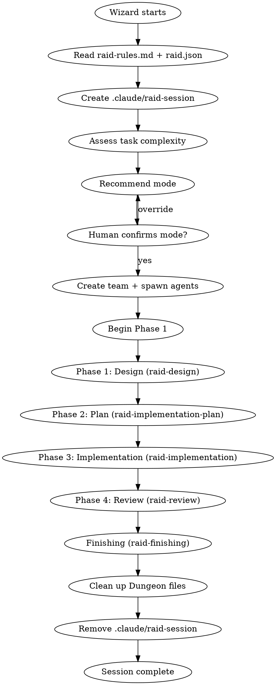
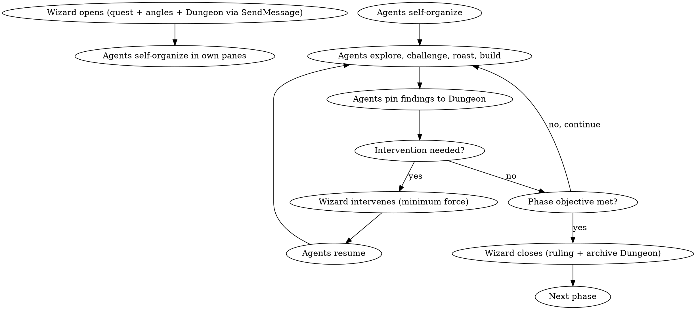

# Raid Protocol — Adversarial Multi-Agent Development

The canonical workflow for all Raid operations. Every feature, bugfix, refactor follows this sequence.

<HARD-GATE>
Do NOT skip phases. Do NOT let a single agent work unchallenged (except in Scout mode). Do NOT proceed without a Wizard ruling. Agents communicate via SendMessage — do not spawn subagents.
</HARD-GATE>

## Session Lifecycle



**On session start:** Create `.claude/raid-session` to activate workflow hooks. After mode approval, create team with `TeamCreate` and spawn agents — each gets their own tmux pane.
**On session end:** Send shutdown to teammates, remove `.claude/raid-session`, remove all Dungeon files.

Hooks that enforce workflow discipline (phase-gate, test-pass, verification) only fire when `.claude/raid-session` exists.

## Team

| Agent | Role | Color |
|-------|------|-------|
| **Wizard** (Dungeon Master) | Opens phases, observes, intervenes when necessary, closes with ruling | Purple |
| **Warrior** | Aggressive explorer, stress-tests to destruction, builds on team findings | Red |
| **Archer** | Precise pattern-seeker, finds hidden connections and drift, traces ripple effects | Green |
| **Rogue** | Adversarial assumption-destroyer, constructs attack scenarios, weaponizes findings | Orange |

## Team Spawning

After mode approval, the Wizard creates the team and spawns agents:

```
TeamCreate(team_name="raid-{mode}-{slug}")
Agent(subagent_type="warrior", team_name="raid-...", name="warrior")
Agent(subagent_type="archer", team_name="raid-...", name="archer")  # Full Raid + Skirmish
Agent(subagent_type="rogue", team_name="raid-...", name="rogue")    # Full Raid only
```

Each agent gets its own tmux pane. Agents stay alive for the entire session — they go idle between turns and wake up when they receive a message.

**Communication:**
- `SendMessage(to="warrior", message="...")` — direct message
- Agents message each other directly: `SendMessage(to="archer", ...)`
- The Dungeon is still the shared knowledge artifact for durable findings
- The task list (`TaskCreate`/`TaskUpdate`) handles work coordination

**User access:** The user can click into any agent's tmux pane and interact directly. User instructions override all agents.

## Team Rules

Read and follow `.claude/raid-rules.md`. Non-negotiable. 17 rules including Dungeon discipline, direct engagement, wise escalation, and evidence-backed roasts.

## Configuration

Read `.claude/raid.json` for project-specific settings. If absent, use sensible defaults:

| Key | Default | Purpose |
|-----|---------|---------|
| `project.testCommand` | (none) | Command to run tests |
| `project.lintCommand` | (none) | Command to run linting |
| `project.buildCommand` | (none) | Command to build |
| `project.packageManager` | (auto-detected) | Package manager (npm, pnpm, yarn, bun, uv, poetry) |
| `project.runCommand` | (auto-detected) | Run command prefix (e.g., `pnpm`, `npm run`) |
| `project.execCommand` | (auto-detected) | Exec command prefix (e.g., `pnpm dlx`, `npx`) |
| `paths.specs` | `docs/raid/specs` | Where design docs go |
| `paths.plans` | `docs/raid/plans` | Where plans go |
| `paths.worktrees` | `.worktrees` | Where worktrees go |
| `conventions.fileNaming` | `none` | Naming convention |
| `conventions.commits` | `conventional` | Commit format |
| `raid.defaultMode` | `full` | Default mode |
| `browser.enabled` | `false` | Whether browser testing is active |
| `browser.framework` | (auto-detected) | Detected framework (next, vite, angular, etc.) |
| `browser.devCommand` | (auto-detected) | Dev server command |
| `browser.baseUrl` | (auto-detected) | Base URL for browser tests |
| `browser.portRange` | `[3001, 3005]` | Port range for isolated agent instances |
| `browser.playwrightConfig` | `playwright.config.ts` | Playwright config path |
| `browser.auth` | `null` | Auth config (discovered by agents) |
| `browser.startup` | `null` | Startup recipe (discovered by agents) |

## Browser Testing

When `browser.enabled` is `true` in `raid.json`, browser testing integrates into the existing workflow:

- **Phase 3 (Implementation):** Browser-facing code uses TDD with Playwright — write `.spec.ts` files as part of RED-GREEN-REFACTOR. Use `raid-browser-playwright`. Challengers boot their own app instances to verify tests independently.
- **Phase 4 (Review):** After code review, challengers do live adversarial inspection in Chrome — each on their own isolated port. Use `raid-browser-chrome`. Warrior stress-tests, Archer checks visual consistency, Rogue probes security.
- **Startup discovery:** First time browser testing runs, an agent investigates how to boot the app (dev server, databases, edge workers, env vars) and writes the recipe to `raid.json`. Use `raid-browser`.
- **Pre-flight:** Before every browser session, agents must state exactly what they're testing (hard gate) and check auth requirements.
- **Cleanup iron law:** Every boot has a matching cleanup. Leaked processes are never acceptable.

Browser testing is **not a separate workflow** — it extends existing phases. If `browser.enabled` is `false` or absent, all browser-related behavior is skipped.

## Modes

Three modes that scale effort to task complexity.

| Aspect | Full Raid | Skirmish | Scout |
|--------|-----------|----------|-------|
| Agents active | 3 | 2 | 1 |
| Design phase | Full adversarial | Lightweight | Skip (inline) |
| Plan phase | Full adversarial | Merged with design | Skip (inline) |
| Implementation | 1 builds, 2 attack | 1 builds, 1 attacks | 1 builds, Wizard reviews |
| Review phase | 3 independent reviews | 1 review + Wizard | Wizard review only |
| TDD | **Enforced** | **Enforced** | **Enforced** |
| Verification | Triple | Double | Single + Wizard |
| Design doc | Required | Optional (brief) | Not required |
| Plan doc | Required | Combined with design | Not required |
| Dungeon | Full (all sections) | Lightweight | Wizard notes only |

**Mode selection:** User specifies, or Wizard recommends based on task complexity.
**Escalation:** Wizard may escalate (Scout->Skirmish->Full) with human approval.
**De-escalation:** Only with human approval.

**TDD is non-negotiable in ALL modes.** This is an Iron Law, not a preference.

## The Dungeon — Shared Knowledge Artifact

The Dungeon (`.claude/raid-dungeon.md`) is the team's shared knowledge board. It persists within a phase and gets archived when the phase closes.

### Dungeon Structure

```markdown
# Dungeon — Phase N: <Phase Name>
## Quest: <task description>
## Mode: <Full Raid | Skirmish | Scout>

### Discoveries
<!-- Verified findings that survived challenge, tagged with agent name -->

### Active Battles
<!-- Ongoing unresolved challenges between agents -->

### Resolved
<!-- Challenges that reached conclusion — conceded, proven, or Wizard-ruled -->

### Shared Knowledge
<!-- Facts established as true by 2+ agents agreeing or surviving challenge -->

### Escalations
<!-- Points where agents pulled the Wizard in -->
```

### Dungeon Lifecycle

| Event | Action | Who |
|-------|--------|-----|
| Phase opens | Create `.claude/raid-dungeon.md` with header | Wizard |
| During phase | Read and write via `DUNGEON:` signal | Agents |
| Phase closes | Rename to `.claude/raid-dungeon-phase-N.md` | Wizard |
| Next phase opens | Create fresh `.claude/raid-dungeon.md` | Wizard |
| Session ends | Remove all Dungeon files | Wizard |

### Dungeon Curation Rules

**What goes IN the Dungeon (via `DUNGEON:` only):**
- Findings that survived a challenge (verified truths)
- Active unresolved battles (prevents re-litigation)
- Shared knowledge promoted by 2+ agents agreeing
- Key decisions and their reasoning
- Escalation points and Wizard responses

**Verification requirement:** Pinned entries (`DUNGEON:`) must reference at least 2 agents who independently verified the finding. The hook enforces this as a format check — but the requirement is substantive, not cosmetic. Pinning a finding with agent names who did not actually verify it is a protocol violation. The Wizard will remove fraudulent pins and redirect the offending agent.

**What stays in conversation only:**
- Back-and-forth of challenges and roasts
- Exploratory thinking and hypotheses
- Concessions and rebuttals
- Anything that didn't produce a durable insight

**The conversation is the sparring ring. The Dungeon is the scoreboard.**

### Referencing Prior Phases

Agents can read archived Dungeons from prior phases. Design knowledge carries into Plan. Plan knowledge carries into Implementation. This is how context survives phase transitions.

## The Phase Pattern

Every phase follows the open/close bookend model:



### Phase Transition Gates

| From | To | Gate |
|------|-----|------|
| Design | Plan | Design doc approved by Wizard ruling, committed |
| Plan | Implementation | Plan approved by Wizard ruling, committed |
| Implementation | Review | All tasks complete, all tests passing, committed |
| Review | Finishing | Wizard ruling: approved for merge |

**Violating the letter of these gates is violating the spirit of the process.**

## Interaction Protocols

### Communication Signals Reference

| Signal | Who | Meaning | Goes to Dungeon? |
|--------|-----|---------|------------------|
| `DISPATCH:` | Wizard | Opening a phase via SendMessage, assigning angles | No (phase opening) |
| `REDIRECT:` | Wizard | Brief course correction — one sentence, then silence | No |
| `RULING:` | Wizard | Phase over, binding decision | Ruling archived with Dungeon |
| `@Name, ...` | Any agent | Direct address to specific agent | No |
| `FINDING:` | Any agent | Discovery with own evidence | No |
| `CHALLENGE:` | Any agent | Independently verified a claim, found a problem | No |
| `BUILDING:` | Any agent | Independently verified a claim, found it goes deeper | Result goes to Dungeon if verified |
| `DUNGEON:` | Any agent | Pinning finding verified by 2+ agents | Yes — this is the write gate |
| `WIZARD:` | Any agent | Escalation — needs Wizard input | Yes (as escalation point) |
| `CONCEDE:` | Any agent | Proven wrong, moving on | No |

### Direct Interaction Rules

- **Evidence required.** All challenges, roasts, and findings must carry proof — file paths, line numbers, concrete scenarios. "This is wrong" without evidence is laziness.
- **Build explicitly.** `BUILDING:` forces credit and continuity. Don't restart from scratch when someone found something useful.
- **Concede instantly.** When proven wrong, concede. Then find a new angle. No ego.
- **Pin deliberately.** `DUNGEON:` is the quality gate. Only verified, challenged findings get pinned. Other agents can challenge whether a pin belongs.
- **Escalate wisely.** `WIZARD:` when genuinely stuck, split on fundamentals, or need project-level context. Not when lazy.

### When to Escalate to Wizard

**Do escalate:**
- 2+ agents stuck on same disagreement for 3+ exchanges with no new evidence
- Uncertain about project-level context (user requirements, constraints, priorities)
- Team needs a direction-setting decision that affects the quest
- Found something that may require human input

**Don't escalate:**
- You can resolve it by reading the code
- Another agent already answered your question
- It's a matter of opinion that doesn't affect the outcome
- You're stuck but haven't tried talking to the other agents first

## When the Wizard Intervenes

The Wizard observes 90%, acts 10%. Intervention triggers:

| Signal | Action |
|--------|--------|
| Same arguments 3+ rounds, no new evidence | `REDIRECT:` Break the loop. Or `RULING:` if unresolvable. |
| Agents drifting from objective | `REDIRECT:` One sentence back on track. |
| Agents stuck, no progress (deadlock) | `RULING:` Decide with rationale. Binding. |
| Shallow work, rubber-stamping (laziness) | `REDIRECT:` Demand genuine independent verification. |
| Skipped verification (responded without own evidence) | `REDIRECT:` "Verify first, then respond." |
| Premature convergence (agreed without challenging) | `REDIRECT:` "Challenge before agreeing." |
| Defending past evidence (ego) | `REDIRECT:` Evidence or concede. |
| Wrong finding in Dungeon (misinformation) | `REDIRECT:` Remove and correct. |
| Agent escalation (`WIZARD:`) | Answer or redirect as appropriate. |
| All agents converged with genuine verification | `RULING:` Synthesize and close. |

## Red Flags — Thoughts That Signal Violations

| Thought | Reality |
|---------|---------|
| "This phase is obvious, let's skip it" | Obvious phases are where assumptions hide. |
| "The agents agree, no need for cross-testing" | Agreement without challenge is groupthink. |
| "Let's just fix this quickly, no need for design" | Quick fixes without design become tech debt. |
| "TDD would slow us down on this one" | TDD is an Iron Law. No exceptions. |
| "One agent can handle this alone" | Scout mode exists. Use it. Don't bypass modes. |
| "We already know what to build" | Knowing and verifying are different things. |
| "The Wizard should mediate this" | Agents resolve directly. Wizard observes. |
| "Let me just post everything to the Dungeon" | Dungeon is a scoreboard, not a log. Pin only verified findings. |
| "I'll wait for the Wizard to tell me what to do next" | You own the phase. Self-organize. |

## Skills Reference

| Skill | Phase | Purpose |
|-------|-------|---------|
| `raid-protocol` | Start | Session lifecycle, Dungeon lifecycle, modes, rules, reference |
| `raid-design` | 1 | Adversarial design with agent-driven exploration |
| `raid-implementation-plan` | 2 | Collaborative plan with direct cross-testing |
| `raid-implementation` | 3 | Agent-driven implementation with rotation |
| `raid-review` | 4 | Adversarial full review with Dungeon-tracked issues |
| `raid-finishing` | End | Completeness debate + merge options |
| `raid-tdd` | 3 | TDD with collaborative test quality review |
| `raid-debugging` | Any | Competing hypothesis with direct debate |
| `raid-verification` | Any | Evidence before completion claims |
| `raid-git-worktrees` | 3 | Isolated workspace setup |
| `raid-browser` | 3, 4 | Browser orchestration: startup discovery, boot/cleanup, pre-flight |
| `raid-browser-playwright` | 3 | Automated browser TDD with Playwright MCP |
| `raid-browser-chrome` | 4 | Live adversarial Chrome inspection |

## Hooks Reference

All hooks source `raid-lib.sh` for shared session/config parsing.

| Hook | Event | Active | Purpose |
|------|-------|--------|---------|
| `validate-commit.sh` | PreToolUse (Bash) | Always (format), Raid session (tests/verification) | Conventional commits + tests pass + verification evidence |
| `validate-write-gate.sh` | PreToolUse (Write/Edit) | Raid session only | Phase-aware write gate (design doc before code) |
| `validate-file-naming.sh` | PostToolUse (Write/Edit) | Always | Enforce naming conventions |
| `validate-no-placeholders.sh` | PostToolUse (Write/Edit) | Always | No TBD/TODO in specs/plans |
| `validate-dungeon.sh` | PostToolUse (Write/Edit) | Raid session only | Dungeon discipline enforcement |
| `validate-browser-cleanup.sh` | PostToolUse (Bash) | Raid session + browser enabled | Warn if browser ports still occupied |
| `validate-browser-tests-exist.sh` | PreToolUse (Bash) | Raid session + browser enabled | Warn if browser-facing code has no Playwright tests |

## Commit Convention

All commits follow: `type(scope): description`

Types: `feat`, `fix`, `docs`, `style`, `refactor`, `perf`, `test`, `build`, `ci`, `chore`, `revert`

Phase transitions: `docs(design): <topic>`, `docs(plan): <topic>`, `feat(scope): <what>`, `fix(scope): <what>`
