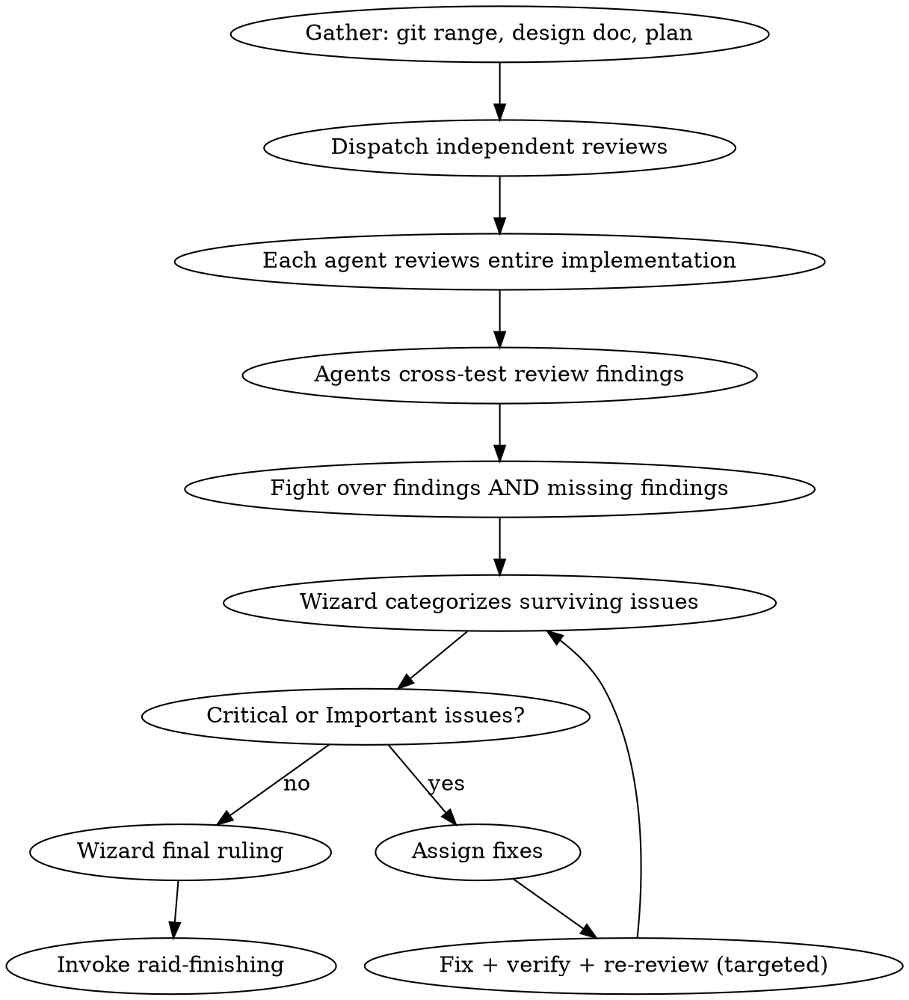

# Raid Review — Phase 4

The final gauntlet. Three reviewers, three angles, zero mercy.

<HARD-GATE>
Do NOT declare work complete without Phase 4 (except Scout mode where Wizard reviews alone). All assigned agents review the ENTIRE implementation independently. Use `raid-verification` before any completion claims. No subagents.
</HARD-GATE>

## Mode Behavior

- **Full Raid**: 3 independent reviews, cross-tested. All severity levels enforced.
- **Skirmish**: 1 agent reviews + Wizard. Cross-testing between reviewer and Wizard.
- **Scout**: Wizard reviews alone. Checks against requirements and runs tests.

## Process Flow



## Wizard Checklist

1. **Prepare** — gather git range, design doc, plan doc
2. **Dispatch full review** — all agents review independently
3. **Observe the fight** — agents cross-test review findings
4. **Synthesize** — categorize surviving issues by severity
5. **Rule on fixes** — Critical and Important must be fixed
6. **Verify fixes** — targeted re-review after fixes (use `raid-verification`)
7. **Final ruling** — approved or rejected
8. **Transition** — invoke `raid-finishing`

## Dispatch

**📡 DISPATCH:**

> **Warrior**: Review full implementation. Run every test. Check error handling at every boundary. Verify all requirements from design doc. Find the bugs that crash in production.
>
> **Archer**: Review full implementation. Does it match the design doc exactly? Are patterns consistent? Interfaces correct? Types sound? Naming conventions followed throughout? File structure clean? Find the bugs that silently produce wrong results.
>
> **Rogue**: Review full implementation. Think like an attacker. What inputs break it? What timing causes races? What happens when dependencies fail? Find the bugs nobody else will find.

## Review Checklist — Each Agent

**Requirements:**
- Every design doc requirement implemented?
- No extras (YAGNI)?
- Nothing misinterpreted?

**Code Quality:**
- Clean separation? Single responsibility?
- Error handling at every boundary?
- DRY? Clear names? No magic numbers?

**Testing:**
- Every function tested? Behavior, not implementation?
- Edge cases? Failure paths?
- All passing? Run test command from `.claude/raid.json`.

**Architecture:**
- Design decisions correctly implemented?
- Interfaces match spec?
- Dependencies correct? No drift?

**Naming & Structure:**
- Consistent naming everywhere (files, functions, methods, types, variables)?
- File system follows conventions?
- Modules clean and composable?

**Production:**
- Performance OK? Memory reasonable?
- External calls have timeouts/retries?
- Logging exists at key boundaries?
- No secrets in code?

## Issue Severity

| Severity | Definition | Action |
|----------|------------|--------|
| **Critical** | Bugs, security holes, data loss, crashes | Must fix. No exceptions. |
| **Important** | Missing features, poor error handling, test gaps, naming inconsistencies | Must fix. |
| **Minor** | Style, docs, optimization | Note for future. |

## Cross-Testing Review Findings

After independent reviews, agents fight over findings AND missing findings:
- "Is this actually a bug or intended behavior?"
- "You gave the auth module a pass but didn't check [specific thing]"
- "Your severity is wrong — this is Critical, not Minor, because [concrete scenario]"
- "You missed [area] entirely — review it now"

## Review Report Template

Each agent reports:

```
### [Agent] Review

**Reviewed:** [files/components examined]
**Tests run:** [command + result]

#### Critical
- [Issue with file:line and concrete failure scenario]

#### Important
- [Issue with file:line and consequence]

#### Minor
- [Issue with file:line]

#### Strengths
- [What's well done — be specific]
```

## Red Flags

| Thought | Reality |
|---------|---------|
| "The implementation looks fine, no issues" | Every review finds at least one issue. Look harder. |
| "This is a Minor issue" (when it causes wrong behavior) | If it can produce wrong results, it's Important or Critical. |
| "The tests pass, so it works" | Tests prove what they test. What DON'T they test? |
| "I already reviewed this during implementation" | Implementation review is per-task. Phase 4 is holistic. Fresh eyes. |
| "Let's skip re-review of the fixes" | Fixes introduce new bugs. Always verify. |

## Final Ruling

**⚡ WIZARD RULING: APPROVED FOR MERGE** — all Critical/Important fixed, tests pass, requirements met.

**⚡ WIZARD RULING: REJECTED** — specify what must change and which phase to return to.

**Terminal state:** Invoke `raid-finishing`.
