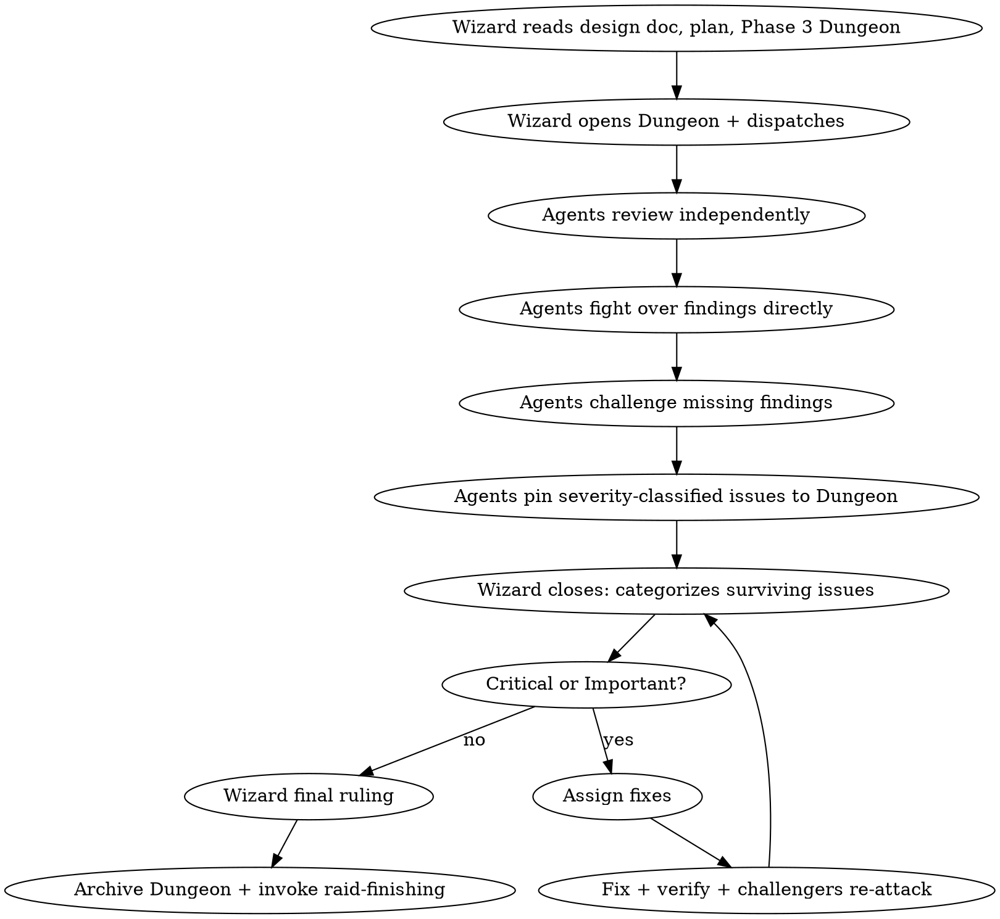

# Raid Review — Phase 4

Three reviewers, three angles, zero mercy. They fight each other, not just the code.

<HARD-GATE>
Do NOT declare work complete without Phase 4 (except Scout mode). All assigned agents review the ENTIRE implementation independently, then attack each other's findings. Use `raid-verification` before any completion claims. No subagents.
</HARD-GATE>

## Mode Behavior

- **Full Raid**: 3 independent reviews, then agents fight directly over findings. All severity levels enforced.
- **Skirmish**: 1 agent reviews + Wizard. Cross-testing between reviewer and Wizard.
- **Scout**: Wizard reviews alone. Checks against requirements and runs tests.

## Process Flow



## Wizard Checklist

1. **Prepare** — gather git range, design doc, plan doc, read Phase 3 Dungeon
2. **Open the Dungeon** — create `.claude/raid-dungeon.md` with Phase 4 header
3. **Dispatch** — all agents review independently, then interact directly
4. **Observe the fight** — agents challenge findings and missing findings directly
5. **Close** — categorize surviving issues by severity from Dungeon
6. **Browser inspection** — dispatch agents to inspect in Chrome (if `browser.enabled`)
7. **Observe browser fights** — agents cross-verify findings on separate instances
8. **Rule on fixes** — Critical and Important must be fixed (code AND browser)
9. **Verify fixes** — targeted re-attack after fixes (use `raid-verification`)
10. **Final ruling** — approved or rejected
11. **Archive Dungeon** — rename to `.claude/raid-dungeon-phase-4.md`
12. **Transition** — invoke `raid-finishing`

## Opening the Dungeon

Create `.claude/raid-dungeon.md`:

```markdown
# Dungeon — Phase 4: Review
## Quest: Full adversarial review of <feature> implementation
## Mode: <Full Raid | Skirmish>

### Discoveries

### Active Battles

### Resolved

### Shared Knowledge

### Escalations
```

## Dispatch

**📡 DISPATCH:**

> **@Warrior**: Review full implementation. Run every test. Check error handling at every boundary. Verify all requirements from design doc. Find the bugs that crash in production. Then fight @Archer and @Rogue over their findings.
>
> **@Archer**: Review full implementation. Does it match the design doc exactly? Patterns consistent? Interfaces correct? Types sound? Naming conventions followed? File structure clean? Find the bugs that silently produce wrong results. Then fight @Warrior and @Rogue.
>
> **@Rogue**: Review full implementation. Think like an attacker. What inputs break it? What timing causes races? What happens when dependencies fail? Find the bugs nobody else will find. Then fight @Warrior and @Archer.
>
> **All**: Review independently first, then fight directly. Challenge each other's findings AND each other's blind spots. Pin severity-classified issues to Dungeon with `📌 DUNGEON:`. Reference the Phase 3 Dungeon for context.

## Review Checklist — Each Agent

**Requirements:** Every design doc requirement implemented? No extras (YAGNI)? Nothing misinterpreted?

**Code Quality:** Clean separation? Error handling at every boundary? DRY? Clear names?

**Testing:** Every function tested? Edge cases? Failure paths? All passing?

**Architecture:** Design decisions implemented correctly? Interfaces match spec? No drift?

**Naming & Structure:** Consistent naming? File system follows conventions? Modules clean?

**Production:** Performance OK? External calls have timeouts? No secrets in code?

## The Fight — Agents Challenge Each Other

After independent reviews, agents fight DIRECTLY over findings AND missing findings:

- `⚔️ CHALLENGE: @Archer, you gave the auth module a pass but didn't check the session rotation path — review it now.`
- `🔗 BUILDING ON @Warrior: Your finding about the missing error handler — the impact is worse than you stated because...`
- `🔥 ROAST: @Rogue, your "Critical" severity on the naming inconsistency is overblown — here's why it's actually Minor...`
- `📌 DUNGEON: [Critical] handler.js:23 — missing input validation allows injection. Verified by @Warrior and @Rogue.`

**Agents classify severity when pinning to Dungeon:**

| Severity | Definition | Action |
|----------|------------|--------|
| **Critical** | Bugs, security holes, data loss, crashes | Must fix. No exceptions. |
| **Important** | Missing features, poor error handling, test gaps, naming inconsistencies | Must fix. |
| **Minor** | Style, docs, optimization | Note for future. |

## Browser Inspection Phase (when `browser.enabled` in raid.json)

After code review findings are pinned, the Wizard announces browser inspection.

### Process

1. **Wizard announces:** "Browser inspection phase — each reviewer boots their own instance"
2. **Each reviewer BOOTs** their own app instance on separate ports (invoke `raid-browser`)
3. **Each reviewer runs PRE-FLIGHT** — state test subject, check auth, discover routes
4. **Each reviewer LOGINs** if auth is required (credentials from `.env.raid`)
5. **Each reviewer inspects** from their angle (invoke `raid-browser-chrome`):
   - Minimum gates first (console, network, page loads)
   - Then angle-driven exploration (Warrior: stress, Archer: visual/precision, Rogue: security)
   - Evidence captured for every finding (GIF, screenshot, console/network)
6. **Cross-verification** — each reviewer reproduces others' findings on their own instance
7. **Pin browser findings** to Dungeon alongside code review findings
8. **Each reviewer CLEANUPs** their instance
9. **Wizard rules** on ALL findings (code + browser) together

### Browser findings follow the same severity rules:

- **Critical** (crash, security, layout broken) — must fix
- **Important** (broken feature, visual inconsistency, responsive breakage) — must fix
- **Minor** (polish, console warnings) — note for future

**Browser bugs block merge the same way code bugs do.**

## Closing the Phase

The Wizard closes when agents have exhausted their findings and the Dungeon has all issues classified:

**⚡ WIZARD RULING: APPROVED FOR MERGE** — all Critical/Important fixed, tests pass, requirements met.

**⚡ WIZARD RULING: REJECTED** — specify what must change and which phase to return to.

## Red Flags

| Thought | Reality |
|---------|---------|
| "The implementation looks fine, no issues" | Every review finds at least one issue. Look harder. |
| "I'll report my findings to the Wizard" | Report to the other agents directly. Fight over them. |
| "This is a Minor issue" (when it causes wrong behavior) | Wrong results = Important or Critical. |
| "The tests pass, so it works" | Tests prove what they test. What DON'T they test? |
| "Let's skip re-review of the fixes" | Fixes introduce new bugs. Always re-attack. |

**Terminal state:** Archive Dungeon. Invoke `raid-finishing`.
