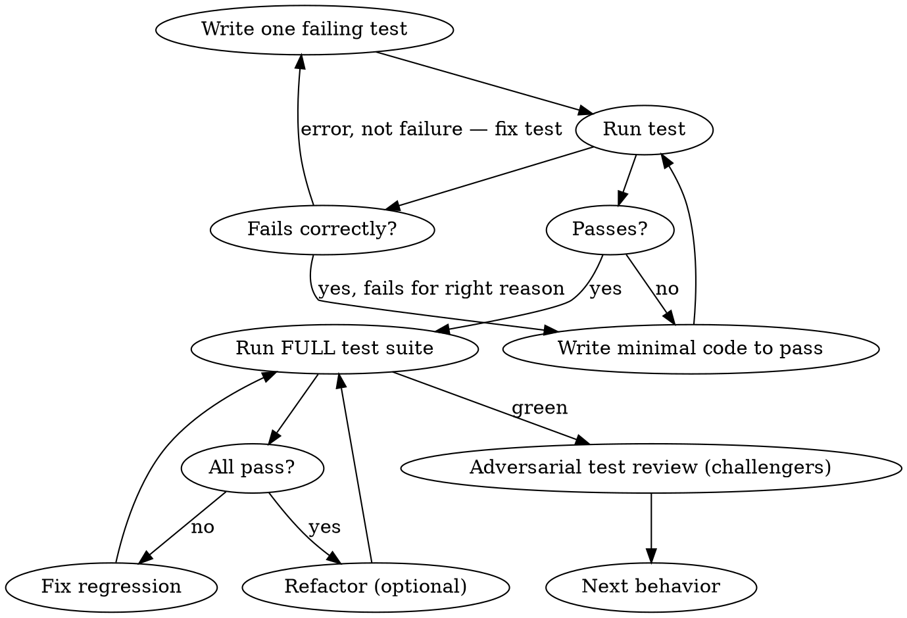

# Raid TDD — Test-Driven Development

Write the test first. Watch it fail. Write minimal code to pass. Then the others try to break it.

**Core principle:** If you didn't watch the test fail, you don't know if it tests the right thing.

**Violating the letter of these rules is violating their spirit.**

**TDD is enforced in ALL modes — Full Raid, Skirmish, and Scout. No exceptions.**

## The Iron Law

```
NO PRODUCTION CODE WITHOUT A FAILING TEST FIRST
```

Write code before the test? Delete it. Start over. No exceptions.
- Don't keep it as "reference"
- Don't "adapt" it while writing tests
- Don't look at it
- Delete means delete

## Process Flow



## Red-Green-Refactor

### RED — Write Failing Test
- One test, one behavior. "And" in the name? Split it.
- Clear name describing the behavior, not the implementation
- Real code, no mocks unless absolutely unavoidable
- Good: `test_expired_token_returns_401`
- Bad: `test_auth`, `test1`, `test_the_function`

### Verify RED — Watch It Fail (MANDATORY. Never skip.)
Run: test command from `.claude/raid.json`
- Test **fails** (not errors — fails). A test that errors proves nothing.
- Failure message matches your expectation
- Fails because the feature is missing, not because of typos or import errors

### GREEN — Minimal Code
- Simplest code that makes the test pass. Nothing more.
- No extra features, options, configurations
- "Can I make it pass with less code?" — if yes, do that instead

### Verify GREEN — Watch It Pass (MANDATORY.)
Run: test command from `.claude/raid.json`
- New test passes
- ALL existing tests still pass
- Output clean — no warnings, no deprecation notices

### REFACTOR — Clean Up (only after green)
- Remove duplication, improve names, extract helpers
- Keep tests green throughout — run after every change
- Refactor the TESTS too, not just the implementation

## Browser-Aware TDD (when `browser.enabled` in raid.json)

### Deciding Test Type

Before writing the test, decide: is this a unit test or a browser test?

| Write Browser Test | Write Unit Test Only |
|---|---|
| New user-facing flow (signup, checkout) | Pure utility function |
| UI interaction (drag-drop, modal, form) | API endpoint logic |
| Client-side routing / navigation | Data transformation |
| Visual state changes (loading, error, empty) | Business rule validation |
| Integration between frontend and API | Database queries |

- **If both:** Write the unit test FIRST, then the browser test
- **State your reasoning** — challengers will attack this decision
- **When unsure:** Write the browser test. Better to have it and not need it.

### Browser TDD Cycle

Follow the same RED-GREEN-REFACTOR discipline but with Playwright:

1. **RED:** Write `.spec.ts` with user behavior assertions + console/network checks
2. **Verify RED:** Run `{execCommand} playwright test` — must fail for the RIGHT reason
3. **GREEN:** Implement feature → test passes
4. **Verify GREEN:** Run FULL suite (unit + browser) → all green
5. **REFACTOR:** Clean up → re-run all

Invoke `raid-browser` for pre-flight and boot. Use the browser test patterns below for Playwright-specific guidance.

### "Tests pass" = Unit AND Browser Tests

When claiming tests pass, both must pass:
- Unit: test command from `raid.json`
- Browser: `{execCommand} playwright test`

## Adversarial Test Review

After TDD cycle, challengers attack the TESTS directly — and build on each other's critiques:

1. **Does this test prove the behavior, or just confirm the implementation?** If you renamed an internal method, would the test break? It shouldn't.
2. **What input would make this test pass even with a broken implementation?** (e.g., a test that only checks the happy path passes for any implementation that doesn't crash)
3. **What edge cases are uncovered?** Empty input, null, boundary values, Unicode, concurrent access.
4. **Is it testing real code or mock behavior?** Mocks that don't match real behavior = false confidence.
5. **Would this catch a regression?** If someone changes the implementation next month, does this test catch the break?

**Challengers interact directly:**
- `CHALLENGE: @Warrior, your test at line 15 only validates the happy path — here's an input that passes with a broken implementation: ...`
- `BUILDING: @Archer, your edge case finding — the same gap exists in the error path test at line 32...`
- `CHALLENGE: @Rogue, you claimed the test is implementation-dependent but renaming the internal method doesn't break it — here's proof: ...`

**Browser-specific attacks (when `browser.enabled`):**

6. **This is a user-facing feature but you only wrote unit tests — where's the browser test?** If the user interacts with it in a browser, it needs a browser test.
7. **Your browser test checks the DOM but doesn't assert on console errors or network health.** Infrastructure assertions are mandatory.
8. **You tested at desktop width only — what about mobile?** Responsive behavior is Important severity.

**Challengers don't just report to the Wizard — they fight each other over test quality.**

## Testing Anti-Patterns

| Anti-Pattern | Problem | Fix |
|---|---|---|
| Testing mock behavior, not real behavior | Mocks pass, production breaks | Use real implementations. Mock only external services. |
| Test-only methods in production code | Production API polluted for tests | Test through the public interface. If you can't, the design is wrong. |
| Mocking without understanding the real behavior | Mock returns "success" but real service returns different shape | Read the real implementation before mocking. |
| Incomplete mocks | Mock covers happy path, misses errors | Mock all paths, or don't mock at all. |
| Integration tests as afterthought | Unit tests pass, integration breaks | Write integration tests as part of TDD, not after. |

## Common Rationalizations

| Excuse | Reality |
|--------|---------|
| "Too simple to test" | Simple code breaks. Test takes 30 seconds. Write it. |
| "I'll test after" | Tests passing immediately prove nothing about the design. |
| "Need to explore first" | Fine. Throw away exploration code. Start fresh with TDD. |
| "Test hard = skip it" | Hard to test = hard to use. Fix the design. |
| "TDD slows me down" | TDD is faster than debugging. Every time. |
| "Tests after achieve same goals" | Tests-after = "what does this code do?" Tests-first = "what should this code do?" |
| "Keep the code as reference" | You'll "adapt" it. That's testing after with extra steps. Delete means delete. |
| "Just this once" | Every exception is a precedent. Delete the code. Start with TDD. |
| "Already manually tested" | Manual testing leaves no record, can't be re-run, can't catch regressions. |
| "TDD is dogmatic" | TDD is evidence-based discipline. Dogma would skip the evidence. |

## Verification Checklist

Before claiming a TDD cycle is complete:

- [ ] Every new function has a test
- [ ] Watched each test fail before implementing
- [ ] Each test failed for the expected reason (not errors)
- [ ] Wrote minimal code to pass (no over-engineering)
- [ ] All tests pass (new and existing)
- [ ] Output clean (no warnings)
- [ ] Tests use real code (minimal mocking)
- [ ] Edge cases and error paths covered
- [ ] Tests describe behavior, not implementation

Can't check all boxes? Don't proceed. Fix what's missing.

## When You're Stuck

| Situation | Action |
|-----------|--------|
| Can't write the test | The requirement is unclear. Ask the Wizard. |
| Test won't fail | You may already have the implementation. Delete it. Write test. Watch it fail. |
| Test fails but for wrong reason | Fix the test setup, not the implementation. |
| Can't make it pass with minimal code | The design may be wrong. Discuss before forcing. |
| Tests are brittle (break on refactor) | Tests are testing implementation, not behavior. Rewrite them. |
