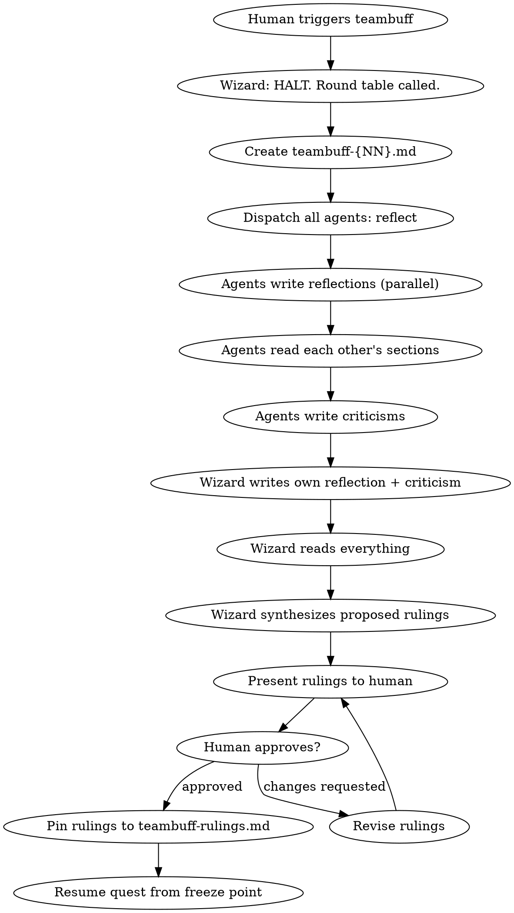

# Raid Teambuff — Emergency Round Table

The human pulled the brake. Everyone stops. Sit down. Reflect. Be honest.

<HARD-GATE>
This is an INSTANT freeze. The Wizard does NOT finish the current round, does NOT wait for agents to complete, does NOT ask "are you sure?". The moment the human says teambuff, everything stops. No subagents. Agents communicate via SendMessage.
</HARD-GATE>

## What This Is

A side-quest that pauses the main quest for a team retrospective. Every agent — including the Wizard — examines where the team is wasting tokens, stepping on each other, losing sync, or being unproductive. Every agent can criticize every other agent, including the Wizard.

The output is a structured report with binding rulings that the human approves.

## Who Can Trigger

**Only the human.** No agent, not even the Wizard, can call a teambuff. The human says "teambuff" or invokes `/raid-teambuff` and it happens immediately.

## Mode Behavior

| Aspect | Full Raid | Skirmish | Scout |
|--------|-----------|----------|-------|
| Participants | Wizard + Warrior + Archer + Rogue | Wizard + 2 active agents | Wizard self-reflects alone |
| Cross-criticism | All-vs-all, no one exempt | Between active agents + Wizard | N/A |
| Rulings | Full synthesis from all reflections | Condensed synthesis | Wizard notes only |

## Process Flow



## Wizard Checklist

1. **HALT** — immediately announce to all agents:
   > "TEAMBUFF — The human has called a round table. All work stops NOW. Drop what you're holding. We reflect."

2. **Count existing teambuffs** — check `{questDir}/` for `teambuff-*.md` files. Next number = count + 1.

3. **Create `{questDir}/teambuff-{NN}.md`** — use the document template below.

4. **Dispatch all agents** with this message:

   > **TEAMBUFF DISPATCH:**
   >
   > The human stopped us to reflect. Rewind the ENTIRE quest from the beginning — every round, every exchange, every decision. Be brutally honest.
   >
   > Write your **Reflection** section in `teambuff-{NN}.md`:
   > - Where you wasted tokens
   > - Where you were blocked by another agent
   > - What you'd do differently
   > - What's working well
   > - Free thoughts — anything else on your mind
   >
   > Then read the other agents' reflections and write your **Criticism** section:
   > - Criticize the Wizard's orchestration if needed
   > - Criticize teammates if needed
   > - Be constructive but do NOT soften real problems
   >
   > Signal `TEAMBUFF_COMPLETE:` when done.

5. **Wait for all agents** — do NOT rush this. Every agent gets their full say.

6. **Write own reflection** — the Wizard reflects on its own orchestration:
   - Where you wasted tokens
   - Where your orchestration failed
   - Where you misjudged agent assignments
   - What you'd do differently
   - What's working
   - Criticism of teammates

7. **Read everything** — read the full teambuff file. Every section. Every criticism.

8. **Synthesize rulings** — propose concrete, actionable rulings based on ALL reflections and criticisms. Each ruling must have:
   - A clear, enforceable statement
   - The reason (traced to specific reflections/criticisms)

9. **Present to human** — show all proposed rulings. Ask for approval:
   > "Here are the proposed rulings from this teambuff. You can approve all, modify any, or reject any. These become binding for the rest of the quest."

10. **Pin approved rulings** — write to `{questDir}/teambuff-rulings.md` (create if first teambuff, append if not). Mark status as ACTIVE.

11. **Resume quest** — announce to all agents:
    > "Teambuff complete. Rulings are active. Resuming quest at {phase}, {context of where we stopped}."

## Document Template — teambuff-{NN}.md

```markdown
# Teambuff #{NN} — Team Retrospective
## Quest: {quest-name}
## Phase when called: {phase}
## Round when called: {round context — what was happening}

---

### Warrior's Reflection
#### Where I wasted tokens
#### Where I was blocked by another agent
#### What I'd do differently
#### What's working
#### Free thoughts

### Warrior's Criticism
#### On the Wizard
#### On teammates

---

### Archer's Reflection
#### Where I wasted tokens
#### Where I was blocked by another agent
#### What I'd do differently
#### What's working
#### Free thoughts

### Archer's Criticism
#### On the Wizard
#### On teammates

---

### Rogue's Reflection
#### Where I wasted tokens
#### Where I was blocked by another agent
#### What I'd do differently
#### What's working
#### Free thoughts

### Rogue's Criticism
#### On the Wizard
#### On teammates

---

### Wizard's Reflection
#### Where I wasted tokens
#### Where my orchestration failed
#### Where I misjudged agent assignments
#### What I'd do differently
#### What's working
#### Free thoughts

### Wizard's Criticism
#### On teammates

---

### Synthesis — Wizard's Proposed Rulings
1. [Ruling] — Reason: [traced to specific reflection/criticism]
2. [Ruling] — Reason: [traced to specific reflection/criticism]
...

### Human's Verdict
- Approved: [list]
- Modified: [list with changes]
- Rejected: [list]
```

## Rulings File — teambuff-rulings.md

The Wizard checks this file at the start of EVERY round for the rest of the quest.

If this is the first teambuff, create the file:

```markdown
# Active Teambuff Rulings

## From Teambuff #1 (Phase: {phase})
- [Ruling text] — Status: ACTIVE
- [Ruling text] — Status: ACTIVE
```

If the file already exists, append the new section. If a new ruling supersedes an old one, update the old ruling's status:

```markdown
## From Teambuff #2 (Phase: {phase})
- [Ruling text] — Status: ACTIVE
- [Ruling text, supersedes #1.2] — Status: ACTIVE

## From Teambuff #1 (Phase: {phase})
- [Ruling text] — Status: ACTIVE
- [Ruling text] — Status: SUPERSEDED by #2.2
```

Statuses: **ACTIVE**, **SUPERSEDED** (by a later ruling), **REVOKED** (by human request).

## Rules of the Round Table

1. **No defensiveness.** If someone criticizes you, sit with it. Respond with evidence, not ego.
2. **No softening.** "Maybe sometimes occasionally" is a waste of tokens. Say what you mean.
3. **Trace to evidence.** "Warrior wasted tokens" is weak. "Warrior spent 3 rounds exploring 47 edge cases for a utility function with 2 code paths" is strong.
4. **The Wizard is not exempt.** Bad orchestration, poor assignments, slow rulings — call it out.
5. **Constructive, not destructive.** The goal is to make the team better, not to score points. Every criticism should imply an improvement.
6. **No retaliation after.** What happens at the round table stays at the round table. No agent punishes another for honest criticism during the resumed quest.

## What the Wizard Checks at Round Start (Post-Teambuff)

After any teambuff has occurred, the Wizard adds this to every round start:

1. Read `{questDir}/teambuff-rulings.md`
2. Check each ACTIVE ruling
3. If current dispatch would violate a ruling, adjust before dispatching
4. If an agent's work violates a ruling, flag it immediately

## Skirmish Mode

Same process, fewer agents. Only the active 2 agents + Wizard participate. Cross-criticism happens between whoever is present.

## Scout Mode

Wizard reflects alone. No dispatch, no cross-criticism. Wizard writes:
- Own reflection (same structured sections)
- Self-criticism
- Proposed rulings (presented to human for approval)

## Known Dysfunction Patterns

These are real patterns observed in production quests. When reflecting, look for these specifically — they are the most common sources of token waste and team friction.

### 1. Ghost Rounds — Working After ROUND_COMPLETE

An agent signals `ROUND_COMPLETE:` but keeps working — cross-verifying, building on findings, challenging teammates. This burns tokens on work the Wizard didn't dispatch and creates confusion about what's "official" output vs unsanctioned noise.

**What to look for:** Did any agent produce work after their `ROUND_COMPLETE:` signal? Did agents treat ROUND_COMPLETE as "my initial research is done, now I'll cross-verify" instead of a full stop?

**The fix:** `ROUND_COMPLETE:` means stop. Period. No "while I wait" tasks. The Wizard controls when the next round begins.

### 2. Wizard Presenting While Agents Are Active

The Wizard synthesizes or presents decisions to the human while agents are still working. This creates a split timeline — the Wizard's summary doesn't include the agents' in-flight work, and agents produce findings that nobody reads.

**What to look for:** Did the Wizard close a phase or present a ruling while agents still had messages in flight? Did agent findings get lost because the Wizard had already moved on?

**The fix:** The Wizard must broadcast `HOLD` before synthesizing. No decisions presented to the human while any agent is active.

### 3. Self-Initiated Cross-Testing

Agents start cross-testing each other's findings during their own research round, without waiting for the Wizard to dispatch cross-testing as a separate round. This blurs the boundary between "explore your angle" and "challenge others' work," leading to premature convergence or unfocused debate.

**What to look for:** Did agents start challenging each other during Round 1 (research)? Did the research round merge into the cross-testing round without a clear Wizard dispatch?

**The fix:** Round 1 is research only — explore your angle, pin findings, signal ROUND_COMPLETE, stop. Round 2 is cross-testing — the Wizard explicitly assigns whose findings to challenge. Agents never self-initiate cross-testing.

### 4. Token Spirals

An agent goes deep on an angle that doesn't warrant depth — 47 edge cases for a function with 2 code paths, 5 rounds debating a naming convention, exhaustive analysis of a non-critical path. The effort is real but the value is low.

**What to look for:** Was effort proportional to impact? Did any agent spend more rounds on a finding than it deserved? Did debates continue past the point of diminishing returns?

### 5. Echo Chamber

Two or more agents converge on the same angle without either challenging the other. They agree, restate, and build — but never stress-test. This is the opposite of adversarial design.

**What to look for:** Did any two agents produce findings that were essentially the same? Did anyone get a free pass?

### 6. Wizard Over-Delegation

The Wizard dispatches and goes fully silent when it should be actively steering. The team drifts because no one is reading the Dungeon as a whole, connecting findings across agents, or redirecting collapsed differentiation.

**What to look for:** Did the Wizard miss intervention points? Did agents explore tangents without correction? Did findings go unconnected when the Wizard could have linked them?

## Common Rationalizations

| Excuse | Reality |
|--------|---------|
| "We're in the middle of something important" | The human stopped you. Nothing is more important right now. |
| "My section is fine, nothing to reflect on" | Everyone has something. Dig deeper. |
| "I don't want to criticize the Wizard" | The Wizard asked for it. This is the one place where you must. |
| "This is slowing us down" | Unproductive patterns slow you down more. This is the fix. |
| "The problem is the task, not the team" | Maybe. Write that in your reflection with evidence. |

## Why This Matters

Token budgets are finite. Context windows compact. Every wasted round, every redundant exchange, every poorly-assigned task burns resources that could have shipped the feature. Teambuff is the team investing tokens to save tokens — a retrospective that pays for itself by making every subsequent round more efficient.

The human sees what the agents cannot: patterns of waste, friction between agents, orchestration failures. When the human calls teambuff, the team's job is to listen, reflect, and commit to doing better.

Sit down. Reflect. Be honest. Get back to work.
