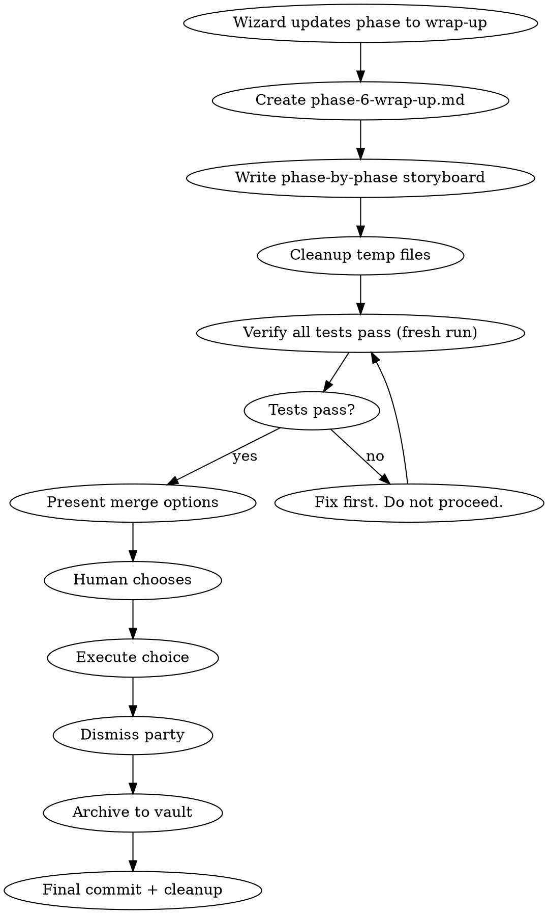

# Raid Wrap Up — Phase 6

The quest ends. The bard sings the tale. The treasure is committed. The party rests.

<HARD-GATE>
Do NOT write new code. This phase is about reporting, cleanup, PR creation, and archival. Agents are dismissed, not dispatched.
</HARD-GATE>

## Process Flow



## Wizard Checklist

1. **Update raid-session** via Bash (write gate blocks Write/Edit on this file):
   ```bash
   jq '.phase="wrap-up"' .claude/raid-session > .claude/raid-session.tmp && mv .claude/raid-session.tmp .claude/raid-session
   ```
2. **Create storyboard** — `{questDir}/phase-6-wrap-up.md`
3. **Write narrative** — phase-by-phase story from quest files
4. **Cleanup** — remove temp configs, debug files, stale artifacts
5. **Verify tests** — fresh full run, must pass
6. **Present options** — 4 merge choices
7. **Execute choice** — merge, PR, keep, or discard
8. **Dismiss party** — RPG flavor shutdown
9. **Archive** — move dungeon to vault
10. **Final commit** — `docs(quest-{slug}): phase 6 wrap-up — quest complete`
11. **Session cleanup** — remove `.claude/raid-session`

## Step 1: The Quest Storyboard

Create `{questDir}/phase-6-wrap-up.md` and write a phase-by-phase narrative:

```markdown
# Phase 6: Wrap Up — Quest Storyboard

## Quest: [quest name]

## References
- PRD: `{questDir}/spoils/prd.md` (if exists)
- Design: `{questDir}/spoils/design.md`
- Design Evolution: `{questDir}/phases/phase-2-design.md`
- Plan: `{questDir}/phases/phase-3-plan.md`
- Tasks: `{questDir}/spoils/tasks/phase-3-plan-task-*.md`
- Implementation: `{questDir}/phases/phase-4-implementation.md`
- Review: `{questDir}/spoils/review.md` (if exists)
- Review Evolution: `{questDir}/phases/phase-5-review.md` (if exists)

---

### Phase 1: PRD — Forging the Scroll
<!-- If prd.md exists. Summarize: what requirements were established,
     key decisions, any surprising findings from exploration. 2-5 bullets. -->

### Phase 2: Design — Charting the Map
<!-- Who wrote the initial design (dice result). Key defend/concede moments.
     Architecture chosen and main alternatives rejected.
     Drift check result if PRD existed. 3-6 bullets. -->

### Phase 3: Plan — Marshaling the Forces
<!-- Total task count, dependency structure highlights.
     Key findings from plan review that changed the decomposition. 2-4 bullets. -->

### Phase 4: Implementation — Into the Fray
<!-- How tasks were divided (which agent, which domain).
     Notable challenges overcome. Test count / coverage highlights. 3-5 bullets. -->

### Phase 5: Review — Inspecting the Treasure
<!-- If review ran. Findings count by severity.
     Key fixes applied. Black cards if any. 2-5 bullets. -->

### Quest Summary
<!-- Total phases completed. Key achievements (what was built).
     Known limitations (deferred items, accepted constraints). -->
```

Read all prior phase files from the quest directory to build this narrative.

## Step 2: Cleanup

Remove temporary artifacts:
- Debug files
- Temp configs
- Stale backups in the quest directory

## Step 3: Final Verification

```
1. IDENTIFY: test command from .claude/raid.json
2. RUN: Execute the FULL test suite (fresh, complete)
3. READ: Full output, check exit code, count failures
4. VERIFY: Zero failures?
   If NO → STOP. Fix first. Do not present options.
   If YES → Proceed with evidence.
```

## Step 4: Present Options

```
RULING: The quest is complete and verified.

Tests: [N] passing, 0 failures (evidence: [command output])

Options:
1. Merge back to [base-branch] locally
2. Push and create a Pull Request
3. Keep the branch as-is (handle later)
4. Discard this work

Which option?
```

**For option 2 (PR):** Create the PR with:
- **Title**: Descriptive, includes quest name
- **Body**: The phase-by-phase storyboard from the wrap-up doc

## Step 5: Execute

| Option | Actions |
|--------|---------|
| **1. Merge** | Checkout base -> pull -> merge -> run tests on merged result -> delete branch -> clean up |
| **2. PR** | Push with -u -> create PR via gh with storyboard body -> clean up |
| **3. Keep** | Report branch location. Done. |
| **4. Discard** | Require typed "discard" confirmation -> delete branch (force) -> clean up |

## Step 6: Dismiss the Party

Announce the quest's end with RPG flavor:

> "The quest is done, brave engineers. The bards will sing of **{quest-name}**. Sheathe your tools — until the next adventure."

No shutdown messages needed — agents are spawned per-turn and have already completed.

## Step 7: Archive to Vault

1. Move quest directory to vault:
   ```
   mv .claude/dungeon/{quest-slug}/ .claude/vault/{quest-slug}/
   ```
2. Update vault index at `.claude/vault/index.md`:
   ```
   | {date} | [{quest-name}]({quest-slug}/quest.md) | {mode} | {tags} |
   ```

## Step 8: Final Commit & Cleanup

1. **Commit**: `docs(quest-{slug}): phase 6 wrap-up — quest complete`
2. **Remove** via Bash (write gate blocks Write/Edit on this file): `rm -f .claude/raid-session`
3. **Session is over. No further skills to load.**

## Red Flags

| Thought | Reality |
|---------|---------|
| "Tests passed earlier, no need to re-run" | Fresh run or no claim. Always. |
| "Skip the storyboard, just make the PR" | The storyboard IS the PR body. It documents the journey. |
| "Leave the dungeon files, they might be useful" | Archive to vault. Session artifacts don't belong in the repo. |
| "Merge without testing the merged result" | Merges introduce conflicts. Test after merge. |
| "I'll write the code fix myself" | You are the Wizard. Dispatch the fix to an agent. |

## Phase Spoils

**Output**: `{questDir}/phase-6-wrap-up.md` — The complete quest narrative, phase by phase.
